# Selah 產品需求計劃（PRD）

> **母語**：繁體中文　|　**目標學習語言**：英文 / 日文（多目標語言）
> **平台**：第一階段 iOS App 唯一實作，架構預留 Android / Google Play 發布框架
> **版本**：v1.3（2026-06-26 修訂：App 命名 Selah / SwiftUI 原生技術棳 / 六分類題材系統 / Smart Excel System 六級間隔 / ElevenLabs 6 精選音色 / 微型輸出挑戰規格 / 行為訊號驅動統一 / 雙語策略確定 / 音色全局設定簡化） | **v1.2**：2026-06-26：6 分類題材系統 / Smart Excel System 六級間隔 / ElevenLabs 6 精選音色 / 微型輸出挑戰規格 / 行為訊號驅動統一 / 雙語策略確定 / 音色全局設定簡化）　|　**v1.1**：2026-06-26　|　**初版**：2026-06-25
> **依據**：`language-learning-system-design.md`（設計藍圖 v1.0）、`pet-system-design.md`（寵物系統技術規格）

---

## 目錄

1. [產品定位與設計哲學](#一產品定位與設計哲學)
2. [使用者旅程與痛點映射](#二使用者旅程與痛點映射)
3. [五階段核心功能拆解](#三五階段核心功能拆解)
4. [寵物系統設計](#四寵物系統設計核心章節)
5. [UX 與資訊架構](#五ux-與資訊架構)
6. [遊戲化與回饋系統](#六遊戲化與回饋系統)
7. [使用者回饋與資料驅動](#七使用者回饋與資料驅動)
8. [風險與緩解](#八風險與緩解)
9. [分階段開發路線圖](#九分階段開發路線圖)
10. [開放問題與後續決策](#十開放問題與後續決策)

---

## 一、產品定位與設計哲學

### 1.1 一句話定位

**Selah 是一款以「你真實生活會說的話」為唯一學習原點的個人化語言學習 App，用一隻與你學習狀態共生的語言精靈，把枯燥的習慣養成變成一段你捨不得中斷的陪伴關係。**

### 1.2 核心問題陳述

| 問題 | 現象 | 我們的解法 |
|------|------|-----------|
| 學了用不到 | 課本對話跟自己生活無關 | 只學「你昨天真的說了」的句子（自我相關性） |
| 不知道說什麼 | 想收集語料但腦袋空白 | 共鳴題材系統激發表達欲 |
| Week 1 放棄 | 90% 在第一週流失 | 8 分鐘 SOP + 寵物情感動機 + 重新定義成功 |
| 動機歸零 | 看不見進步、沒有正回饋 | 寵物成長 + 晚安語 + 進度條視覺化 |
| 鸚鵡學舌 | 一開始就跟讀，無深層學習 | 強制「盲聽→預測→跟讀」順序 |
| 品質盲點 | 無法判斷 AI 翻譯是否自然 | 雙模型交叉驗證 |

### 1.3 目標用戶畫像

**主要用戶**：20–35 歲，母語繁體中文，想學**英文或日文口語**的上班族/學生
- **場景**：工作會議、技術分享、朋友聊天、旅行、追劇、社群互動
- **痛點**： textbook 英文用不到、想學日文動漫/旅行用語但無從下手、買了課程用不完
- **特徵**：手機不離身、有碎片時間（通勤/刷牙）、對可愛事物與養成有情感投射

### 1.4 設計心理學依據

#### 1.4.1 BJ Fogg 行為模型（B = MAP）

要讓用戶每天學習，必須同時滿足 **動機(Motivation) × 能力(Ability) × 提示(Prompt)**：

| 要素 | 本產品對策 |
|------|-----------|
| **動機 M** | 寵物成長（關聯性）、晚安語（勝任感）、共鳴題材（自主性） |
| **能力 A** | Week 1 只需 8 分鐘、語音輸入降摩擦、種子庫冷啟動 |
| **提示 P** | 寵物狀態推播（軟性、非疲勞轟炸）、夜間預習提醒 |

#### 1.4.2 自決理論（Self-Determination Theory）

內在動機來自三個心理需求，本產品對應：

| 需求 | 產品機制 |
|------|---------|
| **自主性 Autonomy** | 自選語料、自選音色感情、自選題材、自命名寵物 |
| **勝任感 Competence** | 進度條、紅→綠轉換、六週時間線、功能解鎖 |
| **關聯性 Relatedness** | 寵物陪伴、寵物「聽懂你」、晚安語回顧 |

#### 1.4.3 Loss Aversion（損失厭惡）的安全使用

寵物死亡機制利用損失厭惡維持動機，但**必須控制創傷風險**：
- ✅ 用「沉睡/退化」取代「死亡」字眼
- ✅ 緩衝期 + 警告 + 可救（多階段 pipeline）
- ✅ 語料庫 100% 保留（不損失最大投入）
- ❌ 不做嚴厲懲罰、不責備、不羞辱
- **設計底線**：寵物是陪伴者，不是監工

### 1.5 多目標語言決策（英文 / 日文）

本產品支援**英文與日文**作為目標學習語言，這影響多個模組：

| 模組 | 多語言處理 |
|------|-----------|
| AI 翻譯 | 依目標語言路由：中→英 / 中→日，日文需處理敬語、性別語尾 |
| TTS 音色 | 英文用 ElevenLabs 英文音色；日文用日文音色（含男/女聲、關西腔等） |
| 感情標籤 | 共通（輕鬆/正式/激動…），但日文增加「敬體/常體」「丁寧/親暱」維度 |
| 共鳴題材 | 題材分「通用」與「語言專屬」（如日文加「動漫/旅行/商務敬語」） |
| 檢測系統 | 日文需處理假名/漢字讀音標注（furigana） |
| 語料進化 | 日文進化路徑包含「敬語升級」「口語化」雙向 |

> **第一階段只做英語學習，日語保留架構。** 用戶可同時學兩種語言，共享同一隻寵物。XP 分語言計算（避免疊加暴衝），但狀態維度（Hunger/Mood/Health/Bond）共享——學任何語言都讓寵物吃飽開心。架構上 XP 事件資料結構預留 `targetLang` 欄位，日語上線時零改動。

### 1.6 競品差異化

| 維度 | Duolingo | Forest | Finch | **Selah** |
|------|----------|--------|-------|---------------------|
| 學習內容來源 | 預設課程 | 無 | 無 | **用戶真實生活語料** |
| 個人化程度 | 低 | 無 | 中（寵物） | **極高（語料+音色+題材+寵物）** |
| 動機機制 | Streak | 種樹 | 寵物 | **寵物 + 自我相關語料** |
| 學習方法 | 翻譯選擇題 | 計時 | 自我關懷 | **盲聽→跟讀→檢測（肌肉記憶）** |
| 失敗處理 | 掉 streak | 樹枯萎 | 寵物難過 | **緩衝可救，語料保留** |

### 1.7 跨平台策略（iOS 優先 + Android 預留）

| 決策 | 說明 |
|------|------|
| **技術框架** | SwiftUI 原生（iOS Phase 1），業務邏輯層 Swift Package 做平台無關抽象，Android 階段用 Kotlin Multiplatform 共享邏輯 |
| **第一階段** | 只發布 iOS App Store，SwiftUI 原生開發，專注打磨核心體驗 |
| **Android 預留** | 業務邏輯層 Swift Package 可經 KMP 共享，UI 層 Android 重寫 |
| **抽象層** | TTS、語音識別、推播、本地儲存、Haptics、音訊播放皆封裝為 Protocol 介面 |

**為何第一階段只做 iOS**：
1. iOS `SFSpeechRecognizer` 原生語音識別品質穩定，與本產品語料輸入核心強相關
2. 集中資源打磨「寵物 + 語料迴圈」核心體驗
3. iOS 用戶付費意願與留存數據更利於早期驗證

**跨平台抽象原則**（所有原生功能皆遵守）：
```
應用層（SwiftUI Views + ViewModels）
    ↓ 呼叫 Protocol
Domain 層（業務邏輯：XP 計算 / Smart Excel / 寵物狀態機 / 里程碑判定）
    ↓ Protocol 注入
Data 層（SwiftData Repository 實作）
    ↓
Infrastructure 層（ElevenLabs / SFSpeechRecognizer / AVAudioSession / UserNotifications）
```

---

## 二、使用者旅程與痛點映射

### 2.1 三大 Week 1 殺手 → 產品功能對策

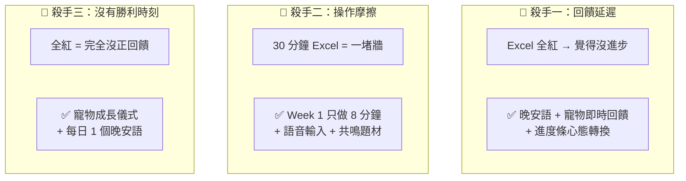

### 2.2 完整使用者旅程（以新用戶為例）

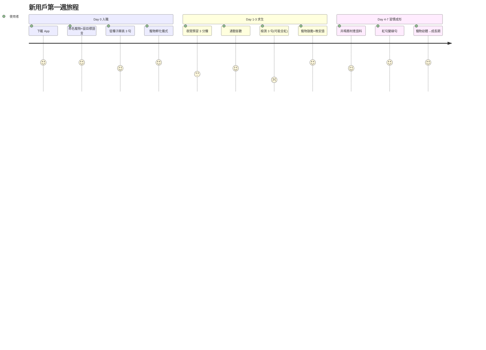

### 2.3 成長里程碑：Stage 階段制（取代週次制）

> 註：以**用戶的真實行為與感受**為準，用戶可自我評估目前處於哪個 Stage。時間僅為約略參考。

| Stage | 名稱 | 成功訊號（行為驅動） | 系統解鎖功能 | 寵物形態 |
|-------|------|---------------------|------------|---------|
| Stage 1 | 🌱 起步期 | 連續 7 天打開 App（全紅也算！）| 語料捕捉 + 夜間預習 + 盲聽跟讀 | 蛋 → 幼體 |
| Stage 2 | 🔄 回憶期 | Recall 20-30%，至少 3 句🔴→✅ | + **微型輸出挑戰**（對 AI 說 1 句，pattern matching 實現） | 幼體成長 |
| Stage 3 | ✨ 靈光期 | Clinking：脫口說出之前卡住的句子（刷牙時不自覺說出） | 升級標準檢測量（10-20 句） | 幼體 → 成長期 |
| Stage 4 | 💬 對話期 | Basic Conversation：用句型簡單對話 | + 變形同義句解鎖 | 成長期 |
| Stage 5 | 🌊 流利期 | Genuinely Conversational：不再先想中文，能真正用外語思考 | 全功能開通，進入持續進化 | 成長期 → 成熟期 |

> **自我評估**：用戶可在「🌱成長」Tab 中查看各 Stage 的描述，自行勾選目前所處階段。系統同時依據行為數據（紅→綠轉換率、靈光乍現回報、對話能力）提供建議 Stage，但最終由用戶確認。

---

## 三、五階段核心功能拆解

### 階段 ①　Language Island 語料庫 ⭐

語料庫是整個系統的**定錨點**——語料若與用戶無關，後續步驟再精緻都沒用。

#### 3.1.1 共鳴題材系統（Resonance Topic System）— 解決「不知道說什麼」

**核心理念**：找出用戶共鳴點，讓語料自然產出。很多用戶不是不想收集語料，而是不知道自己能說什麼。透過題材與觸發問題，降低「冷啟動認知負擔」。

##### 三種語料產出模式（難度由淺到深）

| 模式 | 機制 | 適用場景 | 認知負擔 | 角色定位 |
|------|------|---------|---------|---------|
| **共鳴題材引導**（主推） | 系統給分類題材 + 共鳴觸發問題，用戶挑選後有感而發 | 冷啟動、每日靈感 | 低 | 靈感觸發器 |
| **場景掃描** | 選工作/點餐等場景，AI 引導提問補未來需求 | 有明確目標場景 | 中 | 場景補全器 |
| **自由語音** | 想到什麼說什麼 | 已建立習慣的用戶 | 低（但要自己想） | 自由表達 |

##### 共鳴題材庫設計

**六大分類（v1.2 確定）**：

| # | 分類 | 一句話鉤子 | 典型內容 | AI 判別關鍵線索 |
|---|------|----------|---------|---------------|
| 1 | **社畜日常** 💼 | 跟工作有關的一切 | 會議發言、簡報、跟老闆報告、面試、同事溝通、寫 email | 關鍵詞：老闆/客戶/會議/簡報/報告/加班/同事/面試 |
| 2 | **朋友幹話** 💬 | 跟朋友混在一起時說的話 | 閒聊、八卦、約見面、嘴砲、講笑話 | 語氣輕鬆、無特定任務目的、不屬於其他分類的日常對話 |
| 3 | **先吐為快** 💨 | 不爽的、想抱怨的、憋著的 | 抱怨工作/生活、取暖討拍、發洩不爽、碎念 | 誇張語氣、負面情緒詞、碎念感（vs 走心時刻的克制感） |
| 4 | **走心時刻** 💕 | 認真說出心裡話的時候 | 說感受、告白、安慰人、深度對話、講恐懼或脆弱 | 克制語氣、深度表達、真誠而非釋放（vs 先吐為快的宣洩感） |
| 5 | **據理力爭** 🗣️ | 不退讓、要站穩立場 | 客訴、argue、談判、拒絕、跟房東吵架 | 對立/協商場景、需要達成結果的張力 |
| 6 | **生活闖關** 🌍 | 在外面搞定一切 | 點餐、購物、旅行、訂票訂房、問路、辦事 | 與外部世界互動、有明確交易/互動對象 |

> **設計原則（2026 生活化方向）**：題材切進**具體、有畫面、有情緒**的生活瞬間。2026 年中文圈爆款的核心是「活人感」「情緒驅動（愛意/快樂/壓力感）」「痛文化（敢於自嘲）」「主體性」。6 個分類覆蓋用戶日常語言場景的絕大部分需求，每個分類內含多個具體題材。

**各分類具體題材示例**：

| 分類 | 題材（具體、有畫面） | 共鳴觸發問題 |
|------|---------------------|-------------|
| **社畜日常** 💼 | 周會裝忙、被 @ 全體時的心跳、午休逃跑計畫、跟同事的微妙距離感 | 「如果可以對老闆說一句不用負責任的真心話，你會說什麼？」 |
| **朋友幹話** 💬 | 跟朋友的無腦對話、突然想約的衝動、八卦交換、迷因分享 | 「最近跟朋友聊天最好笑的一段是什麼？」 |
| **先吐為快** 💨 | 通勤地獄、星期一的命是咖啡給的、洗澡時的內心小劇場、深夜emo | 「今天最讓你想翻白眼的一瞬間是什麼？說出來讓我笑一下」 |
| **走心時刻** 💕 | 已讀不回的煎熬、暗戀的小動作、斷崖式分手、跟朋友說不出口的話 | 「最近有哪句話在心裡排練了很久，卻始終沒說出口？」 |
| **據理力爭** 🗣️ | 退換貨被刁難、鄰居噪音、被插隊、跟朋友意見分歧 | 「最近有哪件事讓你很想站出來理論，但最後忍住了？」 |
| **生活闖關** 🌍 | 點餐踩雷、網購翻車、排隊等太久、旅行迷路 | 「最近在外面遇到最荒謬的事是什麼？」 |

**日文圈爆款題材（目標語言＝日文時，結合 2026 流行語與界隈文化）**：

| 分類 | 題材 | 共鳴觸發問題（觸發用戶想用日文表達） |
|------|------|--------------------------------|
| **日常独り言（一人語り）** | 通勤電車地獄、お風呂妄想、深夜のエモい | 「今日一番『エモい』だった瞬間は？（今天最 emo 的瞬間？）」 |
| **界隈文化** | 推し活、マイブーム、ハマってるもの | 「最近ハマってる界隈ある？教えて！（最近沉迷什麼圈子？）」 |
| **若者言葉** | ギュン/メロい/〇〇で滅 等流行語的場景 | 「最近使い始めた若者言葉ある？どんな場面で？（最近開始用的流行語？）」 |
| **デジタルデトックス（數位排毒）** | SNS 疲れ、スマホなしの一日 | 「スマホなしで一日過ごせそう？何する？（不用手機過一天會做什麼？）」 |
| **おひとりさま（一個人）** | 一人飯、一人カラオケ、一人旅 | 「一人で好きなことトップ３教えて！（一個人最愛做的事前三名？）」 |
| **推し活・オタク** | アニメ/アイドル/ゲームへの熱量 | 「今一番熱い推し、誰？何が好き？（現在最有熱量的推是誰？）」 |
| **季節・行事** | お花見、花火、紅葉、年末年始 | 「この季節の一番の思い出は？（這季節最難忘的回憶？）」 |

> **題材產出率優化**：每個觸發問題都設計成**开放式、有情緒鉤子**，而非「請描述你的工作」（太正式，沒人想答）。問題越具體越生活，語料產出率越高。後台依各題材實際產出率動態調整 `weight` 與推薦排序。

##### 語料自動分類與學習覆蓋度（v1.2 新增）⭐

每句語料入庫時，系統根據語料內容和來源題材，**自動打上場景分類標籤**（對應上述 6 大分類）。此分類由 AI 翻譯 pipeline 順便完成，不需要用戶手動選擇。

**學習覆蓋度視覺化**：在語料庫頁面顯示一個簡單的「學習覆蓋度」圓餅圖/橫條圖，展示各場景的語料佔比。當某個場景低於 10% 時，系統在「今日靈感」推薦中加權該場景的題材，但用戶完全可以忽略推薦、自由選擇。

> **設計意圖**：既不會增加用戶負擔，又能讓系統在後台悄悄引導均衡發展，避免所有語料集中在「先吐為快」而忽略「據理力爭」等學習價值高的場景。

##### 題材的「可更新性」設計（OTA 遠端配置）⭐

題材**非 hardcode**，存於後台，App 啟動時拉取，無需發版即可換題，以保持新鮮感與代入感：

```json
{
  "version": "2026.06.26",
  "season": "summer_2026",
  "categories": [
    {
      "id": "daily吐槽",
      "name": "日常吐槽",
      "icon": "😤",
      "topics": [
        {
          "id": "tp_commute",
          "title": "通勤地獄",
          "triggerQuestion": "今天最讓你想翻白眼的一瞬間是什麼？說出來讓我笑一下",
          "targetLang": ["en", "ja"],
          "tags": ["痛文化", "daily", "always_on"],
          "suggestedScenes": ["朋友聊天", "社群發文"],
          "weight": 1.2
        }
      ]
    },
    {
      "id": "otaku推し",
      "name": "推し活・界隈",
      "icon": "✨",
      "topics": [
        {
          "id": "tp_oshi",
          "title": "今一番熱い推し",
          "triggerQuestion": "今一番熱い推し、誰？何が好き？（現在最有熱量的推是誰？為什麼？）",
          "targetLang": ["ja"],
          "tags": ["界隈文化", "推し活", "ja_only"],
          "suggestedScenes": ["朋友聊天", "SNS分享"],
          "weight": 1.0
        }
      ]
    }
  ],
  "dailyPicks": ["tp_commute", "tp_oshi", "tp_042"],
  "expiresAt": "2026-07-03"
}
```

**更新機制**：
- **每日精選 dailyPicks**：每天輪換 3 個推薦題材，APP 內「今日靈感」入口
- **週更主題**：每週一個主題週（如「旅行週」「職場吐槽週」）
- **季節性題材**：依季節/節慶自動啟用（夏天→海邊、年底→回顧）
- **時事熱點**：熱門事件 48 小時內上線題材（內容運營節奏）
- **後台數據回饋**：記錄各題材語料產出率，動態調整 `weight` 與推薦排序
- **快取與離線**：拉取後本地快取，離線時用舊版本題材

#### 3.1.2 語音輸入與確認流程（iOS 原生）

**核心理念**：語音輸入對用戶更方便（降低能力門檻），但語音識別必有誤差，需確認步驟保證語料品質。

##### 完整 User Flow

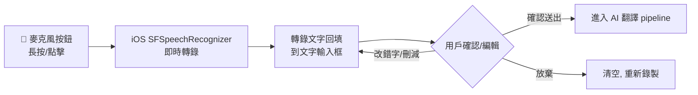

##### 設計規範

| 項目 | 規範 |
|------|------|
| **統一輸入入口** | 語音與打字共用同一個文字輸入框，降低切換摩擦。語音按鈕在輸入框內，點擊錄音、轉錄後文字出現在同一框 |
| **強制確認** | 轉錄結果**必進編輯確認**，避免識別錯誤污染語料品質 |
| **連續多句** | 支援連續說多句，系統自動斷句（依標點/停頓），可逐句或整批送出 |
| **即時轉錄** | 錄音過程中即時顯示辨識文字（部分結果 partial result），用戶有掌控感 |
| **權限引導** | 首次使用說明「為什麼需要麥克風/語音識別權限」（語音權限只傳蘋果伺服器辨識，不存音檔） |
| **辨識語言** | 依當前語料輸入語言切換（母語繁中輸入 → zh-TW；若直接說目標語言也可切 en-US/ja-JP） |
| **跨平台預留** | 語音識別封裝為 `ISpeechRecognition` 介面，Android 階段換 `android.speech.tts` / 雲端方案 |

#### 3.1.3 AI 翻譯 + 雙模型交叉驗證（沿用藍圖，強化多語言）

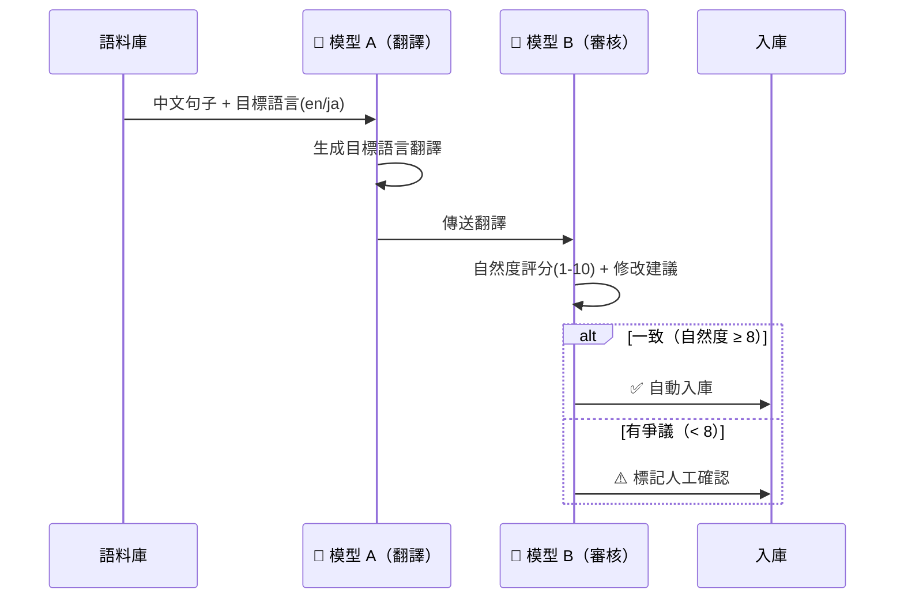

**多語言強化**：
- **英文翻譯**：要求口語化、避免 textbook 英文，提供自然度與場合標注
- **日文翻譯**：處理敬語（丁寧/尊敬/謙讓）、性別語尾（だ/よ/ね）、場合（商務/朋友），翻譯時標注讀音假名

#### 3.1.4 種子庫（冷啟動輔助）

預置 20-30 句按場景分類種子句（中英/中日雙版本），解決「第一週不知道收集什麼」。用戶挑選過程本身就是「自我相關性」判斷。

| 場景 | 種子句（中文） |
|------|-------------|
| 自我介紹 | 我叫 XX，在 XX 公司做 XX，我喜歡爬山和看電影 |
| 抱怨工作 | 今天忙死了，老闆又改需求了 |
| 點餐 | 我要一個大杯拿鐵，少冰，不加糖 |
| 閒聊 | 你週末去哪裡玩了？那部電影好看嗎？ |
| 購物 | 這個有其他顏色嗎？可以算便宜一點嗎？ |

#### 3.1.5 語料進化路徑（沿用藍圖）

| 進化類型 | 觸發條件 | 產出 | 解鎖時間 |
|----------|---------|------|---------|
| **縱向深化** | 句子已過關（✅） | 同場景進階表達 | Week 2 起 |
| **橫向拓展** | Week 4 解鎖功能 + 某句連續 3 天過關後自動生成 | 同句話 5 種口語變形 | Week 4 |

---

### 階段 ②　夜間加速器（Pre-input Comprehension）

#### 3.2.1 核心機制

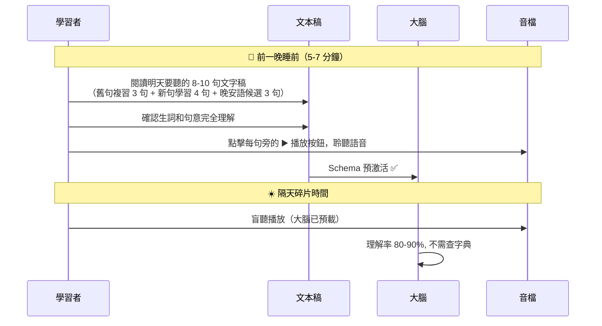

#### 3.2.2 功能要點

| 功能 | 說明 |
|------|------|
| **文字稿預習** | 顯示中+目標語言對照，可點查生詞 |
| **語音播放** | 每句旁附 ▶️ 播放按鈕，點擊即可聆聽該句語音（ElevenLabs 生成），預習時就能建立聽覺印象 |
| **生詞標記** | 用戶標記「看不懂」，系統累積個人詞彙表 |
| **用戶生詞標注（生詞本）** | 預習過程中，用戶可**長按任一英文單字**將其加入生詞本。系統自動顯示該字釋義。生詞遵循 Smart Excel 級別（L0-L5）管理。生詞本在「📝筆記」Tab 中統一管理 |
| **預習完成記錄** | 完成預習後系統記錄狀態（僅作為行為追蹤，**不作為盲聽解鎖條件**——盲聽功能始終可用） |
| **日文讀音輔助** | 漢字附 furigana 假名標注 |
| **提醒** | 夜間預習推播（與寵物「睡前故事」綁定） |

---

### 階段 ③　碎片輸入與跟讀 ⭐（ElevenLabs 高品質語音）

#### 3.3.1 ElevenLabs 語音生成流程（本階段核心）

**核心理念**：高品質自然語音是跟讀成效的關鍵。機械合成音讓人疲勞、難以建立肌肉記憶；ElevenLabs 接近真人的情感語音能提升沉浸感與跟讀意願。

> ⭐ **關鍵設計：音色由用戶選擇**。每個語料句子的語音，都使用**用戶自己選定的音色**來生成。讓用戶對「自己的聲音形象」有掌控感（自主性），也讓長期跟讀保持聽覺一致性與熟悉感。

##### 音色設定規則（v1.2 簡化）⭐

> **核心原則：音色是全局設定，不是逐句設定。** 減少決策疲勞，讓用戶專注學習。

| 規則 | 說明 |
|------|------|
| **全局主打音色** | 用戶在設定中選一個「我的主打音色」，之後所有新語料**自動使用此音色生成** |
| **切換時間點** | 用戶隨時可在設定中更換主打音色；切換後的新語料用新音色，**舊語料保留原音色不變** |
| **不做逐句覆寫** | MVP 不提供逐句換音色功能，避免 Week 1-2 決策疲勞 |
| **感情標籤精簡** | 3-5 個選項（見下方感情標籤表），系統根據語料內容自動建議，用戶可接受或改選 |

##### 生成流程（簡化版）

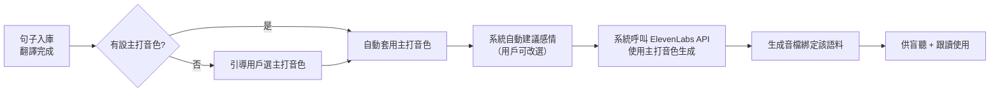

##### 音色庫設計（Voice）— 用戶可選

用戶從音色庫中**自由選擇**主打音色。每個音色都可試聽，選定後成為該用戶的預設生成音色。音色庫可持續擴充（後台配置）。

**英文音色**（6 個精選，基於 ElevenLabs Voice Library 調查 v1.2）：

> ElevenLabs 提供超過 120 個 AI 語音，v3 模型支持 inline tags 控制情感表達（emotion, audio events, soundscapes），有「full range of emotions」動態範圍。同一音色可自然表達輕鬆、正式、激動等不同情感，不需要為每種情感換音色。MVP 階段精選以下 6 個方向，每個附 3-5 秒試聽樣本，用戶直觀感受差異後選定。

| # | 方向 | 性別 | 口音 | 年齡感 | 適合場景 | 試聽文案建議 |
|---|------|------|------|--------|---------|------------|
| 1 | Casual Warm | 男 | 美式 | 青年 | 朋友聊天、日常閒聊 | "Hey, what's up? I've been meaning to tell you something..." |
| 2 | Professional Clear | 女 | 美式 | 成熟 | 會議、簡報、工作溝通 | "Let me walk you through the key findings from this quarter." |
| 3 | British Polished | 男 | 英式 | 成熟 | 正式場合、商務 | "I'd like to propose a different approach to this matter." |
| 4 | Warm & Friendly | 女 | 美式 | 青年 | 日常、溫柔陪伴 | "That's totally fine, take your time. No rush at all." |
| 5 | Energetic & Upbeat | 男 | 美式 | 青年 | 抱怨、吐槽、激動 | "Dude, you won't believe what just happened at work today!" |
| 6 | Calm & Measured | 女 | 英式 | 成熟 | 認真說話、走心時刻 | "I've been thinking a lot lately about what really matters." |

> **試聽流程**：音色選擇頁面只展示上面 6 個精選方向（不展示完整 120+ 音色庫，避免決策疲勞）。每個附試聽按鈕，用**同一句語料、不同音色**生成樣本。選定後成為全局主打。如需更多選擇，設定頁提供「瀏覽完整音色庫」入口（連結到 ElevenLabs Voice Library）。

**日文音色**（6-8 個精選）：

| 音色代號 | 性別 | 特色 | 適合場景 |
|---------|------|------|---------|
| JA-F-ANIME | 女 | 動漫感 | 動漫/輕鬆 |
| JA-M-ANIME | 男 | 熱血感 | 動漫/少年 |
| JA-F-KEIGO | 女 | 丁寧敬語 | 商務/服務 |
| JA-M-BUSINESS | 男 | 商務沉穩 | 商務會議 |
| JA-F-KANSAI | 女 | 關西腔 | 旅行/喜劇 |
| JA-M-FRIEND | 男 | 朋友口語 | 朋友聊天 |

##### 音色選擇的用戶流程（v1.2 簡化）

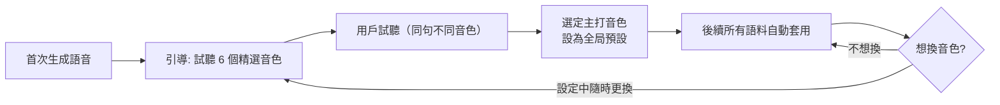

**選擇權規範**（v1.2 簡化版）：
- **首次強制選擇**：第一次生成語音時，引導用戶試聽 6 個精選音色並選定主打（不跳過，建立認同感）
- **全局切換**：設定中可隨時更換主打音色；切換後新語料用新音色，舊語料保留原音色不變
- **不做逐句覆寫**：MVP 不提供單句換音色功能，降低決策疲勞
- **試聽必須**：每個音色都有試聽樣本（同一句語料、不同音色生成），用戶聽過才選（避免盲選後悔）

##### 感情標籤設計（Emotion / Style）— v1.2 精簡為 5 選項

> **設計原則**：感情選項精簡為 3-5 個，降低決策負擔。ElevenLabs v3 模型本身支持豐富情感表達，透過 inline tags 可在同一音色中自然切換語調，不需要大量感情選項。

| 感情標籤 | 適用分類 | 對應語速/語調 |
|---------|---------|-------------|
| 輕鬆 Casual | 朋友幹話、生活闖關 | 中速、自然起伏 |
| 正式 Formal | 社畜日常（會議/簡報） | 穩重、清晰 |
| 激動 Upset | 先吐為快、據理力爭 | 偏快、起伏大 |
| 溫柔 Gentle | 走心時刻、安慰感謝 | 偏慢、柔和 |
| 認真 Serious | 據理力爭、正式道歉 | 平穩、低沉 |

**自動建議**：系統依語料分類自動建議感情（先吐為快→Upset、走心時刻→Gentle、社畜日常→Formal），用戶可接受或改選。
**日文特殊維度**（Phase 2）：增加「敬體/常體」「丁寧/親暱」二級選項。

##### 成本控制與快取

| 項目 | 策略 |
|------|------|
| **快取** | 同句同音色同感情只生成一次，永久快取（除非重生） |
| **字元配額** | 後台控制 ElevenLabs 月字元用量，超量降級（提示用戶） |
| **重生限制** | 每句每日重生上限 3 次（防濫用） |
| **預生成** | 種子庫音檔可預先生成，降低首次延遲 |
| **離線播放** | 音檔下載本地，碎片時間離線播放 |
| **降級方案** | ElevenLabs 服務中斷時，臨時用 iOS AVSpeechSynthesizer（品質降但可用） |

##### 跨平台預留

TTS 封裝為 `ITTSProvider` 介面：
```
interface ITTSProvider {
  generate(text, voiceId, emotion, lang): Promise<AudioFile>
  getVoiceLibrary(lang): Voice[]
}
```
iOS 階段實作 `ElevenLabsTTSProvider`，未來 Android 無縫複用；亦可替換為其他 TTS 供應商。

#### 3.3.2 盲聽播放器（死時間利器）

> **設計目標**：這是「死時間回收」的核心工具。用戶在刷牙、通勤、做家事時，把手機當隨身播放器，反覆盲聽累積龐大輸入量。因此必須**極低操作負擔、可背景播放、可耳機盲操**。

| 功能 | 說明 |
|------|------|
| **第 1-3 遍純盲聽** | 只播放目標語言音檔，不顯示文字（強迫耳朵處理） |
| **次數追蹤** | 記錄每句盲聽次數，餵入寵物成長值（+2/遍）與狀態 |
| **清單循環** | 多句循環播放，適合通勤/家事長時間場景 |
| **背景播放** | 支援鎖屏/背景播放控制（死時間不需盯螢幕） |
| **耳機控制** | 支援耳機按鍵操作（播放/暫停/上下句），口袋裡就能操作 |
| **鎖屏小工具** | 鎖屏直接顯示播放控制，不解鎖即可操作 |
| **預測偵測**（第 4-6 遍）| 盲聽達第 4 遍後，提示用戶「試著在播出前自己說出來」；若用戶標記「我預測成功了」，觸發高成長值（+20 XP）與寵物慶祝 |

#### 3.3.3 影子跟讀模式（Shadowing）

| 功能 | 說明 |
|------|------|
| **第 4-5 遍跟讀** | 動嘴模仿，建立嘴部肌肉記憶 |
| **同步歌詞** | 顯示目標語言文字（日文附 furigana） |
| **錄音比對**（可選） | 錄下自己的跟讀，與原音對比播放 |
| **解鎖門檻** | 盲聽滿 3 遍才解鎖跟讀（鐵律強制） |

#### 3.3.4 順序鐵律強制

> ⚠️ **盲聽 → 預測 → 跟讀順序不可顛倒**。一開始就跟讀只是鸚鵡學舌，大腦未真正處理語言。

UI 引導：跟讀按鈕預設鎖定，盲聽滿 3 遍後亮起，附說明「先讓耳朵熟悉，再讓嘴巴跟上」。

---

### 階段 ④　Excel 錯題庫檢測系統（App 全自動管理）⭐

> **核心變革**：傳統學習法要「用戶自己開 Excel 手動標記」。本 App **把這個過程自動化**——錯題庫的維護、排序、紅綠標記、隔日複習排程全部由 App 管理，用戶只需「看中文、開口說、自評卡住與否」，其餘交給系統。降低摩擦，但保留「自己誠實面對卡頓」這個無可取代的學習核心。

#### 3.4.1 檢測流程（App 自動管理）

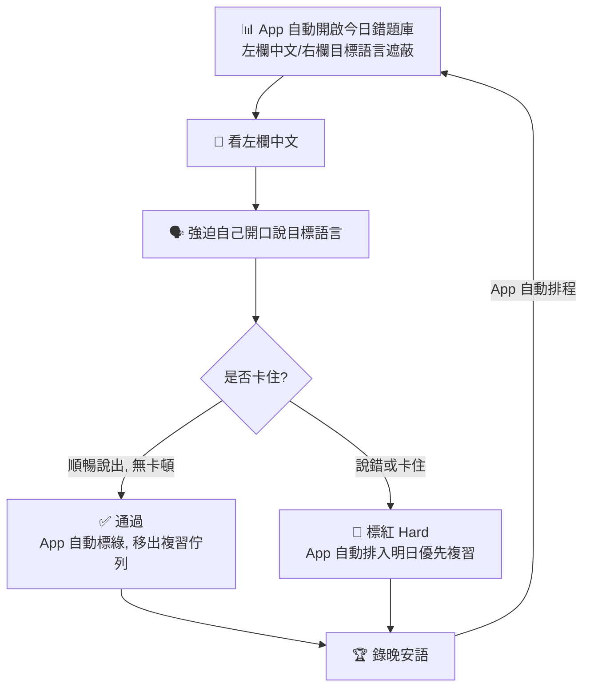

> **「卡住」是最核心的衡量訊號**：這套系統沒有「80 分或 90 分」，只有明確的「通過」或「卡住」。卡住代表大腦正在經歷神經重新連結的「摩擦感（discomfort）」——這是學習正在發生的證明，不是失敗。

#### 3.4.2 Smart Excel System — 六級間隔複習機制（v1.2 新增）⭐

> **核心問題**：語料只會進不會出，長期後檢測佇列會無限增長。需要一個「淘汰機制」讓真正精通的句子退出日常佇列，確保用戶每天檢測量控制在 30 分鐘以內。

**六級間隔複習（Spaced Review）級別設計**：

| 級別 | 名稱 | 間隔 | 觸發條件 | 設計理由 |
|------|------|------|---------|---------|
| L0 | Red Queue（每日優先） | 每天 | 昨天標紅 / 入庫 < 7 天的新語料 | 新鮮語料必須高頻接觸 |
| L1 | 初次通過 | 3 天後複測 | 首次無卡頓通過 | 3 天是最短的記憶衰減窗口 |
| L2 | 短期穩固 | 7 天後複測 | L1 通過後 | 一週後仍能說出 = 初步固化 |
| L3 | 中期穩固 | 14 天後複測 | L2 通過後 | 兩週後仍能說出 = 中期記憶 |
| L4 | 長期穩固 | 30 天後複測 | L3 通過後 | 一個月後仍能說出 = 長期記憶 |
| L5 | Mastered Pool（精通區） | 月度喚醒 | L4 通過後（累計 5 次連續通過） | 正式退出日常佇列 |

**級別回退規則**：每個級別如果複測時卡住，**退回 L0**（回到每日優先佇列），而不是只退一級。這是因為「卡住」代表輸出通道斷裂，需要重新從高頻接觸開始修復。

**Mastered Pool 月度喚醒**：進入精通區後，每月隨機抽 5-10 句做喚醒測試。如果喚醒失敗，該句回到 **L2（7 天間隔）** 而非 L0，避免打擊感太重——畢竟這個句子曾經精通，不需要從頭來過。

**每日檢測量控制**：透過六級間隔機制，即使用戶累積了 300 句語料，每天真正需要檢測的可能只有 10-15 句（紅句 + 到期複習句），30 分鐘以內可以完成。

#### 3.4.3 App 自動管理的職責劃分

| 工作 | 傳統手動 Excel | 本 App |
|------|--------------|--------|
| 錯題庫維護 | 用戶手動建表 | ✅ **App 自動**：語料入庫即自動建表 |
| 中/外語遮蔽 | 用戶手動遮右欄 | ✅ **App 自動**：介面遮蔽 + 點擊揭示 |
| 紅綠標記 | 用戶手動標色 | ✅ **App 自動**：依自評一鍵標記 |
| 間隔複習排程 | 用戶自己記得 | ✅ **App 自動**：六級間隔自動排程（見 3.4.2） |
| Mastered Pool 管理 | 無 | ✅ **App 自動**：連續 5 次通過進入精通區，月度喚醒 |
| 變形同義句生成 | 無 | ✅ **App 自動**：AI 生成紅句的 5 種變形 |
| 進度可視化 | 用戶自己看紅綠比例 | ✅ **App 自動**：掌握度儀表板 |
| **開口說 + 誠實自評卡住** | 用戶 | 用戶（**這步不可被取代**） |

> **唯一保留給用戶的動作**：看中文 → 開口說 → 誠實自評「我有沒有卡住」。這個「親手面對摩擦感」的過程，是任何自動評分都無法取代的學習本質。App 只負責把周邊雜務全部接管。

#### 3.4.4 掌握度衡量標準（行為/生理反應驅動，非時間驅動）⭐

> ⚠️ **關鍵原則：掌握度不是看「學了幾週」，而是看用戶的「真實行為與生理反應」**。時間只是約略參考，真正的判定訊號如下。

**A. 單一句子的掌握度衡量**

| 衡量訊號 | 判定方式 | 代表意義 |
|---------|---------|---------|
| **Excel 測驗「無卡頓輸出」**（最核心）| 看中文、遮外語，開口能順暢說出整句、不卡住 → ✅掌握；若說錯或「卡住」→ 🔴未掌握 | 大腦是否真正建立輸出通道 |
| **盲聽第 4-6 遍「預測能力」** | 聽到第 4、5、6 遍時，能在音檔播出前自己「脫口而出」預測出下一句 | 大腦與嘴部肌肉已產生初步記憶 |

**B. 整體語言能力的掌握度衡量（五 Stage，以行為訊號為準，用戶可自我評估）**

| Stage | 行為訊號（不是看時間！） | 約略對應時間（僅參考）|
|-------|------------------------|---------------------|
| **Stage 1 🌱 起步期** | 連續 7 天打開 App，Excel 全紅也沒關係 | Week 1 |
| **Stage 2 🔄 回憶期** | 表格開始出現 ✅，能回想起 20-30% 內容 | Week 2 |
| **Stage 3 ✨ 靈光期** | 在毫無防備的日常（如刷牙）突然無意識脫口說出之前念不對的句子 | Week 3（分水嶺）|
| **Stage 4 💬 對話期** | 能用學過的固定句型套路，與外國朋友/同事有問有答撐起簡單對話 | Week 4 |
| **Stage 5 🌊 流利期** | 不再死背稿子，能真正用外語思考、回應、切換多句型 | Week 6+ |

> **設計含義**：App 追蹤這些「行為訊號」來建議用戶目前所處 Stage（而非單純算天數）。用戶可自行確認或調整。例如：用戶若持續回報「刷牙時脫口而出」，系統建議進入 Stage 3 靈光期並觸發慶祝。

#### 3.4.5 Week 1 求生版 vs 標準版

| 參數 | Week 1 求生版 | 標準版（Week 3 後） |
|------|-------------|-------------------|
| 每日句子量 | 3-5 句 | 10-20 句 |
| 檢測時間 | 5 分鐘 | 30 分鐘 |
| 標記方式 | 會/不會（兩色） | 紅/黃/綠（三色） |
| 紅句處理 | App 排入明日優先，先不管 | App 自動生成 5 句變形同義句 |
| 成功定義 | 「今天打開了檢測表」 | 「今天說對了幾句」 |

#### 3.4.6 日文檢測特殊處理

- 顯示中文，用戶說日文（含正確讀音）
- 卡住時可提示 furigana 假名讀音
- 敬語正確性檢查（丁寧/常體混用警示）

#### 3.4.7 晚安語錄音（原 Daily Win）

> 晚安語功能詳細規格見 **5.5 晚安語功能**。

- 每日至少挑 1 句最順的，錄下晚安語
- 累積「我的聲音進化史」，強烈正回饋
- 餵入寵物「心情」維度與成長值（最重要的單一事件，+12 XP）

#### 3.4.8 靈光乍現（Clinking）觸發條件與機制 ⭐

> **核心理念**：靈光乍現是語言學習的分水嶺時刻——你在毫無預警的日常場景（刷牙、等電梯、洗碗）中，不自覺地脫口說出之前一直卡住的句子。這是神經迴路真正串聯的證明。

**觸發方式：用戶主動回報（Self-report）**

| 項目 | 說明 |
|------|------|
| **觸發入口** | 畫面上的**浮動 ✨ 按鈕**（始終可見，不影響日常操作） |
| **觸發時機** | 用戶在任何時刻體驗到「脫口而出」的瞬間，立即點擊 ✨ 按鈕 |
| **回報內容** | 簡短記錄：哪句話脫口而出、在什麼場景（選填） |
| **即時回饋** | 觸發 +25 XP、寵物大慶祝動畫、全屏✨特效 |
| **Stage 判定** | 首次回報靈光乍現 → 系統建議進入 **Stage 3 ✨ 靈光期** |

**防濫用機制**：

| 風險 | 機制 |
|------|------|
| **浮報刷 XP** | 靈光乍現為「低頻高獎勵」事件，系統偵測**異常高頻回報**（如一天超過 3 次）時，自動降權（後續回報 XP 遞減：+25 → +10 → +5） |
| **無腦連點** | 同一句話 24 小時內只計首次靈光乍現 |
| **數據監控** | 後台追蹤各用戶靈光乍現頻率分佈，異常偏高的數據點標記供分析 |

---

### 階段 ⑤　六週時間線與每日時間結構（The 6-Week Timeline）

#### 3.5.1 每日時間結構：求生期 8 分鐘 / 標準期 30 分鐘 + 死時間利用 ⭐

> 這套學習法的時間哲學：**每天只需有限專注時間，其餘全部建立在「死時間（dead time）」上**。

| 時期 | 專注時間 | 死時間（碎片） | 設計理由 |
|------|---------|-------------|---------|
| **Week 1-2 求生期** | **8 分鐘/天**（預習 3 分鐘 + 檢測 5 分鐘） | 盲聽+跟讀（跟通勤重疊） | 第一週充滿摩擦感，8 分鐘保護用戶度過陣痛期 |
| **Week 3+ 標準期** | **30 分鐘/天**（預習 5 分鐘 + 檢測 25 分鐘） | 盲聽+跟讀 1-2 小時+ | 度過陣痛期後，30 分鐘專注 + 死時間回收龐大輸入輸出量 |

> **核心洞察**：龐大的輸入輸出量不是靠「再擠出時間」，而是**把本來就會浪費掉的死時間回收**。刷牙、通勤、做家事時，耳朵和嘴巴是空著的——App 的盲聽播放器就是為此設計（背景播放、耳機控制、循環清單）。
>
> **求生期 vs 標準期**：8 分鐘是 Week 1-2 的產品策略（保護用戶度過摩擦期），30 分鐘是 Michel 原意的標準版（Week 3 後）。區分兩者能讓團隊明白這個設計的用心。

#### 3.5.2 進度可視化（行為訊號驅動，v1.2 統一）

> **關鍵原則（v1.2 統一）**：底層邏輯統一為「行為訊號為主、時間為參考」。系統追蹤用戶的真實行為訊號（紅→綠轉換率、脫口而出回報、基礎對話能力）來判定里程碑，而非單純計算天數。這能徹底消除開發團隊在實作邏輯上的困惑——如果用戶一週沒開 App，日曆上的「Week 2」對他毫無意義。

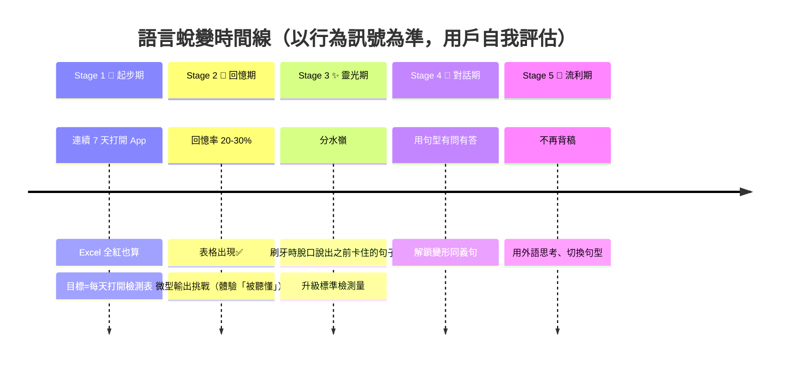

#### 3.5.3 每週成功標準與功能解鎖

（見 2.3 節表格）

---

## 四、寵物系統設計（核心章節）

> **配套文件**：寵物視覺行為規格、Bond 親密度計算公式、四維度（Hunger/Mood/Health/Bond）數值運算細節，詳見 **`pet-system-design.md`**。本文檔聚焦產品層設計邏輯，技術實作規格以該文件為準。

### 4.1 世界觀與身份

#### 4.1.1 世界觀

在 Selah 上住著一種名為**「語言精靈（Word Sprite）」**的生物。牠們以人類的「語言能量」為食——當你真實地使用、學習一種語言，精靈就會獲得養分成長；若你長時間不再輸出語言能量，精靈會虛弱、沉睡。

**核心隱喻**：你的學習狀態 = 精靈的生命力。牠不是監督你的工具，而是**與你共生的夥伴**——你學得好，牠過得好；你停下來，牠會難過但不會責怪你。

#### 4.1.2 身份設定

| 屬性 | 設定 | 理由 |
|------|------|------|
| **種類** | 語言精靈 Word Sprite（虛構生物，非現實動物） | 跨文化中性、可愛、可塑性高 |
| **數量** | **單一主角**（一隻） | 集中情感投射，避免分散；架構預留多品種擴展 |
| **命名** | 用戶自命名（孵化時） | 建立自主性與關聯性 |
| **性格** | 溫柔、好奇、鼓勵型（永不責備） | 情感安全感，符合陪伴者定位 |
| **語言** | 會「說」用戶的目標語言（簡單字詞），隨學習進度解鎖更多詞彙 | 與學習綁定，產生驚喜 |

### 4.2 形態生命週期（組合式：核心簡單 + 預留擴展）

#### 4.2.1 核心形態線（對應六週）

```mermaid
graph LR
    E["🥚 蛋<br/>註冊後初始"] -->|首次檢測(50 XP)| B["🐣 幼體<br/>W1-2"]
    B -->|300 XP 累積| G["🐤 成長期<br/>W2-3"]
    G -->|1000 XP 累積| M["🦜 成熟期<br/>W3-4"]
    M -->|3000 XP 累積| E2["✨ 傳說型<br/>W6+"]
```

| 形態 | 觸發條件（XP 行為驅動）| 約略對應時間 | 外觀特徵 | 可執行行為 |
|------|----------------------|-------------|---------|-----------|
| 蛋 | 註冊即有 | Day 0 | 純色蛋，會輕微晃動 | 等待孵化（首次檢測儀式） |
| 幼體 | 累積 **50 XP**（首次檢測 + 幾次練習即可達到）| Day 1-2 | 小巧、大眼、呆萌 | 打招呼、撒嬌、簡單表情 |
| 成長期 | 累積 **300 XP**（約連續 3 天認真練習）| ~Week 1-2 末 | 體型變大、有翅膀/角萌芽 | 互動更多、開始說目標語言字詞 |
| 成熟期 | 累積 **1000 XP**（約 Week 3-4）| ~Week 3-4 | 完整形態、可飛行/特效 | 完整情緒表達、說短句 |
| 傳說型 | 累積 **3000 XP**（約 Week 6+）| ~Week 6+ | 特殊光效、稀有外觀 | 解鎖隱藏對白 |

> **注意**：所有形態進化由 **XP（行為）** 驅動，非「連續幾天」或「累積幾天」等時間指標。XP 數值詳見 4.3.2 成長值事件表。上表的「約略對應時間」僅為參考，假設用戶每日約獲得 80-120 XP。

#### 4.2.2 預留擴展（組合式架構）

形態系統設計為**數據驅動**，未來可擴展：
- **進化分支**：成長期依用戶學習偏好分岐（如英文主攻→商務型、日文動漫→和風型）
- **多品種**：成熟期可選擇不同品種精靈（架構預留，MVP 不開放）
- **外觀配件**：帽子、背景、特效（長期 monetization 點，MVP 不做）

### 4.3 ⭐ 寵物成長值系統（Growth / XP）— 與練習行為深度綁定

> **核心問題**：寵物的成長應該如何定義？如何和用戶的練習相關聯？
>
> **答案**：寵物成長不是看「時間」，而是看用戶的**真實練習行為與成果**。答對、答錯、預測成功、靈光乍現……每種行為都提供**不同的成長值**，讓寵物的成長精準反映用戶的學習質量，而非單純的打卡次數。

#### 4.3.1 成長值的設計哲學

| 原則 | 說明 |
|------|------|
| **行為驅動，非時間驅動** | 成長值來自具體學習行為的「質量」，不是開 App 時長 |
| **答對 > 答錯，但答錯不歸零** | 答對給高成長值；答錯給少量「嘗試值」（保護勝任感，鼓勵面對摩擦） |
| **深度學習 > 表面打卡** | 預測成功、靈光乍現等「深度掌握訊號」給最高成長值 |
| **可量化、可調校** | 所有數值後台可配置，上線後依數據平衡 |

#### 4.3.2 成長值事件表（Growth Events）⭐

下表定義**每種練習行為提供多少成長值（XP）**。成長值累積後推動寵物形態進化（見 4.3.4）。

| 練習行為 | 成長值 XP | 影響的狀態維度 | 設計理由 |
|---------|----------|--------------|---------|
| **檢測答對（無卡頓輸出 ✅）** | **+15** | Hunger +10、Mood +5、Bond +1 | 核心掌握訊號，最高價值行為 |
| **檢測答錯（卡住 🔴）** | **+3**（嘗試值） | Mood 不扣 | 面對摩擦、不放棄本身值得鼓勵；但不給高值避免「亂答刷分」 |
| **盲聽第 4-6 遍預測成功**（脫口而出）| **+20** | Hunger +3、Mood +8、Bond +1 | 肌肉記憶形成訊號，深度學習的標誌，給最高值 |
| **盲聽 1 遍**（純輸入）| **+2** | Hunger +1 | 基礎輸入，價值低但不可少 |
| **跟讀 1 遍** | **+5** | Hunger +3、Mood +2 | 輸出練習，價值高於純聽 |
| **完成夜間預習**（搞懂生詞）| **+8** | Hunger +5、Mood +3 | 理解率建構，間接提升盲聽成效 |
| **完成晚安語錄音** | **+12** | Mood +15、Bond +1 | 每日最重要的正回饋事件 |
| **靈光乍現回報**（用戶主動標記）| **+25** | Mood +20、Bond +2 | 神經串聯時刻，里程碑級事件，給最高值 |
| **語料產出**（語音/題材收集）| **+6** | Hunger +3、Mood +2 | 語料庫建構，系統根基 |
| **完成急救任務**（危險期可救）| **+30** | Health +40、Mood +20 | 挽救生命的高價值行為 |
| **連續 Streak 達標** | **+5/天加成** | Bond +0.5/天 | 習慣維持的累積獎勵 |

> **關鍵差異化**：答對（+15）顯著高於答錯（+3），但答錯仍有 +3 而非 0——這是刻意的。學習法核心是「擁抱摩擦感」，給答錯少量成長值，能避免 Week 1 全紅時用戶覺得「做了等於沒做」而放棄。

#### 4.3.3 成長值的反作弊與防刷機制

| 風險 | 機制 |
|------|------|
| **重複刷同一句答對** | 同句 24 小時內只首次答對給完整 XP，之後複習給遞減 XP（+15 → +5 → +2） |
| **盲聽掛機刷次數** | 盲聽需實際播放完成才計次（偵測播放進度），不可快進 |
| **亂答騙嘗試值** | 答錯 XP 低（+3），且每日答錯總 XP 設上限（如每日最多 +15） |
| **靈光乍現浮報** | 靈光乍現為「低頻高獎勵」事件，系統偵測異常高頻標記會降權 |

#### 4.3.4 每日 XP 上限

| 規則 | 說明 |
|------|------|
| **每日 XP 上限** | **200 XP/天**（後台可調）。超過部分不計入累積 XP，避免暴衝進化 |
| **自然控制** | 反作弊機制（同句遞減、答錯上限）會自然壓低邊際收益，大多數認真用戶不會觸及上限 |
| **例外事件** | 靈光乍現（+25）不受上限限制（里程碑級事件，不該被壓制） |
| **設計理由** | 防止「週末狂練 8 小時一次進化三階」的脫節體驗，讓進化節奏穩定 |

> 以附錄 A 試算為例，認真練習約 113 XP/天，遠低於 200 上限，正常用戶不會觸及。

#### 4.3.5 成長值 → 寵物形態進化（升級規則）

成長值累積到門檻即觸發形態進化（呼應 4.2.1 形態線）：

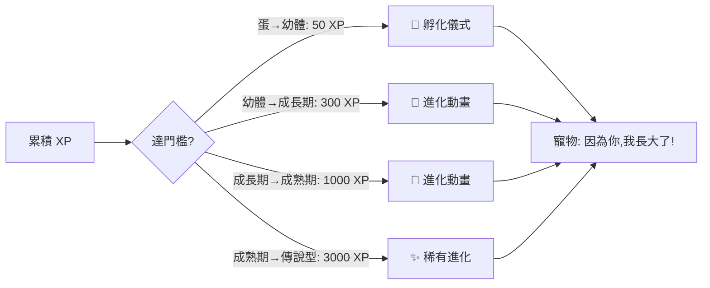

| 進化階段 | 累積 XP 門檻 | 約略達成時間（每日認真練）| 儀式 |
|---------|-------------|----------------------|------|
| 蛋 → 幼體 | 50 XP | Day 1-2（首次檢測 + 幾次練習）| 孵化動畫 + 命名 |
| 幼體 → 成長期 | 300 XP | 約 Week 1 末 | 進化動畫 + 解鎖新互動 |
| 成長期 → 成熟期 | 1000 XP | 約 Week 3-4 | 進化動畫 + 解鎖說短句 |
| 成熟期 → 傳說型 | 3000 XP | 約 Week 6+ | 稀有特效 + 隱藏對白 |

> **設計要點**：門檻設計讓「認真練習的用戶」能在六週內走完整條進化線，與六週時間線呼應。XP 門檻同樣後台可調。

#### 4.3.6 成長值與掌握度的雙向關係

成長值系統與「掌握度衡量」（見 **3.4.3**）互為表裡：
- **掌握度**衡量「句子/整體能力學會了沒」（學習成效指標）
- **成長值**衡量「寵物長大了多少」（動機回饋指標）
- 兩者數據來源相同（答對/答錯/預測），但用途不同：掌握度驅動學習路徑，成長值驅動情感動機

### 4.4 ⭐ 寵物狀態機（State Machine）

這是寵物行為「有規可循」的基礎。所有狀態變化都是**可量化、狀態驅動**的，不是隨機的。

#### 4.4.1 四個狀態維度

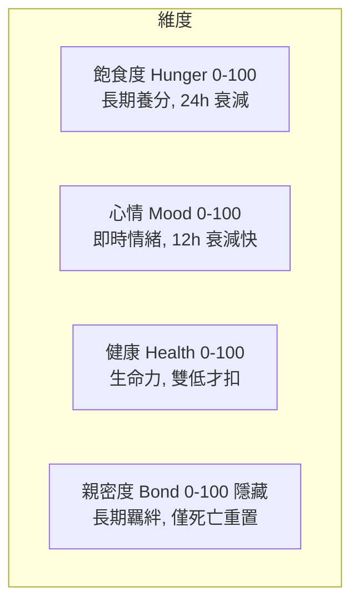

#### 4.4.2 狀態維度詳細規範

> 以下為各維度的衰減與補充概要。**完整的事件→維度對應表（含 XP）見 4.7 綁定規則總表**。

| 維度 | 範圍 | 衰減速率 | 補充方式 | 上限/下限 |
|------|------|---------|---------|----------|
| **飽食度 Hunger** | 0-100 | 每 24 小時 -15（自然飢餓） | 完成檢測 +10/句、預習 +5、跟讀 +3 | 上限 100，≤20 進入飢餓 |
| **心情 Mood** | 0-100 | 每 12 小時 -10（情緒波動） | 晚安語 +15、過關句 +5/句、寵物互動 +2 | 上限 100，≤30 情緒低落 |
| **健康 Health** | 0-100 | 飽食≤20 且心情≤30 持續 24h → -8/天；否則不扣 | 任何學習行為 +1-2（緩慢恢復） | 上限 100，≤20 進入生病 |
| **親密度 Bond** | 0-100 | 僅死亡時部分重置，平時不衰減 | 每日達標 +1、連續 streak +0.5/天加成 | 長期累積，影響寵物互動深度 |

#### 4.4.3 狀態組合 → 寵物整體狀態判定

| 條件 | 整體狀態 | 外觀 | 行為傾向 |
|------|---------|------|---------|
| Health > 60 且 Hunger > 40 | 🟢 健康 | 活潑、發光 | 開心互動 |
| Hunger ≤ 30 或 Mood ≤ 40 | 🟡 低落 | 委屈、摸肚子 | 討食物、求陪伴 |
| Health ≤ 30 或（飢餓+低落持續）| 🟠 生病 | 臥床、出汗 | 推播求救 |
| Health ≤ 15（進入緩衝期）| 🔴 危險 | 倒數計時光圈 | 強推播 + 急救任務 |
| Health = 0（緩衝期過）| 💤 沉睡 | 變回蛋 | 重新孵化 |

### 4.5 ⭐ 死亡 / 重生機制（緩衝 + 警告 + 可救）

**設計原則**：用「沉睡」取代「死亡」字眼；多階段衰退 pipeline，每階段都可挽救；死亡後果控制在可承受範圍。

#### 4.5.1 衰退 Pipeline

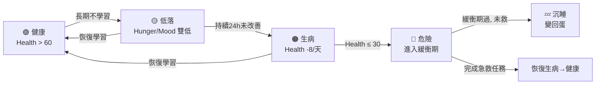

#### 4.5.2 各階段詳細規範

| 階段 | 觸發條件 | 持續時間 | 寵物表現 | 推播策略 | 可救方式 |
|------|---------|---------|---------|---------|---------|
| **🟢 健康** | Health > 60 | — | 正常活潑 | 無（例行提醒） | 維持學習 |
| **🟡 低落** | Hunger ≤ 30 或 Mood ≤ 40 | — | 委屈、討食物 | 每日 1 次軟性提醒：「精靈肚子咕嚕叫了」 | 完成任意學習 |
| **🟠 生病** | Health ≤ 30 或低落持續 24h | — | 臥床、無力 | 每日 2 次提醒：「精靈生病了，需要你的能量」 | 連續 2 天完成檢測 |
| **🔴 危險** | Health ≤ 15 | **緩衝期 72 小時** | 倒數光圈、虛弱 | 高頻提醒 + 鎖屏倒數 | **急救任務**：完成 3 句檢測 + 1 個晚安語 |
| **💤 沉睡** | 緩衝期結束未救 | — | 變回蛋 | 沉睡通知 | **復活藥** 或 **重新孵化** |

#### 4.5.3 急救任務（危險期可救）

進入危險階段後，用戶可透過「急救任務」挽回：
- **任務內容**：完成 3 句檢測（不論對錯，重點是「完成行為」）+ 錄 1 個晚安語
- **效果**：Health 立即恢復到 40（脫離危險），進入恢復期
- **設計意圖**：門檻低、聚焦「行為」而非「結果」，符合「重新定義成功」

#### 4.5.4 復活藥（稀有）

| 屬性 | 規範 |
|------|------|
| **取得** | 用 streak 貨幣（學習能量）兌換，需連續 7 天 streak 累積 |
| **用途** | 沉睡狀態直接喚醒，免重新孵化 |
| **限制** | 每月上限 1 顆，避免濫用 |
| **保留** | 使用復活藥：形態維持沉睡前、親密度 -25%（部分重置） |

#### 4.5.5 死亡後果控制（降低創傷）⭐

**核心原則：用戶最大的投入必須 100% 保留，只損失「可重建」的部分。**

| 項目 | 沉睡後處理 | 理由 |
|------|-----------|------|
| **語料庫** | ✅ 100% 保留 | 用戶最大投入，絕不損失 |
| **檢測進度（紅綠標記）** | ✅ 100% 保留 | 學習成果不歸零 |
| **晚安語錄音** | ✅ 100% 保留 | 情感記憶 |
| **Streak** | ⚠️ 歸零 | 自然後果，但可重新累積 |
| **學習能量貨幣** | ⚠️ 保留 50% | 部分損失，激勵但不殘酷 |
| **寵物形態** | ⚠️ 回退一階（如成長期→幼體） | 有損失感但非歸零 |
| **親密度 Bond** | ⚠️ -50% | 有情感成本，可重建 |
| **用戶等級/勳章** | ✅ 100% 保留 | 長期成就不歸零 |

### 4.6 ⭐ 寵物行為規範表（Behavior Spec）

這是「寵物動作行為有規可循」的核心。每個行為定義：**觸發條件 → 動畫 → 對白 → 對用戶的影響**。

#### 4.6.1 行為總綱

> **核心原則：寵物永不責備用戶。牠是陪伴者，不是監工。**
> 懲罰的形式是「自然後果」（餓、病），不是「指責」（你怎麼不學習）。
> 當用戶失敗時，寵物表現「難過陪伴」而非「失望責備」。

#### 4.6.2 日常行為規範表

| 觸發條件 | 動畫 | 對白（繁中） | 對用戶影響 |
|---------|------|------------|-----------|
| **打開 App** | 依心情打招呼（健康時跳躍/低落時緩緩抬頭） | 「回來啦！我想你了」/「...你來了，抱抱」 | Mood +2，溫暖迎接 |
| **檢測 ✅ 一句** | 跳躍歡呼、撒花特效 | 「太棒了！這句說得真好」 | Mood +5，Hunger +10 |
| **檢測 🔴 卡住** | 拍拍用戶、遞毛巾 | 「沒關係，明天再來。我也常卡住呢」 | Mood 不扣，鼓勵 |
| **完成晚安語** | 大跳舞、煙火 | 「這句超順！我錄下來了，以後可以回味」 | Mood +15，Bond +1 |
| **連續 3 天達標** | 罕見慶祝動畫（變動比率驚喜） | 「你最近好棒！給你一個秘密驚喜🎁」 | 隨機獎勵（外觀/貨幣） |
| **Streak 中斷** | 難過陪伴在身旁、不責備 | 「...今天累了嗎？沒關係，我陪你」 | 不懲罰，僅 Mood 略降 |
| **飽食 < 30%** | 摸肚子、咕嚕叫 | 「咕嚕...有點餓了，學一兩句餵我好嗎？」 | 軟性提醒，非指責 |
| **心情 < 30%** | 委屈、躲角落 | 「...最近覺得有點孤單，跟我說說話嘛」 | 提示晚安語/互動 |
| **生病** | 臥床、出汗、咳嗽 | 「咳咳...沒力氣，需要你的語言能量」 | 強推播急救 |
| **危險期倒數** | 虛弱、光圈倒數 | 「...我好想留下來，但需要你...」 | 鎖屏倒數 + 急救任務 |
| **長時間未開 App（回歸）** | 含淚迎接、撲上來 | 「你回來了！我一直在等你」 | 不責備，迎接回歸 |
| **達成階段性目標** | 進化動畫、發光 | 「因為你，我長大了！謝謝你」 | 形態進化 + Bond 大幅 + |
| **用戶生日/節慶** | 特殊造型、驚喜 | 「生日快樂！這是給你的禮物🎁」 | 限定外觀/獎勵 |

#### 4.6.3 變動比率增強（Variable Ratio）應用

為避免獎勵機械化導致動機鈍化，引入變動比率（老虎機原理）：
- **每連續 3 天達標**，有 30% 機率觸發「罕見驚喜動畫」（隱藏外觀/貨幣/彩蛋對白）
- **每次晚安語**，有 10% 機率寵物「學會一個新的目標語言字詞」並展示
- **不確定性 = 多巴胺**，維持長期新鮮感

#### 4.6.4 行為的語言成長（寵物學說話）

寵物會隨用戶學習進度，逐漸「學會」目標語言字詞：
- 幼體：只會用繁中 + 簡單音效
- 成長期：學會 5-10 個目標語言字詞（Hello / ありがとう 等），隨機穿插
- 成熟期：能說短句，與用戶的目標語言互動
- **字詞來源**：從用戶已過關的語料中抽取（自我相關性延伸到寵物）

### 4.7 學習事件 → 寵物影響綁定規則（量化總表）

這張表是「學習行為如何影響寵物」的**最終單一事實來源（single source of truth）**，整合狀態維度（Hunger/Mood/Health/Bond）與成長值（XP）。確保行為規範可落地工程。

| 學習事件 | XP | Hunger | Mood | Health | Bond | 備註 |
|---------|-----|--------|------|--------|------|------|
| 打開 App（每日首次）| +1 | — | +2 | — | — | 溫暖迎接 |
| 完成夜間預習 | +8 | +5 | +3 | — | — | 每句 |
| 盲聽 1 遍（純輸入）| +2 | +1 | — | — | — | 每句每遍 |
| **盲聽第 4-6 遍預測成功** | **+20** | +3 | +8 | — | +1 | 肌肉記憶訊號，高值 |
| 跟讀 1 遍 | +5 | +3 | +2 | — | — | 每句每遍 |
| **檢測答對 ✅（無卡頓）** | **+15** | +10 | +5 | — | — | 核心掌握訊號 |
| **檢測答錯 🔴（卡住）** | **+3** | — | **不扣** | — | — | 嘗試值，鼓勵面對摩擦 |
| 完成晚安語 | +12 | — | +15 | — | +1 | 每日最重要正回饋 |
| **靈光乍現回報** | **+25** | — | +20 | — | +2 | 里程碑級事件 |
| 語料產出（語音/題材）| +6 | +3 | +2 | — | — | 每句 |
| 連續 Streak 達標 | +5/天 | — | — | — | +0.5/天 | 累積加成 |
| 24h 無任何學習 | — | -15 | -10 | 視雙低而定 | — | 自然衰減 |
| 完成急救任務 | +30 | — | +20 | **+40（脫離危險）** | — | 危險期可救 |

> **設計重點**：
> 1. 所有數值可調（後台配置），上線後依數據調校平衡。
> 2. **答錯 🔴 不扣 Mood、反而給 +3 XP** 是刻意的——保護 Week 1 用戶的勝任感，鼓勵面對「摩擦感（discomfort）」。
> 3. **預測成功（+20）與靈光乍現（+25）是最高值事件**，獎勵「深度掌握」而非「表面打卡」，呼應學習法的核心。
> 4. XP 推動形態進化（4.3.4），狀態維度驅動日常行為與生死（4.4、4.5），兩條線分工明確。

---

## 五、UX 與資訊架構

### 5.1 主要導覽結構（底部 Tab）

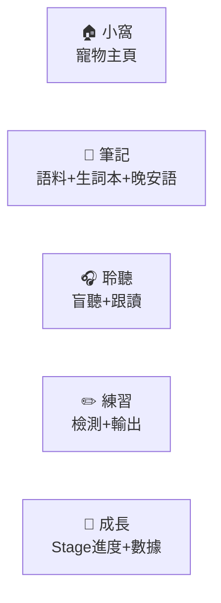

| Tab | 核心內容 | 主要任務 |
|-----|---------|---------|
| **小窩（首頁）** | 寵物 + 狀態條 + 今日任務 + 晚安語錄音入口 + 新手引導入口 | 情感連結、每日儀式 |
| **筆記** | 共鳴題材 + 語音輸入 + 種子庫 + 我的語料 + 生詞本 + 晚安語歷史 | 產出語料、管理筆記 |
| **聆聽** | 盲聽播放器 + 跟讀模式 + 夜間預習入口 | 輸入（聽覺） |
| **練習** | Excel 檢測表 + 紅綠標記 + 微型輸出挑戰 | 輸出（開口說） |
| **成長** | Stage 進度 + 功能解鎖 + 進化路徑 + 數據統計 | 看見進步 |

> **Tab 順序設計理由**：聆聽 → 練習（輸入 → 輸出），符合學習法的自然順序。先聽、再說。

### 5.2 關鍵畫面 Wireframe（文字描述）

#### 畫面 1：小窩首頁（情感核心）
- **中央**：寵物大圖，依狀態顯示對應動畫與表情
- **頂部**：四狀態條（飽食/心情/健康/親密度）以圖示呈現
- **📖 新手引導按鈕**：右上角，點擊可重新觀看 4 步驟新手引導（見 5.4）
- **下方**：「今日任務」卡片（預習 8-10 句、檢測 3 句、錄晚安語），完成打勾
- **晚安語錄音卡片**：專屬卡片入口，點擊展開底部 Bottom Sheet（麥克風 + 文字輸入）；檢測完成後也會出現晚安語入口
- **浮動按鈕**：✨ 靈光乍現按鈕（始終可見）
- **狀態異常時**：頂部出現警示橫幅（如「精靈生病了，點我急救」）

#### 畫面 2：語料庫 - 共鳴題材
- **頂部**：「今日靈感」精選 3 題材卡（大圖+觸發問題）
- **學習覆蓋度**：圓餅圖/橫條圖顯示 6 大分類語料佔比（社畜日常/朋友幹話/先吐為快/走心時刻/據理力爭/生活闖關），低於 10% 的分類高亮提示
- **分類標籤**：💼社畜日常 / 💬朋友幹話 / 💨先吐為快 / 💕走心時刻 / 🗣️據理力爭 / 🌍生活闖關
- **題材卡**：標題 + 觸發問題 + 「我來說說」按鈕
- **底部**：自由語音 / 場景掃描入口

#### 畫面 3：語音輸入確認
- **大麥克風按鈕**（按住說話）
- **文字框**：即時顯示轉錄文字
- **下方**：「重新錄製」「確認送出」按鈕
- **完成後**：進入翻譯結果預覽（中/目標語言對照 + 音色選擇）

#### 畫面 4：檢測表
- **列表**：每句一行，左中文/右目標語言（遮蔽）
- **操作**：點中文→說目標語言→自評✅/🔴
- **頂部**：今日進度（3/5）、Week 1/標準模式切換

#### 畫面 5：音色選擇（句子入庫後）
- **音色卡**：試聽按鈕 + 性別/口音標籤
- **感情選擇**：滑動選擇器（輕鬆/正式/激動...）
- **生成按鈕**：呼叫 ElevenLabs，顯示生成進度

### 5.3 推播策略（與寵物狀態綁定）

| 推播類型 | 觸發 | 內容範例 | 頻率 |
|---------|------|---------|------|
| **夜間預習提醒** | 設定時間 | 「精靈的睡前故事準備好了，3 分鐘搞定明天」 | 每日 1 次 |
| **晚安語提醒** | 晚間 | 「今天最順的一句是？錄下來給精靈聽」 | 每日 1 次 |
| **飢餓提醒** | Hunger ≤ 30 | 「咕嚕...精靈肚子餓了」 | 每日最多 1 次 |
| **生病/危險** | 狀態觸發 | 「精靈生病了，需要你的能量」 | 每日最多 2 次 |
| **回歸迎接** | 長時間未開 | 「你回來了！我一直在等你」 | 僅回歸時 1 次 |
| **驚喜彩蛋** | 達標 + 變動比率 | 「的秘密驚喜等著你🎁」 | 隨機，不超過週 2 次 |

> **疲勞控制**：每日推播上限 3 條；用戶可自訂接收時段；尊重勿擾模式。

### 5.4 新手引導（Beginner Guide）

首次使用 App 時，顯示 **4 步驟引導覆疊（Overlay）**，幫助用戶快速理解核心流程：

| 步驟 | 內容 | 畫面焦點 |
|------|------|---------|
| **Step 1** | 「歡迎來到 Selah！這是你的語言精靈，牠會陪你一起成長」 | 高亮寵物 + 狀態條 |
| **Step 2** | 「每天睡前花 5-7 分鐘預習明天的句子，就像睡前故事」 | 高亮夜間預習入口 |
| **Step 3** | 「通勤、刷牙時打開聆聽，讓耳朵先熟悉」 | 高亮聆聽 Tab |
| **Step 4** | 「準備好了就來練習，開口說就對了！卡住也沒關係」 | 高亮練習 Tab |

| 項目 | 說明 |
|------|------|
| **首次顯示** | 新用戶首次進入 App 時自動顯示，可跳過 |
| **重新觀看** | 小窩頁面右上角 📖 按鈕，隨時可重新觀看引導 |
| **設計原則** | 每步聚焦一個核心概念，文案簡短親切，配合寵物對白增加趣味 |

### 5.5 晚安語功能（取代 Daily Win）⭐

> **核心理念**：每天睡前，用一句話為自己的一天畫下句點。晚安語是 Daily Win 的進化版——不僅記錄學習成就，更承載一天的情感與溫度。

**錄音入口**：

| 入口 | 說明 |
|------|------|
| **小窩頁面專屬卡片** | 小窩首頁的「晚安語」卡片，隨時可點擊錄製 |
| **檢測完成後** | 完成當日檢測後，自動出現晚安語錄音入口 |

**錄製介面**：

- **形式**：底部 Bottom Sheet 彈出
- **輸入方式**：麥克風錄音 + 文字輸入（二選一或並用）
- **內容**：挑選今天最順的一句（或自由發揮），用目標語言說出
- **累積效果**：形成「我的晚安語日記」，可在筆記 Tab 中回顧聲音進化史
- **寵物回饋**：錄製完成後寵物大跳舞 + 煙火慶祝，Mood +15、Bond +1、XP +12

---

## 六、遊戲化與回饋系統

### 6.1 核心循環


### 6.2 機制定義

| 機制 | 說明 | 心理學依據 |
|------|------|-----------|
| **Streak 連續天數** | 連續完成最低門檻（Week 1=打開檢測表）的天數 | 習慣鏈、損失厭惡 |
| **晚安語** | 每日錄最順的一句，累積聲音進化史 | 勝任感、可見進步 |
| **學習能量（貨幣）** | 學習行為獲得，可兌換外觀/復活藥 | 變動比率增強 |
| **進度條心態轉換** | 每句顯示「掌握度進度條」（10%→100%） | 勝任感、打破「全有全無」 |
| **六週時間線解鎖** | 依進度解鎖功能（如 W4 變形同義句） | 目標層次、期待感 |
| **寵物進化儀式** | 達階段目標觸發進化動畫 | 慶祝、關聯性 |

### 6.3 變動比率增強應用點

避免機械化獎勵，在以下點引入隨機性（多巴胺驅動）：
- 連續 3 天達標 → 30% 機率稀有驚喜
- 晚安語 → 10% 機率寵物學會新字詞
- 過關句 → 5% 機率獲得「進化碎片」

### 6.4 進度可視化設計

呼應藍圖的「進度條心態轉換」（從「還有 70% 不會」到「每句都是進度條」）：
- 每句語料顯示掌握度進度條（盲聽次數/檢測狀態綜合計算）
- 週/月統計圖（語料數、過關句、晚安語數）
- 六週時間線主視覺（已完成的週發光）

---

## 七、使用者回饋與資料驅動

### 7.1 關鍵指標（KPI）

| 類別 | 指標 | 目標（參考） |
|------|------|------------|
| **活躍** | DAU、WAU、MAU | — |
| **留存** | Day 1 / Day 7 / Day 30 留存 | Week 1 留存 > 50%（對抗 90% 流失） |
| **核心行為** | 檢測表開啟率、語料產出數/週、晚安語完成率 | — |
| **掌握度** | 紅→綠轉換率、盲聽預測成功率、**靈光乍現回報率**、各掌握階段人數分佈 | Clinking 階段達成率 > 40%（W3）|
| **死時間利用** | 盲聽總時長、背景播放佔比、鎖屏/耳機操作次數 | 盲聽時長 > 30 分鐘/日（死時間回收）|
| **寵物系統** | 寵物死亡率、復活率、急救任務完成率、XP 累積速度 | 死亡率 < 15%、復活率 > 60% |
| **題材系統** | 各題材語料產出率、題材點擊→產出轉換率、**學習覆蓋度均衡性**（6 分類分佈） | — |
| **Smart Excel** | Mastered Pool 進入率、月度喚醒失敗率、每日平均檢測句數 | 每日檢測 ≤ 15 句、喚醒失敗率 < 20% |
| **TTS** | 主打音色設定率、音色/感情選擇分佈、重生率、生成成功率 | 主打音色設定率 > 90%、重生率 < 20% |
| **學習成效** | 紅句→綠句轉換率、變形同義句使用率 | — |

### 7.2 回饋收集機制

| 機制 | 觸發 | 內容 |
|------|------|------|
| **App 內情緒調查** | 每週一次 | 「這週整體感覺？」😊😐😢 + 自由文字 |
| **流失預警問卷** | 偵測活躍下降 | 「最近哪裡卡住了？」選項 + 文字 |
| **寵物死亡後問卷** | 沉睡事件後 | 「精靈沉睡了，你的感受？」+ 訪談邀請 |
| **功能使用埋點** | 持續 | 所有互動事件埋點，供漏斗分析 |

### 7.3 A/B 測試重點

| 測試項目 | 變體 | 關注指標 |
|---------|------|---------|
| **死亡機制嚴格度** | 緩衝 48h vs 72h vs 96h | 死亡率、留存、動機 |
| **推播頻率** | 每日 2 條 vs 3 條 vs 自適應 | 推播開啟率、留存、解除安裝 |
| **寵物 vs 無寵物** | 有寵物組 vs 純進度條組 | Week 1 留存（驗證寵物價值） |
| **題材推薦策略** | 每日精選 vs 個性化推薦 | 語料產出率 |
| **音色預設** | 預設音色 vs 強制選擇 | 完成率、滿意度 |

---

## 八、風險與緩解

| 風險 | 嚴重度 | 緩解策略 |
|------|--------|---------|
| **寵物死亡造成流失** | 高 | 緩衝機制 + 可救 + 語料 100% 保留 + 「沉睡」字眼 + 復活藥 |
| **Week 1 摩擦放棄** | 高 | 8 分鐘 SOP + 共鳴題材降認知負擔 + 語音輸入 + 寵物孵化儀式 + 重新定義成功（全紅也算）+ App 自動管理錯題庫降摩擦 |
| **掌握度自評失真**（用戶自欺標綠）| 中 | 卡住是學習本質、不可由 App 取代；但以「預測成功」「靈光乍現」等客觀行為訊號交叉驗證；提醒用戶「欺騙自己只會卡住進步」 |
| **成長值刷分作弊** | 中 | 24h 內同句遞減 XP + 盲聽播放進度偵測 + 答錯每日 XP 上限 + 靈光乍現低頻高獎勵降權（見 4.3.3）|
| **死時間播放器體驗差**（無法背景/耳機盲操）| 中 | iOS 背景音訊 + 鎖屏控制 + 耳機按鍵 + 中斷自動續播，確保通勤/家事場景可用 |
| **AI 翻譯品質不佳** | 中 | 雙模型交叉驗證 + 人工確認標記 + 用戶回饋修正 |
| **推播疲勞/解除安裝** | 中 | 每日上限 3 條 + 自訂時段 + 勿擾 + 與寵物綁定（軟性） |
| **語音識別錯誤** | 中 | 強制確認流程 + 可編輯 + 連續說多句斷句 |
| **ElevenLabs 成本失控** | 中 | 快取（同句同設定只生成一次）+ 字元配額 + 重生限制（每日 3 次）+ 降級方案 |
| **ElevenLabs 服務依賴** | 中 | TTS 抽象介面 + 降級方案（AVSpeechSynthesizer）+ 預生成種子音檔 |
| **題材內容過時/敏感** | 中 | OTA 即時下架 + 內容審核流程 + 時事題材有效期 |
| **日文翻譯/敬語錯誤** | 中 | 雙模型 + 敬語專門審核 + furigana 輔助 |
| **多用戶同時學兩語言** | 低 | ~~共享寵物，XP 分語言、狀態共享~~（v1.2 已確定） |
| **Mastered Pool 月度喚醒失敗率高** | 中 | 喚醒失敗退回 L2（非 L0），降低打擊感；追蹤喚醒失敗率，若持續偏高則調整 L4→L5 門檻 |

---

## 九、分階段開發路線圖

雖為完整五階段，仍分 4 個里程碑漸進交付，每個里程碑都可獨立驗證價值。

### M0：基礎（驗證動機核心）
**目標**：驗證「寵物 + 檢測表」能否降低 Week 1 放棄率。

| 模組 | 內容 |
|------|------|
| 寵物島首頁 | 寵物顯示 + 狀態條 + 今日任務 |
| 檢測表（求生版） | 中→目標語言遮蔽測驗 + 紅綠標記 + 晚安語 |
| **App 自動管理錯題庫** | 入庫自動建表、遮蔽、紅綠標記、隔日複習排程（用戶只負責開口+自評卡住）|
| **基礎成長值系統** | 答對+15 / 答錯+3 / 晚安語+12，推動蛋→幼體進化 |
| 種子庫 | 20-30 句預置語料（含預生成音檔） |
| 基礎寵物狀態機 | 飽食/心情/健康 + 日常行為規範（簡化版） |
| 基礎形態 | 蛋→幼體→成長期 |

### M1：語料迴圈
**目標**：讓用戶能持續產出個人化語料。

| 模組 | 內容 |
|------|------|
| 共鳴題材系統 | **6 分類題材系統**（社畜日常/朋友幹話/先吐為快/走心時刻/據理力爭/生活闖關）+ AI 自動分類標籤 + 學習覆蓋度視覺化 + OTA 更新 + 今日精選 + 數據回饋 |
| iOS 語音輸入確認流程 | SFSpeechRecognizer + 編輯確認 |
| AI 翻譯雙模型驗證 | 中→英/中→日 + 自然度評分 |
| 夜間加速器 | 文字稿預習 + 生詞標記 + 日文 furigana |

### M2：完整學習迴圈
**目標**：完成盲聽→跟讀→檢測完整肌肉記憶迴圈 + 微型輸出挑戰（Week 2 留存救命丸）。

| 模組 | 內容 |
|------|------|
| **ElevenLabs 音色選擇生成** | **主打音色全局設定**（6 精選音色 + 試聽）+ 感情自動建議 + 快取 + 重生 |
| **死時間盲聽播放器** | 背景播放 + 鎖屏小工具 + 耳機盲操 + 循環清單 |
| **預測能力偵測** | 第 4-6 遍預測偵測 + 預測成功高 XP（+20）+ 寵物慶祝 |
| **微型輸出挑戰** ⭐ | **Week 2 解鎖**：用戶從已過關句子選 1 句對 AI 說，AI 回一句相關回應（pattern matching，非 LLM），體驗「被聽懂」的瞬間。在 Clinking 到來之前提供及時情緒價值，是 Week 2 留存率的救命丸 |
| 影子跟讀模式 | 同步歌詞 + 錄音比對 + 順序鐵律 |
| 六週時間線 | 進度可視化 + **行為訊號掌握階段判定** + 功能解鎖 + 變形同義句（Week 4 解鎖，某句連續 3 天過關才觸發） |
| **Smart Excel System** | 六級間隔複習（L0-L5）+ Mastered Pool + 月度喚醒（見 3.4.2） |

### M3：寵物深化與資料分析
**目標**：完整寵物生命週期 + 資料驅動優化。

| 模組 | 內容 |
|------|------|
| 完整行為規範 | 全部行為表 + 變動比率增強 + 寵物學說話 |
| **完整成長值系統** | 靈光乍現+25、預測成功+20、急救+30、進化門檻（300/1000/3000 XP）|
| 死亡/重生 pipeline | 低落→生病→危險→沉睡 + 急救任務 + 復活藥 |
| 進化系統 | 成熟期 + 傳說型 + 預留進化分支 |
| 推播系統 | 狀態綁定推播 + 疲勞控制 |
| 資料分析 | KPI 儀表板（含掌握階段、死時間利用、預測成功率）+ A/B 測試 + 回饋收集 |

---

## 十、開放問題與後續決策

以下為待後續討論確認的事項，不影響 M0-M1 啟動：

| 議題 | 待決策內容 | 建議時機 |
|------|-----------|---------|
| **社群/排行榜** | 是否加入朋友互動、寵物展示、社群語料分享 | M2 後依留存數據決定 |
| **付費模型** | 免費增值牆、訂閱制（ElevenLabs 成本轉嫁）、外觀付費 | M1 後依成本結構決定 |
| **離線能力** | 題材/音檔離線快取深度、離線檢測能力 | M2 規劃 |
| **ElevenLabs 帳號** | 自建統一帳號 vs 用戶自帶 API Key | M1 依成本決定 |
| **多語言寵物共享** | ~~已確定：共享寵物，XP 分語言計算、狀態共享~~（v1.2） | — |
| **Android / Google Play** | 上架時程、資源配置、Android 特有功能（widget 等） | iOS 驗證成功後 |
| **題材內容運營** | 內容編輯節奏、時事題材 48h 上線流程、敏感內容審核 | M1 上線即需運營 |
| **隱私與資料** | 語料資料所有權、語音辨識資料流向（蘋果伺服器）、GDPR/個資 | M0 前法務確認 |
| **AI 模型選型** | 翻譯/審核雙模型具體供應商（OpenAI/Claude/其他） | M1 技術評估 |
| **寵物美術風格** | 2D/3D、動畫技術（Lottie/Spine）、美術外包 | M0 啟動前定稿 |

---

## 附錄 A：完整每日循環（30 分鐘專注 + 死時間 + 寵物）

> 每天只需 **30 分鐘專注**（檢測 + 預習），其餘輸入輸出量全部建立在**死時間**上（刷牙/通勤/家事時盲聽跟讀）。

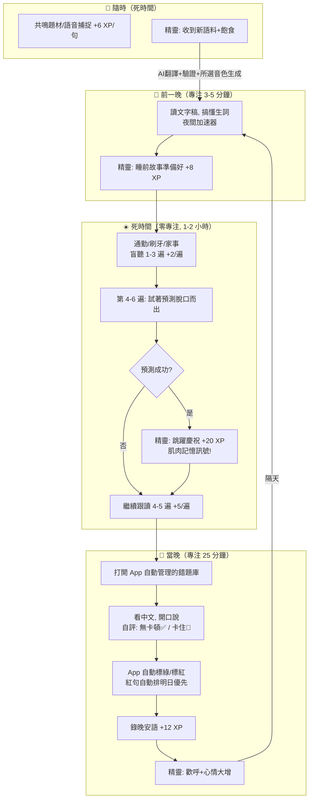

**每日 XP 範例**（認真練習的一天）：
夜間預習 8 + 盲聽 3 遍 6 + 預測成功 20 + 跟讀 2 遍 10 + 檢測答對 3 句 45 + 晚安語 12 + 語料產出 2 句 12 = **約 113 XP/天**（→ 幼體→成長期需 300 XP，約 3 天達成）

## 附錄 B：跨平台抽象層清單

| 抽象介面 | iOS 實作 | Android 預留 |
|---------|---------|-------------|
| `ISpeechRecognition` | SFSpeechRecognizer | android.speech / 雲端方案 |
| `ITTSProvider` | ElevenLabsTTSProvider | 同（雲端，跨平台） |
| `INotification` | UserNotifications | FCM |
| `IStorage` | Core Data / Realm | Room / Realm |
| `IHaptics` | UIFeedbackGenerator | Vibrate API |
| `IAudioPlayer` | AVAudioPlayer | ExoPlayer |

---

> **本文檔版本**：v1.3 | **修訂日期**：2026-06-26 | **v1.2**：2026-06-26 | **v1.1**：2026-06-26 | **初版**：2026-06-25
> **配套文件**：`language-learning-system-design.md`（設計藍圖）、`pet-system-design.md`（寵物系統技術規格）
> **後續產出**：基於本 PRD 產出技術架構方案、Wireframe、寵物美術規格、題材內容運營手冊。
