# Selah 個人化語言學習系統 — 設計藍圖

> 核心理念：以**你真實生活中會說的話**為唯一的學習原點。不學課本上跟自己無關的句子。

---

## 目錄

1. [系統全景圖](#一系統全景圖)
2. [核心設計原則](#二核心設計原則)
3. [階段 ①：建立個人化語料庫（Language Island）](#三階段-建立個人化語料庫language-island)
   - [3.4 場景分類與覆蓋度視覺化（六邊形雷達圖）](#34-場景分類與覆蓋度視覺化六邊形雷達圖)
4. [階段 ②：夜間加速器（Pre-input Comprehension）](#四階段-夜間加速器pre-input-comprehension)
5. [階段 ③：碎片時間輸入與跟讀](#五階段-碎片時間輸入與跟讀dead-time--shadowing)
6. [階段 ④：夜間錯題檢測（Excel System）](#六階段-夜間錯題檢測the-excel-system)
7. [階段 ⑤：六週心理建設時間線](#七階段-六週心理建設時間線the-6-week-timeline)
8. [Week 1–2 生存手冊](#八week-12-生存手冊關鍵存活期)
9. [品質控制機制](#九品質控制機制)
10. [語料進化路徑](#十語料進化路徑corpus-evolution)

---

## 一、系統全景圖

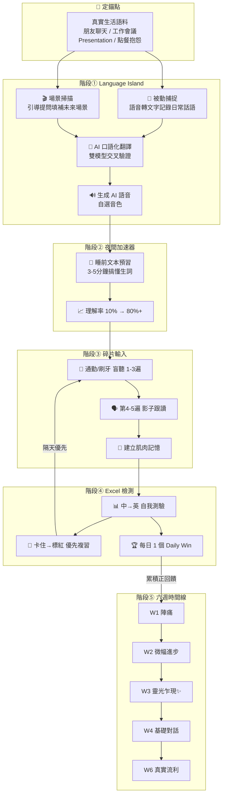

---

## 二、核心設計原則

| 原則 | 說明 | 對應的常見失敗 |
|------|------|--------------|
| **語料自我相關性** | 只學「你昨天真的說了」的句子，利用 self-reference effect 強化記憶編碼 | 學課本對話 → 學完用不到 |
| **理解與練習分離** | 先用夜間預習把理解率拉到 80%+，再用碎片時間練肌肉記憶 | 邊聽邊查字典 → 意志力消耗殆盡 |
| **先輸入後輸出** | 盲聽建立預測能力 → 跟讀建立肌肉記憶 → 檢測強制輸出 | 一開始就跟讀 → 鸚鵡學舌，無深層學習 |
| **降低 Week 1 摩擦** | 每日最低只需 8 分鐘專注時間 | Excel 全紅 + 30 分鐘要求 → 放棄 |
| **重新定義成功** | 「完成行為」>「說對句子」，建立習慣優先於追求品質 | 看不見進步 → 動機歸零 |

---

## 三、階段 ①：建立個人化語料庫（Language Island）

這是整個系統的**定錨點**——如果語料跟你無關，後面的步驟再精緻都沒用。

### 3.1 語料來源的三個層次

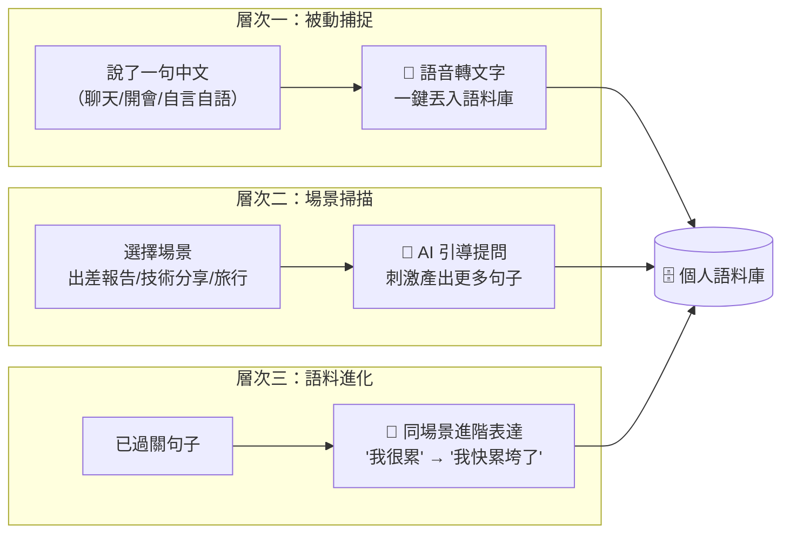

### 3.2 場景掃描引導提問示例

| 場景 | AI 引導提問 |
|------|-----------|
| 🏢 出差報告 | 你去了哪裡？見了誰？最大的收穫是什麼？出了什麼意外？ |
| 🎤 技術分享 | 這個功能的背景是什麼？你選了什麼方案？為什麼沒選另一個？效果數據怎麼樣？ |
| 🍽️ 餐廳點餐 | 你要點什麼？有什麼忌口？上次來這裡吃過什麼？ |
| 🏠 跟房東溝通 | 什麼東西壞了？上次什麼時候說的？他回了什麼？你希望他怎麼處理？ |
| 💬 朋友閒聊 | 最近在忙什麼？週末去了哪裡？有什麼好笑的八卦？ |

### 3.3 語句種子庫（冷啟動輔助）

解決「第一週不知道收集什麼」的問題，預置 20-30 句按場景分類的種子句：

| 場景 | 種子句（中文） |
|------|-------------|
| 自我介紹 | 我叫 XX，在 XX 公司做 XX，我喜歡爬山和看電影 |
| 抱怨工作 | 今天忙死了，老闆又改需求了 |
| 點餐 | 我要一個大杯拿鐵，少冰，不加糖 |
| 閒聊 | 你週末去哪裡玩了？那部電影好看嗎？ |
| 購物 | 這個有其他顏色嗎？可以算便宜一點嗎？ |

> **設計意圖**：學習者從種子庫挑選與自己生活相關的，而非被動接受。挑選行為本身就是第一個「自我相關性」判斷。

### 3.4 場景分類與覆蓋度視覺化（六邊形雷達圖）

語料入庫時，AI 翻譯 pipeline 自動打上場景分類標籤，用戶零操作。分類採用 **6 大場景**，對應六邊形雷達圖的六軸，讓用戶一眼看到語料分佈的強弱。

#### 六類場景定義

| # | 分類 | 一句話鉤子 | 典型內容 | AI 判別關鍵線索 |
|---|------|-----------|---------|---------------|
| 1 | **社畜日常** 💼 | 跟工作有關的一切 | 會議發言、簡報、跟老闆報告、面試、同事溝通、寫 email | 關鍵詞：老闆/客戶/會議/簡報/報告/加班/同事/面試 |
| 2 | **朋友幹話** 💬 | 跟朋友混在一起時說的話 | 閒聊、八卦、約見面、嘴砲、講笑話 | 語氣輕鬆、無特定任務目的、不屬於其他分類的日常對話 |
| 3 | **先吐為快** 💨 | 不爽的、想抱怨的、憋著的 | 抱怨工作/生活、取暖討拍、發洩不爽、碎念 | 誇張語氣、負面情緒詞、碎念感（vs 走心時刻的克制感） |
| 4 | **走心時刻** 💕 | 認真說出心裡話的時候 | 說感受、告白、安慰人、深度對話、講恐懼或脆弱 | 克制語氣、深度表達、真誠而非釋放（vs 先吐為快的宣洩感） |
| 5 | **據理力爭** 🗣️ | 不退讓、要站穩立場 | 客訴、argue、談判、拒絕、跟房東吵架 | 對立/協商場景、需要達成結果的張力 |
| 6 | **生活闖關** 🌍 | 在外面搞定一切 | 點餐、購物、旅行、訂票訂房、問路、辦事 | 與外部世界互動、有明確交易/互動對象 |

> **設計原則**：分類從場景出發（不是語言學意圖），命名生活化、有槽點，年輕人一看就懂。

#### 分類背後的故事線

這六類不是平等的——它們之間有一條隱含的「**從黑暗到光明**」的使用者旅程：

```
Onboarding Day 1：「昨天有什麼想罵的？先吐出來。」
                  ↓
          📊 六邊形圖：💨 先吐為快 那一角最先長出來
                  ↓
Week 2-3：「你已經會用外語抱怨了。要不要試試跟朋友聊點開心的？」
                  ↓
          📊 六邊形圖：💬 朋友幹話 開始長
                  ↓
Week 4+：「你看，你的六邊形快長齊了。」
```

> 「先吐為快」是大多數用戶的入口——不是因為系統強推，而是因為**onboarding 第一個引導提問就從「抱怨」出發**。從這裡開始，慢慢走出去。

#### AI 分類判斷邏輯

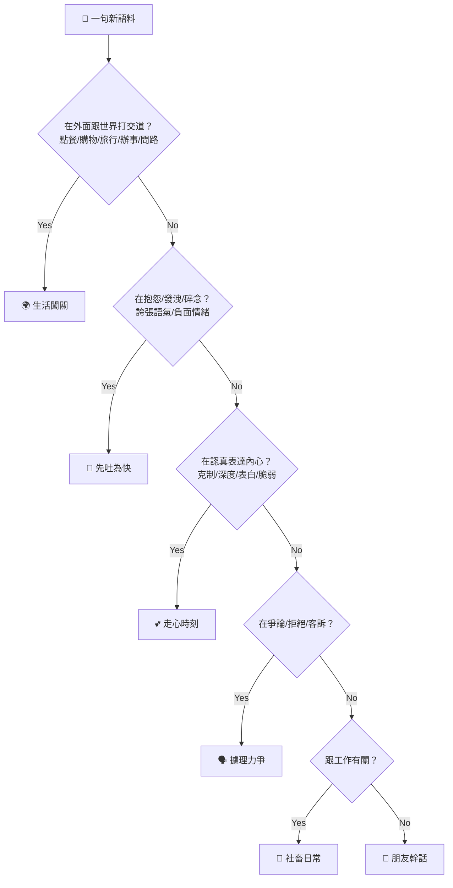

> **判斷順序設計**：場景線索強的（生活闖關）放前面，語氣線索強的（先吐為快、走心時刻）放中間，最難靠關鍵詞區分的（社畜 vs 朋友）放最後，用「有沒有工作線索」作為最後的二分。

#### 六邊形覆蓋度圖

在語料庫頁面以雷達圖呈現，六軸各代表一個場景分類。軸上數值為該場景的語料佔比（%）。

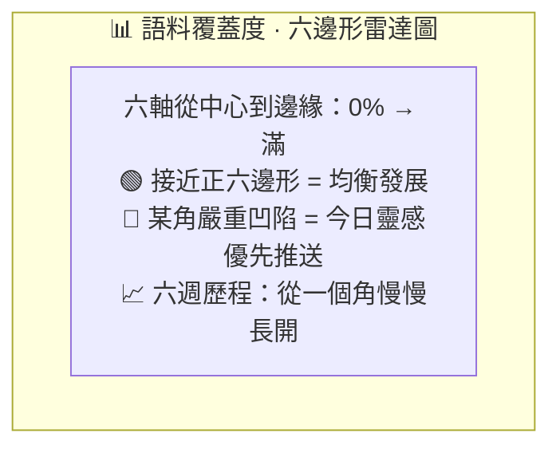

**「今日靈感」推薦權重**：

```
推薦權重 = (1 / 該類別覆蓋率) × 該類別題材庫存量
```

- 覆蓋率最低的類別自然浮到最上面
- 但不會推薦到沒有題材的空類別
- 用戶可以不甩推薦，自由選擇

> **六邊形的敘事力**：多數用戶第一週的六邊形會極度不均衡（先吐為快和社畜日常爆高），這不是 bug——這是起點。六週後六邊形慢慢長開的過程，就是「從負能量出發，走向更完整的自己」的可視化證明。

---

## 四、階段 ②：夜間加速器（Pre-input Comprehension）

### 4.1 核心機制

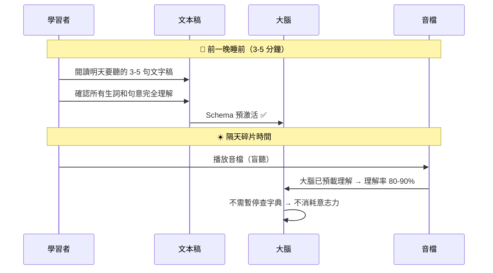

### 4.2 為什麼這一步是效率的關鍵

| 情境 | 理解率 | 意志力消耗 | 結果 |
|------|--------|-----------|------|
| 不預習直接盲聽 | 10-20% | 🔴 極高（反覆暫停查字典） | 挫折 → 放棄 |
| 前一晚預習過 | 80-90% | 🟢 極低（流暢聆聽） | 成就感 → 持續 |

---

## 五、階段 ③：碎片時間輸入與跟讀（Dead Time & Shadowing）

### 5.1 執行流程


### 5.2 執行鐵律

> ⚠️ **順序不可顛倒**：盲聽 → 預測 → 跟讀。如果一開始就跟讀，只是「鸚鵡學舌」，大腦沒有真正處理語言。

---

## 六、階段 ④：夜間錯題檢測（The Excel System）

### 6.1 基本結構

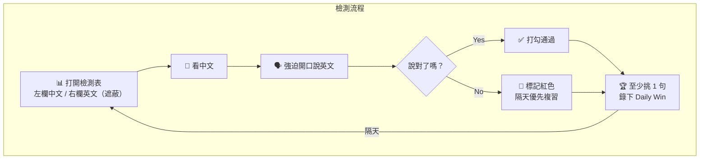

### 6.2 擁抱不適感

> 當你卡住說不出來的時候，那種痛苦的「摩擦感」**正是大腦神經正在重新連結的時刻**。不要逃避它——它是學習真正發生的訊號。

### 6.3 Week 1 vs 標準版

| 參數 | Week 1 求生版 | 標準版（Week 3 後） |
|------|-------------|-------------------|
| 每日句子量 | 3-5 句 | 10-20 句 |
| 檢測時間 | 5 分鐘 | 30 分鐘 |
| 標記方式 | 會 / 不會（兩色） | 紅 / 黃 / 綠（三色） |
| 紅字處理 | 先不管，隔天再來 | AI 生成 5 句變形同義句 |
| 成功定義 | 「今天打開了檢測表」 | 「今天說對了幾句」 |

---

## 七、階段 ⑤：六週心理建設時間線（The 6-Week Timeline）

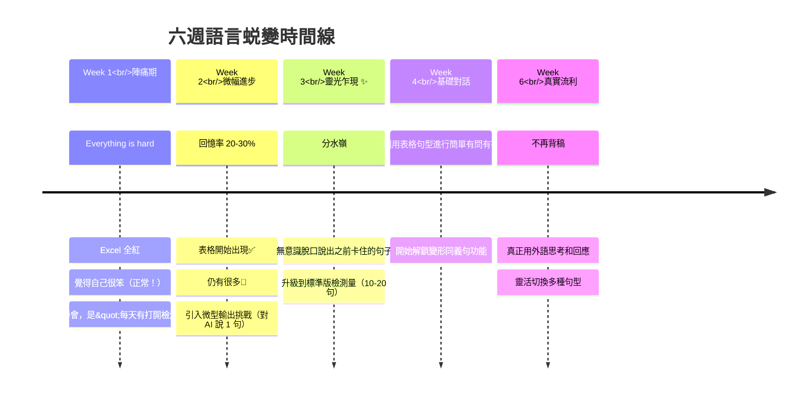

### 7.1 每週的具體成功標準

| 週次 | 成功標準（學習者自評） | 系統解鎖功能 |
|------|---------------------|------------|
| W1 | 連續 7 天打開檢測表（不論結果） | 語料捕捉 + 夜間預習 + 盲聽跟讀 |
| W2 | 至少 3 句從🔴變成✅ | + 微型輸出挑戰（對 AI 說 1 句） |
| W3 | 體驗到至少 1 次「脫口而出」瞬間 | 升級到標準檢測量（10-20 句） |
| W4 | 能用學過的句型進行簡單對話 | + 變形同義句解鎖 |
| W6 | 不再需要「先想中文再翻譯」 | 全部功能開通，進入持續進化模式 |

---

## 八、Week 1–2 生存手冊（關鍵存活期）

> 90% 的人在第一週放棄，不是因為方法太難，而是**回饋延遲 + 操作摩擦 + 沒有勝利時刻**。

### 8.1 三大殺手與破解


### 8.2 Week 1 每日最低 SOP（8 分鐘/天）

| 時段 | 做什麼 | 時間 |
|------|--------|------|
| 🌙 前一晚睡前 | 看 3 句文字稿，搞懂所有生詞和意思 | **3 分鐘** |
| ☀️ 碎片時間 | 循環播放 3 句音檔（純盲聽，不跟讀） | 跟通勤時間重疊 |
| ☀️ 碎片時間 | 第 4-5 遍開始影子跟讀 | 跟通勤時間重疊 |
| 🌙 晚上 | Excel 打開，檢測 3 句，錄 1 個 Daily Win | **5 分鐘** |

> **總專注時間：8 分鐘/天** — 先讓「打開檢測表」變成自動化行為。

### 8.3 Week 2 每日最低 SOP（15 分鐘/天）

| 時段 | 做什麼 | 時間 |
|------|--------|------|
| 🌙 前一晚睡前 | 看 5 句文字稿（3 舊 + 2 新） | **5 分鐘** |
| ☀️ 碎片時間 | 盲聽 + 跟讀（句子量擴大到 5 句） | 跟通勤時間重疊 |
| 🌙 晚上 | Excel 檢測 5 句 + 對 AI 說 1 句 + 錄 Daily Win | **10 分鐘** |
| 📅 週末 | 整理 14 天語料 → 生成「我的第一本語料庫」封面 | **15 分鐘** |

### 8.4 Week 2 特有策略

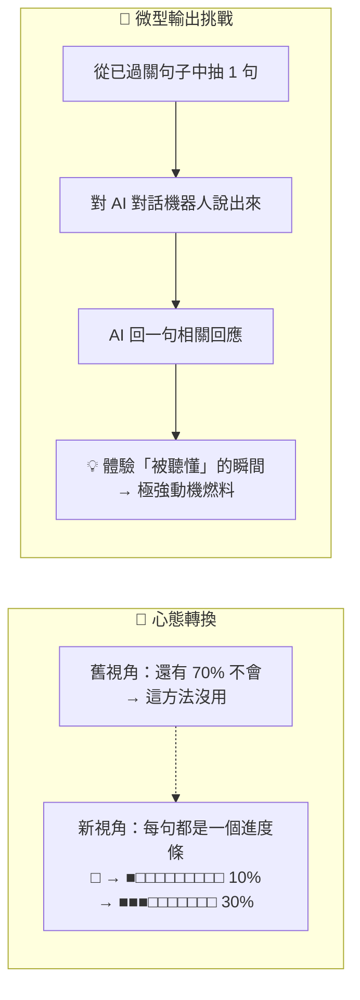

---

## 九、品質控制機制

### 9.1 雙模型交叉驗證（解決語料品質盲點問題）

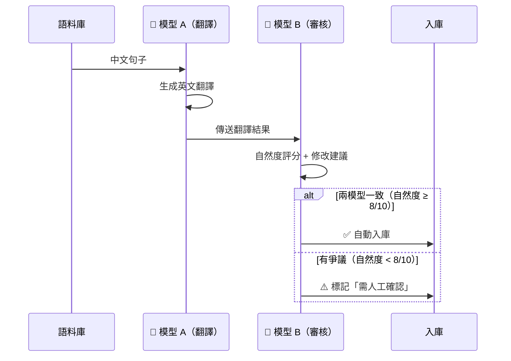

> **設計意圖**：學習者無法判斷 AI 翻譯是否自然（品質盲點），因此在後台自動完成交叉驗證，不增加學習者認知負擔。

---

## 十、語料進化路徑（Corpus Evolution）

個人化語料庫不是靜態的。學習者的表達需求會隨能力成長而進化：

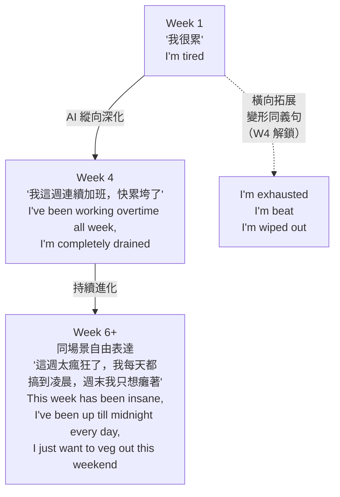

| 進化類型 | 觸發條件 | 產出 | 解鎖時間 |
|----------|---------|------|---------|
| **縱向深化** | 句子已過關（✅） | 同一場景的進階表達 | Week 2 起自動提示 |
| **橫向拓展** | 連續 3 天過關 | 同一句話的 5 種口語變形 | Week 4 |

---

## 附錄：完整每日循環圖

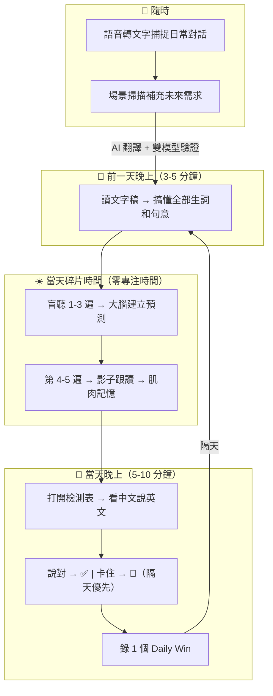

---

> **本文件版本**：v1.2 | **最後更新**：2026-06-26
> 
> 本文檔是 Selah 個人化語言學習系統的設計藍圖。配套文件：PRD v1.3、開工前設計文件（selah-engineering-kickoff.md）。
> 
> **v1.1 更新內容**：新增 §3.4 六類場景分類系統 + 六邊形雷達圖視覺化 + AI 分類判斷邏輯 + 「從黑暗到光明」的使用者旅程敘事。
