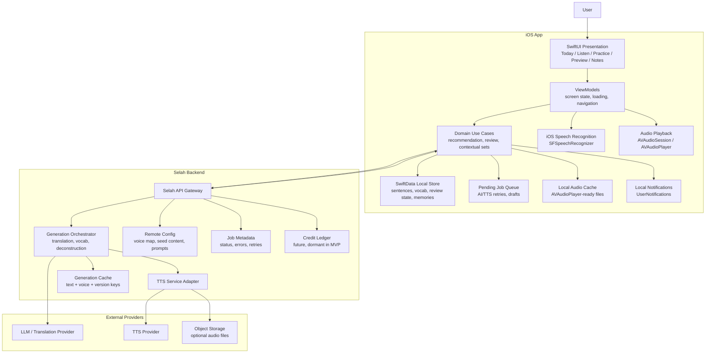
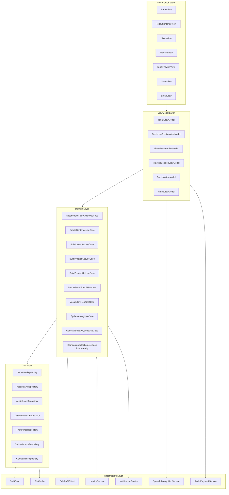
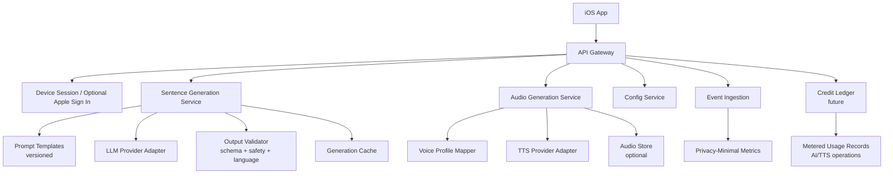
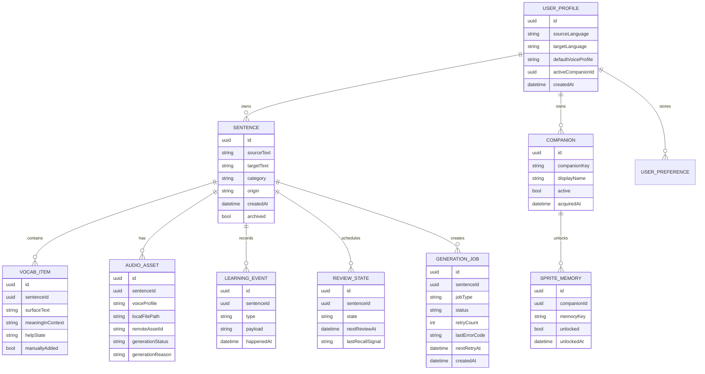
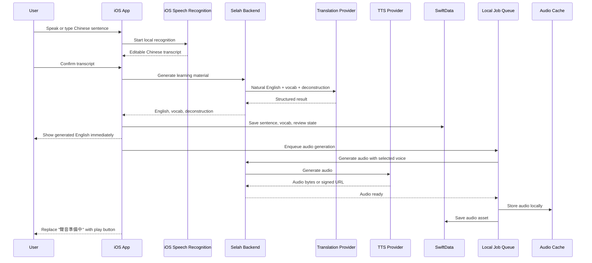
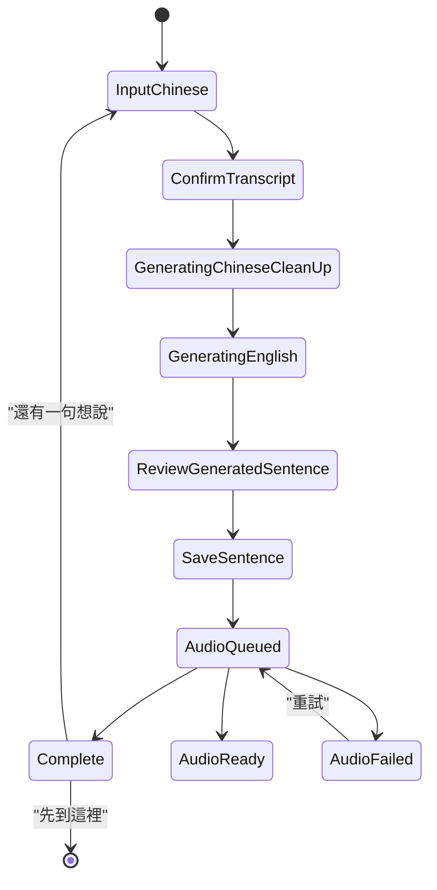
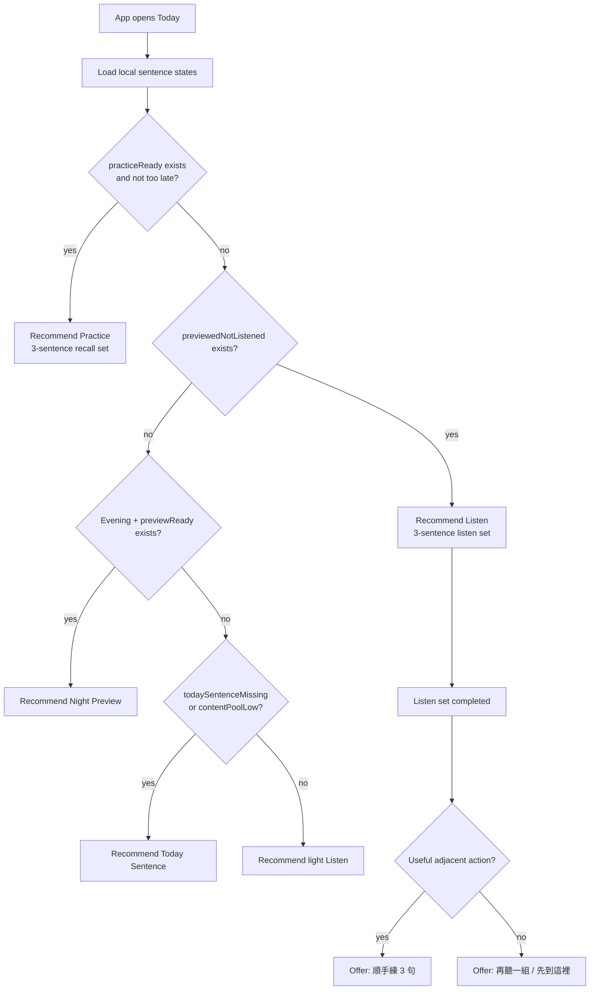
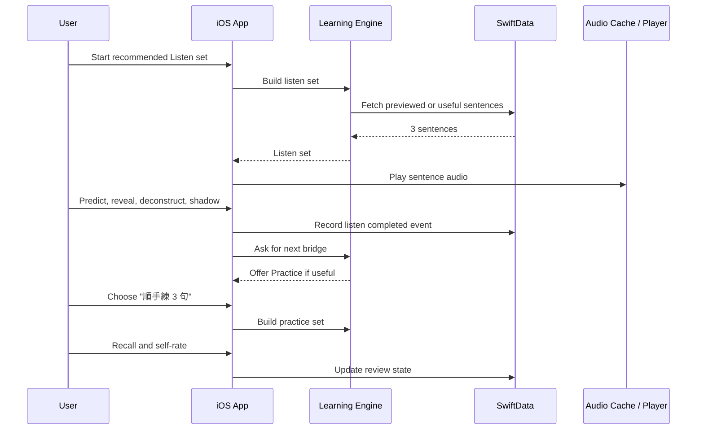

# Selah v8 iOS Architecture

> Status: development architecture draft for v8 MVP.
> Date: 2026-07-05
> Product source of truth: `selah-v8-unified-design-spec.md`
> Prototype reference: `selah-prototype-v8.html`

## 1. Architecture Summary

Selah v8 should be built as an iOS-first, local-first learning app with a lightweight backend for AI/audio generation, retry handling, and future credit accounting.

The app must feel simple:

```text
Open app -> follow one recommended next step -> sentences naturally come back later
```

The implementation can be more sophisticated internally, but the system should not expose provider names, queues, scores, model labels, or technical pipeline language to the user.

### Key Decisions

| Area | Decision | Reason |
|---|---|---|
| iOS app | Native SwiftUI | Best fit for iOS-first MVP, haptics, local audio, push navigation, widget-ready future |
| Minimum iOS | iOS 17+ | Allows SwiftData and modern SwiftUI patterns; acceptable for MVP speed |
| Persistence | Local-first with SwiftData | Learning state should work quickly and feel personal without forcing login |
| STT | iOS native speech recognition first | Lower latency, better privacy, avoids sending raw audio by default |
| Translation | Backend AI gateway | API keys and prompt logic must not live in the app |
| TTS | Background backend job + local audio cache | English generation should not be blocked by audio generation |
| Recommendation | On-device domain logic | It depends mostly on local sentence state and should work instantly |
| Account/sync | Later phase | MVP can validate learning loop without forcing login |
| Credits/billing | Future-ready only | AI/TTS costs should be meterable later, but no MVP charging UI |
| Companion model | Single active companion, multi-companion-ready data | MVP keeps one gentle sprite, but future companion choice should not require a data rewrite |
| Analytics | Event-only, privacy-minimal | Avoid storing raw personal sentences unless explicitly needed |

## 2. Overall System Architecture



### What Requires Backend?

Backend is required for:

- Natural English generation from Traditional Chinese.
- Sentence-specific vocabulary suggestions.
- Sentence deconstruction content.
- TTS generation with provider keys protected.
- Voice-profile mapping from user-facing labels to provider voice IDs.
- Prompt/version management.
- Provider fallback and retry handling.
- Optional audio storage and cache.
- Future credit ledger for paid AI/TTS usage.

Backend is not required for:

- Basic app navigation.
- Local notes.
- Local recommendation.
- Review scheduling.
- Sprite memory unlocks.
- Practice self-rating.
- Local audio playback after audio is cached.
- Local draft and retry queue.

## 3. iOS App Architecture



### iOS Modules

| Module | Responsibility |
|---|---|
| `AppShell` | Tab shell, push navigation, global app state |
| `Today` | Sprite, recommendation card, reason preview, manual entries |
| `SentenceCreation` | Chinese input, transcript confirmation, voice choice, generation progress, save |
| `Listen` | Listen, predict, reveal, deconstruct, shadow, contextual bridge |
| `Practice` | Chinese recall, reveal, self-rating, repeatable 3-sentence sets |
| `Preview` | Night preview batches, sentence-specific vocab hints |
| `Notes` | Saved sentences, vocabulary, sprite memories |
| `LearningEngine` | Recommendation, review rules, contextual set logic |
| `Audio` | TTS job status, file cache, playback, speed, interruption handling |
| `GenerationQueue` | Local drafts, pending AI jobs, pending TTS jobs, retry state |
| `Companion` | Single active sprite in MVP; catalog/selection-ready for later |
| `Services` | API, speech recognition, notifications, haptics |

## 4. Backend Architecture



### Backend Services

| Service | MVP Responsibility |
|---|---|
| API Gateway | One stable API surface for the iOS app |
| Sentence Generation Service | Chinese to natural English, vocab suggestions, deconstruction, category |
| Audio Generation Service | Generate English audio for saved sentences using selected voice |
| Config Service | Voice list, seed sentences, prompt versions, feature flags |
| Event Ingestion | Learning-event metrics without storing raw sentence text by default |
| Cache | Avoid regenerating identical audio or prompt results unnecessarily |
| Job Metadata | Track generation status, retries, provider errors |
| Credit Ledger | Future-only in MVP. Track billable AI/TTS operations later without changing core APIs |

### Backend Storage Policy

For MVP, use privacy-minimal storage:

- Store raw user sentences primarily on device.
- Backend may process raw text transiently to generate English and audio.
- Backend should not permanently store raw sentence text unless account sync or explicit backup is introduced.
- Audio can be returned as bytes or a short-lived signed URL, then cached locally by the app.
- Provider request/response logs must be redacted by default.
- Raw Chinese and generated English should remain primarily local unless the user later enables sync.

If cloud sync becomes part of the product, add explicit user account and encrypted cloud storage as a later phase.

## 5. Core Data Model



### Important Local Entities

| Entity | Notes |
|---|---|
| `Sentence` | The core unit. Every preview, listen, practice, vocab item, and audio asset belongs to a sentence. |
| `VocabularyItem` | Stores only the meaning in this sentence first. It can later become familiar and hidden by default. |
| `ReviewState` | Internal only. User never sees `new / learning / familiar / quiet`. |
| `AudioAsset` | Stores selected voice, generation status, and local cache path. |
| `GenerationJob` | Local retry queue for AI generation, TTS generation, and manual voice regeneration. |
| `LearningEvent` | Append-only history for recommendation, memories, and debugging. |
| `UserPreference` | Voice profile, speed, source language, target language. |
| `Companion` | MVP has one active companion, but the model supports future companion selection. |

### Credit-Ready Fields

Credits are not part of MVP UI, but billable operations should be identifiable later.

For future billing, every backend AI/TTS operation should be able to produce a usage record:

```text
usage.operationType = sentence_generation | audio_generation | audio_regeneration
usage.estimatedUnits = number
usage.userIdOrDeviceId = opaque id
usage.clientRequestId = uuid
usage.createdAt = date
```

In MVP, this can remain disabled or used only internally for cost observation.

## 6. Main Flow: Today Sentence Generation



### Frontend States



Audio generation must never block saving the sentence. If audio is not ready, the UI should show `聲音準備中` and retry in the background.

## 7. Main Flow: Recommendation And Contextual Set



The recommendation engine runs on device because it mostly depends on local review state.

Backend can provide remote config weights later, but it should not be required for the Today screen to load.

## 8. Main Flow: Listen And Practice



## 9. Use Cases

### UC-01 Create A Sentence

| Field | Detail |
|---|---|
| Actor | Learner |
| Trigger | User taps `今日一句` |
| Preconditions | App has microphone permission if voice input is used |
| Main Flow | User speaks or types Chinese, confirms transcript, backend generates English material, app saves sentence, audio is generated in the background |
| Result | Sentence enters future Preview, Listen, and Practice |
| Failure Handling | If AI fails, keep Chinese draft and allow retry. If TTS fails, save sentence and generate audio later. |

### UC-02 Choose English Voice

| Field | Detail |
|---|---|
| Actor | Learner |
| Trigger | User expands `英文聲音` in Today Sentence |
| Main Flow | User previews a voice, selects one, app stores preference |
| Result | Future generated audio uses selected voice |
| Constraint | No voice selection during first onboarding |
| Voice Change Rule | Changing voice affects only newly generated sentences. Existing audio stays unchanged unless the user manually regenerates it. |

### UC-03 Follow Recommended Next Step

| Field | Detail |
|---|---|
| Actor | Learner |
| Trigger | User opens Today tab |
| Main Flow | App computes best next action from local sentence states and shows one primary card |
| Result | User starts Practice, Listen, Night Preview, or Today Sentence without managing flow |
| Constraint | Manual entries remain available but secondary |

### UC-04 Listen To A Contextual Set

| Field | Detail |
|---|---|
| Actor | Learner |
| Trigger | User starts Listen |
| Main Flow | App plays 3 sentences one by one, user predicts, reveals, checks vocab, shadows |
| Result | Sentences become eligible for future Practice |
| Bridge | After set completion, offer `順手練 3 句`, `再聽一組`, or `先到這裡` |

### UC-05 Practice Recall

| Field | Detail |
|---|---|
| Actor | Learner |
| Trigger | Recommendation or bridge from Listen |
| Main Flow | User sees Chinese, recalls English, reveals answer, self-rates |
| Result | Review state updates. Weak sentences return to Listen if needed |
| Unit | 3 sentences per set |

### UC-06 Night Preview

| Field | Detail |
|---|---|
| Actor | Learner |
| Trigger | Evening recommendation or manual entry |
| Main Flow | User lightly previews 3-5 future sentences and taps unknown words |
| Result | Tomorrow's Listen becomes easier |
| Constraint | No memorization pressure |

### UC-07 Review Notes

| Field | Detail |
|---|---|
| Actor | Learner |
| Trigger | User opens Notes tab |
| Main Flow | User checks saved sentences, vocabulary, and sprite memories |
| Result | Reference and emotional continuity |
| Constraint | Notes is not the main learning surface |

## 10. API Draft

These endpoints are intentionally small. The iOS app should not call providers directly.

### `GET /v1/config/bootstrap`

Returns voice profiles, seed sentence packs, prompt/config versions, and feature flags.

```json
{
  "sourceLanguages": ["zh-Hant"],
  "targetLanguages": ["en"],
  "defaultVoiceProfile": "gentle-natural",
  "voiceProfiles": [
    { "id": "gentle-natural", "label": "溫柔自然", "description": "速度適中，適合每天跟讀" },
    { "id": "clear-slow", "label": "清晰慢速", "description": "更慢一點，適合剛開始聽" },
    { "id": "daily-bright", "label": "日常輕快", "description": "比較像朋友說話的速度" }
  ]
}
```

### `POST /v1/sentences/generate`

Generates English learning material for one Chinese sentence.

Request:

```json
{
  "sourceLanguage": "zh-Hant",
  "targetLanguage": "en",
  "sourceText": "今天工作忙翻了，但還是準時下班了",
  "context": {
    "categoryHint": "工作",
    "knownVocab": ["swamped"],
    "style": "spoken-natural"
  }
}
```

Response:

```json
{
  "targetText": "I was swamped at work today, but I still got off on time.",
  "category": "工作的事",
  "vocabulary": [
    { "surfaceText": "swamped", "meaningInContext": "忙翻了", "suggestedHelpState": "learning" },
    { "surfaceText": "got off on time", "meaningInContext": "準時下班", "suggestedHelpState": "new" }
  ],
  "deconstruction": [
    { "surfaceText": "swamped", "meaning": "忙翻了、忙到不行" },
    { "surfaceText": "got off on time", "meaning": "準時下班" }
  ],
  "promptVersion": "v8.0"
}
```

### `POST /v1/audio/generate`

Generates or regenerates audio for an existing English sentence.

Request:

```json
{
  "sentenceId": "local-or-server-sentence-id",
  "targetText": "I was swamped at work today, but I still got off on time.",
  "voiceProfile": "gentle-natural",
  "reason": "initial_generation"
}
```

Response:

```json
{
  "audio": {
    "status": "ready",
    "voiceProfile": "gentle-natural",
    "downloadUrl": "https://example.com/signed-audio-url"
  },
  "usage": {
    "operationType": "audio_generation",
    "estimatedUnits": 1
  }
}
```

`reason` values:

- `initial_generation`
- `manual_regeneration`
- `voice_changed_regeneration`

MVP should not charge users, but the operation is shaped so future credit accounting can be added without redesigning the endpoint.

### `POST /v1/events`

Privacy-minimal event ingestion. Example events:

- `sentence_created`
- `listen_completed`
- `practice_rated`
- `preview_completed`
- `voice_selected`

Do not include raw sentence text in analytics events by default.

## 11. Swift Protocol Sketch

```swift
protocol SentenceGenerationService {
    func generateSentence(
        sourceText: String,
        sourceLanguage: SourceLanguage,
        targetLanguage: TargetLanguage,
        categoryHint: SentenceCategory?
    ) async throws -> GeneratedSentenceResult
}

protocol AudioGenerationService {
    func generateAudio(
        sentenceId: Sentence.ID,
        targetText: String,
        voiceProfile: VoiceProfile.ID,
        reason: AudioGenerationReason
    ) async throws -> GeneratedAudioResult
}

protocol SpeechRecognitionService {
    func start(language: SourceLanguage) -> AsyncThrowingStream<String, Error>
    func stop()
}

protocol AudioPlaybackService {
    func play(asset: AudioAsset, speed: PlaybackSpeed) async throws
    func stop()
}

protocol RecommendationEngine {
    func recommendNextAction(now: Date) async throws -> TodayRecommendation
    func buildContextualBridge(after event: LearningEvent) async throws -> ContextualBridge?
}

protocol ReviewScheduler {
    func updateAfterListen(sentenceId: Sentence.ID, at date: Date) async throws
    func updateAfterPractice(sentenceId: Sentence.ID, signal: RecallSignal, at date: Date) async throws
}

protocol GenerationRetryQueue {
    func enqueue(_ job: GenerationJob) async throws
    func retryDueJobs(now: Date) async throws
    func markSucceeded(jobId: GenerationJob.ID) async throws
    func markFailed(jobId: GenerationJob.ID, error: GenerationError) async throws
}

protocol CompanionRepository {
    func getActiveCompanion() async throws -> Companion
    func setActiveCompanion(_ id: Companion.ID) async throws
    func getOwnedCompanions() async throws -> [Companion]
}
```

## 12. MVP Development Phases

### M0 - Native Prototype Shell

- SwiftUI app shell.
- Today / Notes tabs.
- Push flows for Today Sentence, Listen, Practice, Preview.
- Mock generation service.
- Mock audio files.
- SwiftData schema.
- Local draft and generation job queue schema.
- Single active companion stored through multi-companion-ready data model.

### M1 - Real Sentence Creation

- iOS speech recognition.
- Editable Chinese transcript.
- Backend `/sentences/generate`.
- Save generated sentence locally.
- Voice profile selection UI.
- Enqueue TTS job after English generation succeeds.
- Retry failed AI jobs without losing the Chinese draft.

### M2 - Real Listen And Audio

- TTS generation through backend `/audio/generate`.
- Local audio cache.
- Audio playback speed.
- Listen set and contextual bridge.
- Practice eligibility after Listen.
- Manual audio regeneration entry point for existing sentences.

### M3 - Learning Engine

- Review scheduler.
- Recommendation engine.
- Vocabulary help visibility rules.
- Sprite memory unlocks.
- Night Preview queue.

### M4 - Product Hardening

- Error recovery and retry queues.
- Offline handling.
- Local notifications.
- Widget-ready data summary.
- Optional account/sync decision.
- Credit ledger remains backend-ready but not user-facing.
- Future companion catalog remains hidden unless product decides to expose it.

## 13. Risks And Decisions To Confirm

| Question | Recommended v8 Decision |
|---|---|
| Do we need backend? | Yes, for translation and TTS. Keep learning loop local-first. |
| Should STT be backend? | Prefer iOS native for MVP. Add backend STT fallback only if quality is insufficient. |
| Do users need login? | Not for MVP. Add Sign in with Apple when cloud sync becomes necessary. |
| Should generated audio be stored server-side? | MVP can return audio and cache locally. Server-side object storage is optional for retries and sync. |
| Should voice be selected during onboarding? | No. Default voice first, optional adjustment inside Today Sentence or Settings. |
| Should changing voice update old audio? | No. It affects new sentences only. Existing sentences can be manually regenerated. |
| Should backend decide the next learning step? | No for MVP. The app should decide from local review state. Backend can provide config later. |
| Should analytics store raw sentences? | No by default. Use event-only analytics. |
| Should credits/billing be built now? | No user-facing billing in MVP. Keep backend usage records credit-ready for later. |
| Should there be multiple pets now? | No. MVP has one active companion, but the data model supports multiple companions later. |

## 14. Development Readiness Checklist

- [x] Minimum iOS version: iOS 17+ for MVP.
- [x] Persistence: SwiftData for MVP.
- [ ] Choose backend stack for API gateway and workers.
- [ ] Choose first LLM provider and fallback strategy.
- [ ] Choose first TTS provider and fallback strategy.
- [ ] Define prompt output JSON schema.
- [ ] Define local SwiftData schema.
- [ ] Define local audio cache lifecycle.
- [ ] Define privacy policy for sentence processing.
- [ ] Define provider data-retention and log-redaction policy.
- [ ] Define local retry queue behavior and retry limits.
- [ ] Define future credit usage record schema.
- [ ] Define companion catalog fields, even if only one companion ships.
- [ ] Build mock services before provider integration.
