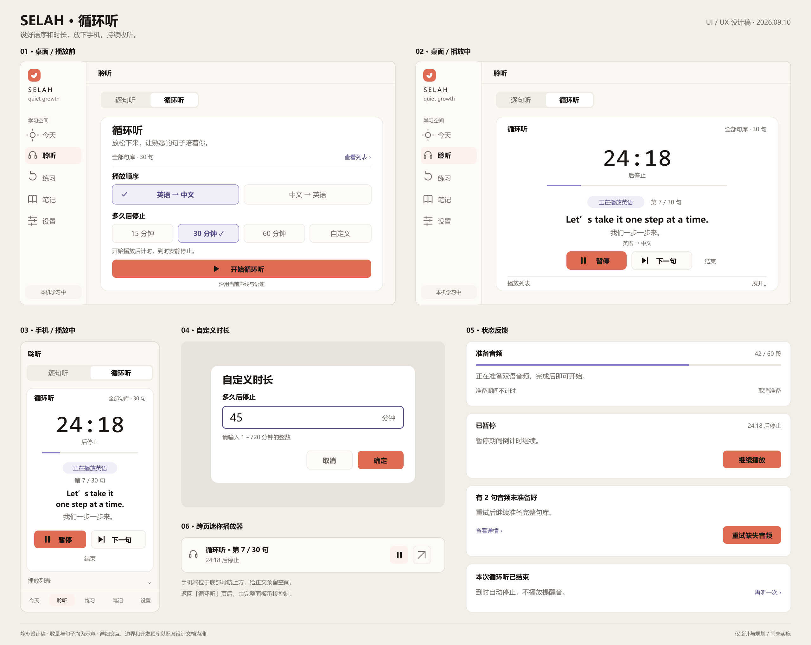

# Selah 循环听 UI／UX 设计

日期：2026-09-10。状态：基于主人认可方向形成的可审阅设计；当前仅设计与规划，产品功能尚未实施。

## 1．交付与范围

在「聆听」内增加「逐句听／循环听」模式切换。循环听面向睡前和放空时的持续背景收听，主路径为「选语序 → 选停止时间 → 开始」。

- [界面总览 PNG](2026-09-10-loop-listening-ui.png) 、[可缩放矢量设计稿](2026-09-10-loop-listening-ui.svg) 。
- [整体开发计划](../plans/2026-09-10-loop-listening-plan.md) 、[项目真实进度](../../../ROADMAP.md) 。
- 设计稿中的 30 句、第 7 句、24：18 和例句均为示意数据，不表示当前账户已有这些内容；实际界面必须使用真实数量和会话状态。
- 本轮可改设计文档、静态设计稿、项目规范与路线图；不修改 Dart、JavaScript、TypeScript、测试、应用资源、配置或构建产物，不调用 TTS，不部署。
- 本期承接现有中英句库。数据使用「学习语言／母语」角色，界面展示实际语言名称；不借此增加新的语言选择或翻译服务。

设计图是静态布局与视觉基准，点击行为以本文为准。总览按展示比例排版，不是可运行原型。图像生成工具因用量上限未成功出图，最终交付为本地绘制的 SVG 及其 PNG 导出，没有使用付费 API 备用路径。

## 2．当前工程依据

| 已核对位置 | 当前实际行为 | 对设计的影响 |
| --- | --- | --- |
| `SelahFlutter/lib/web/web_entry.dart` | 正式入口创建 `WebLearningApp`，导入 `web_learning_app.dart` | 新功能只接正式 Web 入口 |
| `SelahFlutter/lib/web/ui/web_learning_app.dart` 的 `_ListenPage` | 显示当前账户未归档句子，列表＋单句详情 | 复用句库范围，新增页内模式切换 |
| 同文件的 `_WebShell` | 900px 起使用侧栏；1180px 起部分页面显示陪伴栏；手机使用底部导航 | 保留全局导航断点，在循环听中收起陪伴栏以减少干扰 |
| `SelahFlutter/lib/web/learning_controller.dart` 的 `play`、`_audioKey`、`_poll` | 播放及缓存键只读取 `sentence.target`；音频结束会记录 `listen_completed` | 补双语音轨映射；循环会话不能复用学习完成记账 |
| `SelahFlutter/web/selah_bridge.js` 的 `makeAudioController` | 使用 HTML 音频元素；单段结束后释放元素和 Blob URL | 连续队列需独立会话，衔接不能依赖页面定时轮询 |
| 当前正式页面的 `_WebShell`／`_Content` | 此次未找到全局迷你播放器的渲染接线 | 按正式入口接入迷你播放器；不把历史路线图条目当作现成功能 |
| `SelahFlutter/assets/content/seed-audio.json` | 现有种子音频按 seed／声线索引 | 英文音频继续复用，母语覆盖另行核对与补齐 |

品牌依据是根目录、Flutter 子目录的 `CLAUDE.md` 及实际设计 token。`design-system/selah/MASTER.md` 中旧的靛蓝色与儿童字体不作为本设计依据。

## 3．信息架构与视觉

### 3.1 入口

- 侧栏／底栏仍只有「今天、聆听、练习、笔记、设置」。
- 「聆听」标题下放置两个等宽选项：「逐句听」「循环听」。新会话默认打开逐句听；进入循环听不会自动发声。
- 逐句听保留现有列表和答案查看流程。循环听采用一张主要操作卡片，列表默认折叠。
- 在同次应用会话内记住用户查看的模式；刷新后不自动恢复播放。恢复的只有语序和时长偏好。
- 切换模式只改变视图，正在运行的循环继续；开始另一条音频或录音时才进行播放互斥。

### 3.2 视觉规格

| 元素 | 设计值 |
| --- | --- |
| 页面／卡片／边框 | `#FBF8F4`／`#FFFFFF`／`#EBE7E1` |
| 主操作 | 珊瑚 `#E06B54`，深色按钮文字 `#1A1614` |
| 选中项 | 薰衣草浅底 `#F0EEF8`，边框 `#8B7FC7`，同时显示勾选或明确的选中语义 |
| 文本 | 正文 `#1A1614`，说明 `#706B65`；局部强调文字用深薰衣草 `#554B85`，不改全局 token |
| 字体 | 复用 Plus Jakarta Sans、Noto Sans SC；倒计时用既有等宽字体与固定数字宽度 |
| 字号 | 页标题 22px，卡片标题 18～22px，操作及正文 14～16px，辅助说明至少 12px；倒计时桌面 48px、手机 40px |
| 留白 | 4px 网格；桌面卡片内边距 24px，手机 20px；字段组间距 24px |
| 形状 | 卡片圆角 16px，按钮／输入框 10～12px；只使用轻边框和轻阴影 |
| 触控 | 控件有效点击区域至少 44×44px；不能只靠小字「结束」的字形区域响应 |
| 动效 | 沿用现有短状态过渡；不添加循环波形、跳动精灵或完成庆祝；Reduce Motion 下静态切换 |

不新增夜间主题、白噪音、随机播放、句子收藏筛选、复杂音效或专属声线设置。现有声线和语速直接沿用，首版不在循环听页面复制设置面板。

### 3.3 响应式与可访问性

- 主区最大宽度沿用 980px，核心卡片最大宽度 760px，居中。900px 以下使用现有底部导航；900px 及以上使用侧栏。
- 循环听模式及其播放页面不显示侧边陪伴栏；其他模式和页面保留原有行为。
- 内容可用宽度不足 420px 时，时长选项排成两行两列；两种语序各占一行，避免截断语言名。播放按钮与下一句可在大字号下纵向排列。
- 320px、390px、768px、1130px、1440px 均不得横向溢出；200％文字缩放后仍可操作。手机播放页正文可滚动，底栏固定且尊重安全区。
- 自定义弹层自动聚焦输入框，支持 Enter 确认、Escape 取消；关闭后焦点回到「自定义」。手机弹出数字键盘后字段与确定按钮仍可见。
- 模式、语序和时长暴露选中状态；图标按钮分别提供「暂停循环听」「下一句」「返回循环听」等可访问名称。
- 倒计时不每秒向读屏播报；只播报开始、暂停、错误和结束等状态变化。选中不能只依赖颜色。

## 4．六组界面与交互

### S01：设置页

层级为「循环听标题 → 场景说明 → 全部句库数量／查看列表 → 播放顺序 → 多久后停止 → 开始按钮」。

- 标题：「循环听」。说明：「放松下来，让熟悉的句子陪着你。」
- 语序：「英语 → 中文」默认选中；另一项「中文 → 英语」。实际语言变化时替换显示名称，业务值保持角色语义。
- 时长：「15 分钟」「30 分钟」「60 分钟」「自定义」，默认 30 分钟。已确认的自定义值显示为「45 分钟」，再次点击可编辑。
- 说明：「开始播放后计时，到时安静停止。」次级提示：「沿用当前声线与语速」。
- 音轨已齐备时主按钮为「开始循环听」。点击后开始播放，重复点击只能建立一个会话。
- 音轨缺失时主按钮为「准备音频」，显示涉及的句子和音轨数量；准备完成进入待开始状态，按钮变为「开始循环听」。不在一次耗时准备结束后突然自动播放。

### S02：播放页

最醒目的是剩余停止时间，其次为当前句和播放控制。

- 顶部显示「全部句库 · N 句」，中间大字显示 `24:18`，下方说明「后停止」。超过一小时显示 `1:05:00`。
- 细线显示从会话开始至截止时刻的经过比例；它不是学习完成进度，也不是单句拖动条。
- 显示「正在播放英语／正在播放中文」「第 i／N 句」和当前句双语文本。发声语言加文字状态和字重，不仅改变颜色。
- 提供「暂停／继续播放」「下一句」「结束」。下一句跳到下一条句子的第一种语言，整句跳转；最后一句的下一句是下一轮第一句。
- 显示当前语序摘要，点击可更改；更改后提示「下一句起使用中文 → 英语」，当前双语句按原顺序结束。
- 播放期间停止时刻固定。首版不提供延时、取消定时或运行中重设时长；要换时长先结束，再按新设置开始。
- 展开列表可以查看当前位置；首版列表只读，不加入队列编辑或拖拽排序。

### S03：手机布局

信息顺序与桌面一致，按钮优先于长句全文。正文自动换行，卡片高度自适应，不通过固定高度裁掉长句。完整播放面板存在时不重复显示迷你播放器。

### S04：自定义时长

标题「自定义时长」，字段「多久后停止」，输入框后缀「分钟」，说明「请输入 1～720 分钟的整数」，按钮「取消」「确定」。

- 接受 1～720 的十进制整数；修剪首尾空格。空值、0、负数、小数、字母、无穷值或超过 720 均无效。
- 无效时保留输入，字段下显示「请输入 1～720 分钟的整数」，确定不可提交；取消不改变先前选择。
- 取消／遮罩关闭／Escape 的结果一致。确认保存后选中自定义项，不自动开始播放。

### S05：准备、暂停、错误与结束

| 状态 | 显示与操作 | 计时规则 |
| --- | --- | --- |
| 句库为空 | 「还没有可循环播放的句子」＋「去添加一句」 | 不创建会话 |
| 准备中 | 「正在准备双语音频，完成后即可开始。」＋已就绪段数／总段数＋「取消准备」 | 不计时 |
| 准备完成 | 「音频已准备好」＋「开始循环听」 | 点击并实际发声后开始 |
| 缺少音轨／生成失败 | 「有 X 句音频未准备好」＋详情＋「重试缺失音频」 | 开播前不计时；播放中失败继续倒计时 |
| 离线且缺缓存 | 「联网补齐音频后即可循环听」 | 不启动不完整句库 |
| 未登录且需要个人音频生成 | 显示登录入口，保留当前语序和时长 | 不调用需要登录的生成接口 |
| 额度不足 | 显示服务返回的真实限制与重试条件，保留准备成果 | 不自动反复调用、不扩大额度 |
| 用户暂停／系统打断 | 「已暂停」或「播放已被打断」＋「继续播放」 | 倒计时继续 |
| 到时结束 | 「本次循环听已结束」＋「再听一次」 | 归零、释放播放会话，不响铃 |
| 用户主动结束 | 返回设置页，保留语序和时长 | 取消原截止时刻，释放资源 |

失败详情列出句子及缺失的语言，必须区分「句数」和「音轨段数」。同一句缺两种语言仍只计一条失败句。默认不跳过失败句，不能宣称全库已播却遗漏内容。已开始会话重试成功后从失败音轨起重播，不回到第一句；到期后重试不会恢复旧会话。

### S06：跨页迷你播放器

- 离开循环听页面或切回逐句听时，正在播放／暂停的会话显示迷你播放器：「循环听 · 第 i／N 句」「MM:SS 后停止」「暂停／继续」「返回循环听」。
- 桌面位于主内容底部；手机位于底部导航上方，正文预留对应高度。到时结束或手动结束后移除。
- 返回按钮只导航，不另起播放。迷你播放器与完整面板读取同一状态。
- 普通单句播放、种子试听、练习播放或录音开始前暂停循环；新操作不会叠加声音。循环截止时刻继续，用户可在未到期时手动恢复；恢复循环会先停止当前其他音频，录音期间不允许恢复循环。
- 当前句被中断时保留其音轨位置；若播放器资源已被其他操作接管，恢复时可从该音轨头部重播，并明确按此边界验收。

## 5．播放与时间规则

### R01—R04：完整句库与语序

1. R01：范围是当前账户已收录、未归档的全部句子，包括已加入的种子和个人句子，不受今日任务、分类和学习状态筛选。种子目录里未加入的例句不自动混入。保持当前句库的稳定顺序，按句子 ID 去重。
2. R02：每句以两条真实音轨组成一个单元。默认 `targetFirst`：学习语言音轨 → 1 秒间隔 → 母语音轨 → 2 秒间隔 → 下一句。`sourceFirst` 仅交换每句内部的两种语言。
3. R03：最后一句结束后回到第一句，直到截止、主动结束或不可继续的错误。间隔是固定实际秒数，不随语速缩放。下一句跳转不延长截止时间。
4. R04：会话内语序调整从下一句生效。当前句仍按原顺序播完两条音轨；在句间间隔修改则作用于即将播放的下一句。

### R05—R08：时间语义

5. R05：默认 30 分钟，预设 15／30／60 分钟，自定义 1～720 分钟整数。首段收到真实 `playing` 事件时记录开始时刻；此前的准备或浏览器播放授权等待不计时。
6. R06：以固定截止时间计算剩余时长，不靠每秒减一。暂停、句间空隙、缓冲、错误和系统打断都不延后截止时间。恢复／切换音轨前再次核对是否到期，归零后不能又启动下一段。
7. R07：到期优先于句子完整性；当时正在播放的音轨立即停止，不为了凑完整句继续播放。正常推进时两种语言都必须完整播放。停止不响铃、不庆祝、不自动开始新轮。
8. R08：刷新、关页、进程回收或切换账户结束会话，之后不自动恢复声音。截止时间与会话索引不进入账户同步；仅保存语序和时长偏好。

### R09—R12：队列与资源变化

9. R09：首次开始前校验完整队列的文本与双语音轨，缓存完整性通过后才进入待开始。只有实际声线需要的音轨进入本次准备，已存在音轨不重复合成。
10. R10：当前轮句子与文本使用开始该轮时的版本；新句子、改写内容在下一轮队列构建时纳入。若这些内容缺少音轨，下一轮前暂停并提示补齐，不偷偷略过；原截止时间继续。这个低频变化不触发静默付费生成。
11. R11：归档后不再启动该句的后续音轨；当前已发声音轨可结束，随后转下一条有效句。全部句子均归档则结束会话。删除／恢复账户数据和退出登录必须使旧异步回调失效。
12. R12：本次会话固定开播时的声线；设置中改变声线时结束本次循环，下一次按新声线准备。语速更新允许沿用现有即时行为，不改变截止时间；语序、声线、语速是三个独立概念。

### R13—R16：记录与可靠性

13. R13：循环音轨结束不触发 `LearningEngine.listen`、`listen_completed`、复习状态迁移或成长奖励。首版只保存本次会话内的播放状态，不增加云端循环统计或学习事件类型。
14. R14：同一页面只有一个发声源；暂停循环后才能试听／单句播放／练习／录音。结束、退出登录和页面销毁释放音频元素、Blob URL、定时器与媒体控制绑定，旧会话不能被延迟结果重启。
15. R15：Media Session 作为能力增强，提供播放、暂停和下一句；不支持时保留页面控制。锁屏元数据使用「Selah 循环听」和句子序号，默认不展示个人句子全文。
16. R16：锁屏跨音轨续播、静默间隔、暂停期间截止和长时间运行必须真机验证。单纯 `setTimeout`、前台 UI 倒计时或 Media Session 接线不能作为后台能力完成证明。

## 6．音频来源与首版成本边界

- 优先复用现有 `tts-1`、MP3、四种声线和 Storage／Cache API。中文可用同一 TTS 链路，但必须实际听检发音、停顿和中英音量差。
- 对学习语言与母语分别建立音轨角色、文本版本、声线和缓存引用；不能用英文音轨占位，也不能把中文文本显示视为中文音频就绪。
- 本地缓存键保留已有英文键兼容，母语引入独立角色命名；服务端先验证现有按内容哈希的清单能否直接容纳两种文本，不预设必须新增表或 migration。
- 种子母语离线覆盖需独立库存核对。若 30 句的四种现有声线均无母语音轨，完整覆盖目标为 120 段母语音频；这是最大缺口假设，不是已核实库存或已批准生成量。
- 普通账户只准备其完整队列当前声线的缺失音轨；遵守现有分钟／日额度，单条顺序生成、可取消、成功即缓存、重试复用请求 ID。更大句库超过额度时保留成果并明确说明未齐备。
- 未登录的已收录种子依靠预制真实音轨离线播放；不以浏览器朗读替代母语音轨。没有对应预制文件时，如实报告缺失。
- 本轮不产生生成、取回音频或部署操作；后续样本试听和批量预制分别提出数量与预算，之前针对旧功能的验收预算不自动扩展到本功能。

## 7．实现边界与平台验收门槛

`LearningController` 负责账户、偏好、音轨准备和页面状态；纯 Dart 模型负责构建有序双语队列；浏览器音频层拥有正在运行的会话、音轨推进和截止时间。UI 读取镜像状态，不另建自己的计时器作为权威来源。

首次技术验证先使用可核验的真实双语文件测试三条句子的循环，而不是先铺完所有界面。循环控制不能调用当前 `play` 来模拟每条音轨，否则会混入单句停止与学习记账语义。

| 验收环境 | 必须验证 | 完成门槛 |
| --- | --- | --- |
| 桌面 Edge／Chrome | 双向语序、跨轮、后台标签、暂停、到期、缓存、页面导航 | 音轨顺序正确，无重复声源；普通运行截止偏差目标不超过 1 秒 |
| iPhone Safari | 锁屏中英切换、1／2 秒间隔、连续 60 分钟、暂停后到期、耳机控制、系统打断 | 记录机型／系统／浏览器／构建；支持范围内截止偏差目标不超过 2 秒，无需亮屏才能推进 |
| iPhone 主屏幕 PWA | 单独重复 Safari 的关键用例 | 不用 Safari 标签页结果代替 PWA 结果 |
| Android Chrome | 锁屏、通知区操作、连续 60 分钟、后台切换 | 与上述目标相同，记录真实设备版本 |
| 无 Media Session 能力 | 页面控制、倒计时和正常音频播放 | 不因增强 API 缺失而报错 |

这些偏差是产品验收目标，不是浏览器已保证的能力。若后台 JS 挂起使续播或到期无法满足门槛，必须记录具体失败环境并重新评估播放架构，不能仅改倒计时显示就标记“睡前可用”，也不能用屏幕常亮替代锁屏验收。

依据：浏览器文档说明后台计时器可能受到节流，播放音频时也有豁免情况，不能简单把全部后台行为等同为冻结；Media Session 提供系统媒体控制。WebKit 的 Safari 17.5 发布记录包含后台音频继续下一段的修复，故必须按实际版本验收。

- [Page Visibility API](https://developer.mozilla.org/en-US/docs/Web/API/Page_Visibility_API) 。
- [Media Session API](https://developer.mozilla.org/en-US/docs/Web/API/Media_Session_API) 。
- [WebKit Safari 17.5 发布记录](https://webkit.org/blog/15383/webkit-features-in-safari-17-5/) 。
- [OpenAI TTS 语言支持](https://developers.openai.com/api/docs/guides/text-to-speech#supported-languages) 。

上述来源已在本任务前序只读规划中打开核对；资料依据日期为 2026-09-10，实际平台表现仍以执行开发计划时的真机结果为准。

## 8．本轮完成定义

本轮完成仅指：静态稿可打开、设计与计划互相对应、边界规则无冲突、项目规范和路线图同步、产品代码与构建产物未由本任务修改。设计稿不等同于页面接线、音频能力或平台验证；全部产品开发任务保持未完成。

2026-09-10 文档校核结果：设计与计划中的 8 个本地链接均可解析；SVG 通过 XML 解析，PNG 为 2560×2040，已目视检查六组界面的中文显示和排版。主按钮、辅助文字、选中文字的前景／背景对比度分别为 5.48：1、5.28：1、6.70：1。开发计划的已勾选实施步骤为 0。

与本任务开始时的快照相比，8 个循环听相关既有入口、模型、控制器及浏览器桥接文件 SHA-256 一致。本工作区期间还出现了与循环听无关的管理后台文件和既有服务端测试变化，本任务未操作这些文件；这里的“未改代码”指本任务写入范围，不代表整个共享工作区没有其他变化。未运行 Flutter／Deno 产品测试或 Release 构建，不把既有结果记成本功能验证。
