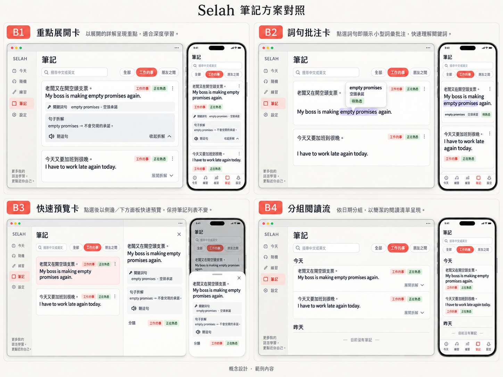
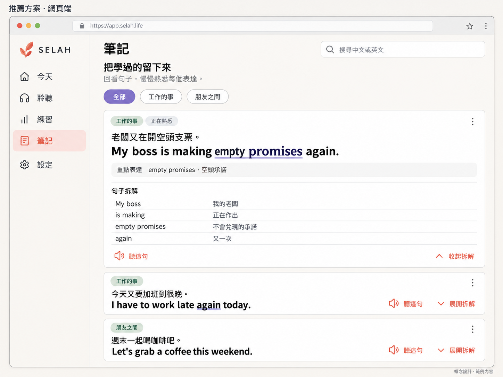
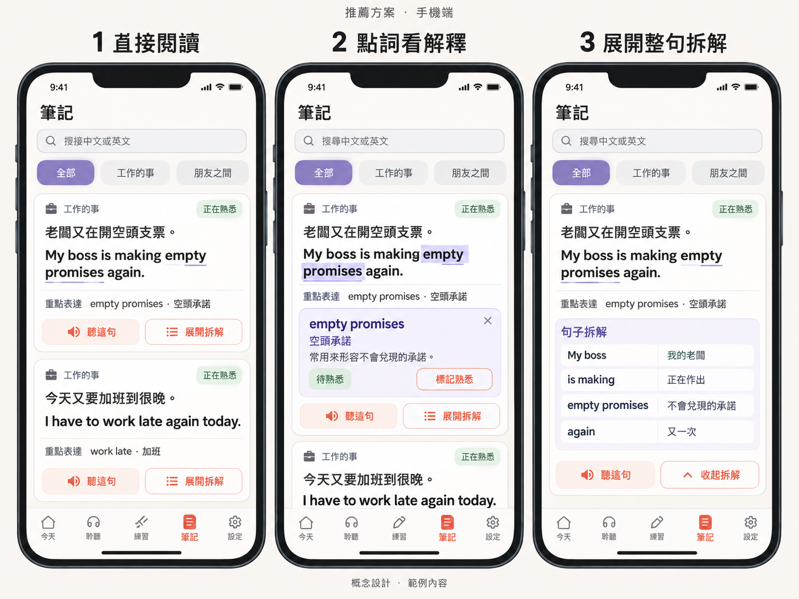

# Selah 笔记 B1＋B2 UI／UX 设计

日期：2026-09-10。状态：基于主人认可的方案 B，以及后续 B1／B2／B3／B4 调研形成的可审阅设计；当前仅设计与规划，产品功能尚未实施。

## 1．交付与范围

把正式 Web「笔记」从「截断列表＋右侧／下方详情」改成「完整双语卡片＋轻量展开＋按词查看释义」。用户打开笔记后就能确认整句英文，不必先点进详情。

- [四种方案对照](2026-09-10-notes-b1b2-ui-overview.png) 、[推荐方案网页端](2026-09-10-notes-b1b2-ui-desktop.png) 、[推荐方案手机端三状态](2026-09-10-notes-b1b2-ui-mobile.png) 。
- [整体开发计划](../plans/2026-09-10-notes-b1b2-plan.md) 、[项目真实进度](../../../ROADMAP.md) 。
- 设计稿中的例句、日期、词汇状态和拆解内容均为示意，不表示当前账户已有这些内容；实际界面必须使用真实句子、分类、熟悉状态、拆解和词汇。
- 本轮可改设计文档、静态概念图、项目规范与路线图；不修改 Dart、JavaScript、TypeScript、测试、应用资源、配置或构建产物，不调用生成／TTS，不部署。
- 本期只改正式 Web 笔记页的查看与确认路径。不新增笔记数据结构、云端字段、数据库 migration、批量删除、历史清理或成长回忆入口。

设计图是静态布局与视觉基准，点击行为以本文为准。概念图按展示比例排版，不是可运行原型。图像由内置 imagegen 生成，用于对照结构，不进入应用资源或构建链路。

## 2．当前工程依据

| 已核对位置 | 当前实际行为 | 对设计的影响 |
| --- | --- | --- |
| `SelahFlutter/lib/web/ui/web_learning_app.dart` 的 `_NotesPage` | 搜索中英、按分类筛选未归档句子；宽屏 ≥700px 左右分栏，窄屏列表下再堆详情 | 取消「先选一句才能看到完整英文」；宽屏不再保留空详情栏 |
| 同文件 `_NotesList` | 中文最多 2 行、英文强制 1 行并截断；熟悉程度只靠色点 | 列表本身必须完整显示中英；熟悉状态改用文字 |
| 同文件 `_NoteDetail` | 选中后才显示整句、拆解、词汇、夜间预览和图标「去聆听」 | 拆解与词汇改为卡片内按需展开；主操作改为「听这句」 |
| 同文件 `_VocabularyRow` | 详情里直接展开全部词义；点击状态标签循环推进 | 默认只露出一个重点表达；点词才打开该词释义和状态操作 |
| `SelahFlutter/lib/web/learning_controller.dart` | 已有 `selectSentence`、`navigate`、`setVocabularyState`、`markPreviewed` | 本期复用这些入口，不新增同步事件或云端字段 |
| `SelahFlutter/lib/web/domain/learning_models.dart` | `LearnSentence` 已有 `source`／`target`／`breakdown`／`vocabulary`／`reviewState` | 只改展示与交互，不改句子模型 |
| `SelahFlutter/lib/web/l10n/selah_strings.dart` | 已有「把学过的留下来」「句子拆解」「去聆听」及 `review.*`／`vocab.*` | 新增展开／收起、听这句、练这句等文案，继续走现有三语文案表 |
| `SelahFlutter/test/web_app_test.dart` | 目前只断言进入笔记页标题，以及隐藏成长回忆入口 | 必须新增完整双语、展开、点词、返回位置的 Widget 测试 |
| `docs/superpowers/specs/2026-09-06-selah-web-ux-reliability-design.md` 4.5 | 当时约定手机笔记为「列表→详情」 | 本期明确替换该约定；搜索、筛选、空状态、复制和词汇撤销继续有效 |
| `_growthMemoriesUiEnabled` | 成长回忆入口已隐藏，测试覆盖「成长回忆」「打开回忆册」不可见 | 本期保持隐藏，不恢复入口 |

品牌依据是根目录、Flutter 子目录的 `CLAUDE.md` 及实际设计 token。`design-system/selah/MASTER.md` 中旧的靛蓝色与儿童字体不作为本设计依据。

## 3．产品判断

笔记页的主任务是「找到一句旧笔记，确认英文，必要时看一个短语或整句拆解，然后继续下一句」。当前实现让用户先看被截断的英文，再点一次才能确认，不符合这个任务。

调研后保留方案 B 的核心：句子直接可读，补充信息按需打开。推荐落地为 **B1＋B2**：

| 方案 | 默认看到什么 | 查看更多 | 本期处理 |
| --- | --- | --- | --- |
| **B1 重点展开卡** | 完整双语＋一行重点表达 | 在原卡片内展开拆解 | **默认结构** |
| **B2 词句批注卡** | 重点短语可点 | 只打开该词释义 | **与 B1 结合** |
| B3 快速预览卡 | 完整双语列表 | 网页侧栏／手机底栏打开长详情 | 仅当单句拆解过长时备用，不作为默认 |
| B4 分组阅读流 | 按今天／昨天连续阅读 | 条目内展开 | 笔记增多后再做，不进本期 |

不采用：

- 继续截断英文的双栏列表。
- 手机「列表下面再堆一张详情卡」。
- 打开第二张时自动收起第一张。
- 多列瀑布流、翻面卡、把成长回忆重新压在确认区上。

依据：[GOV.UK Details](https://design-system.service.gov.uk/components/details/) 要求多数用户需要的内容直接可见；[NN/G 手风琴研究](https://www.nngroup.com/articles/accordions-on-desktop/) 指出自动收起其他面板会妨碍对照。

## 4．信息架构与视觉

### 4.1 入口与层级

- 侧栏／底栏仍只有「今天、聆听、练习、笔记、设置」。
- 「笔记」页层级为：标题 → 说明 → 搜索 → 分类筛选 → 双语卡片列表。
- 搜索和分类继续作用于当前账户未归档句子；空状态继续区分「还没有笔记」和「没有匹配的句子」。
- 成长回忆入口保持隐藏。搜索框右侧筛选图标若本轮仍不打开真实筛选面板，就不要做成可点击外观；分类芯片承担当前筛选。

### 4.2 视觉规格

| 元素 | 设计值 |
| --- | --- |
| 页面／卡片／边框 | `#FBF8F4`／`#FFFFFF`／`#EBE7E1` |
| 主操作 | 珊瑚 `#E06B54`，深色按钮文字 `#1A1614` |
| 选中词／展开区 | 薰衣草浅底 `#F0EEF8`，下划线或边框 `#8B7FC7`，同时有文字状态 |
| 文本 | 正文 `#1A1614`，说明 `#706B65` |
| 字体 | 复用现有 Plus Jakarta Sans、Noto Sans SC／TC；界面语言走现有文案表 |
| 字号 | 页标题 22px；卡片中文 16px；卡片英文 18px／半粗；辅助说明至少 12px |
| 留白 | 4px 网格；桌面卡片内边距 20～24px，手机 16～20px；卡片间距 12～16px |
| 形状 | 卡片圆角 16px，按钮 10～12px；只用轻边框，不用厚阴影 |
| 触控 | 听这句、展开拆解、词汇状态的有效点击区域至少 44×44px |
| 动效 | 展开／收起 150～300ms；Reduce Motion 下瞬间切换，不做高度弹性动画 |

英文比中文更醒目，因为用户来确认的是英文。熟悉状态、词汇状态必须同时有文字，不能只靠色点。

### 4.3 响应式

- 主区最大宽度沿用 980px，卡片阅读列最大宽度 760px，居中。不因宽屏而恢复左右双栏。
- 900px 以下使用现有底部导航；900px 及以上使用侧栏。笔记页不新增陪伴栏。
- 320px、390px、768px、1130px、1440px 均不得横向溢出；200％文字缩放后仍可操作。
- 中英完整换行，禁止 `maxLines: 1` 截断英文。长拆解在卡片内继续增高，由页面滚动承载。
- 手机底栏和安全区必须预留高度；展开内容不得永久被底栏挡住。不承诺展开后下一句仍留在首屏。

## 5．三组界面与交互

### S01：直接阅读

每张卡片默认显示：

1. 分类文字，如「工作的事」。
2. 熟悉状态文字，如「正在熟悉」。
3. 完整母语句 `sentence.source`。
4. 完整学习语句 `sentence.target`，允许自然换行。
5. 一行「重点表达」：取该句第一个词汇，格式为 `empty promises · 空頭承諾`。没有词汇则隐藏这一行，不编造重点。
6. 主操作「听这句」；次操作「展开拆解」。没有拆解时隐藏展开按钮，不显示空面板。

规则：

- 打开笔记后不自动选中、不自动展开、不自动播放。
- 允许同时展开多张卡片；打开第二张不得收起第一张。
- 英文中与词汇 `entry.text` 匹配的片段可点；匹配大小写不敏感，优先最长匹配，只高亮第一次出现。匹配不到则该词仍出现在重点表达行，但不在句中伪造下划线。
- 卡片正文可选择、复制中英原文。复制走系统选择，不新增专用复制按钮。
- 「听这句」调用现有 `selectSentence` 后 `navigate(1)`，进入聆听该句；被浏览器拒绝播放时由聆听页处理，不在笔记页假装已播放。
- 「练这句」放入卡片次级操作，调用 `selectSentence` 后 `navigate(2)`。夜间预览继续作为更次要操作，不放在第一行按钮。

### S02：点词看解释

点击句中可点短语，或点击「重点表达」行，只打开该词的小面板。

面板内容：

- 词汇原文 `entry.text`
- 词义 `entry.meaning`
- 当前状态文字，如「待认识／学习中／熟悉／已掌握」
- 「标记熟悉」或按现有状态机显示下一步；已掌握可回到待认识
- 关闭控件

规则：

- 手机：面板插在该卡片双语正文下方，不是全屏弹层，也不是底部详情页。
- 网页：词旁小浮层；空间不足时退回卡片内插页，不把浮层画出窗口。
- 同一张卡片同时只打开一个词面板；点另一词则替换，不叠加。
- 词面板与整句拆解可同时存在。
- 状态修改继续走 `setVocabularyState`；撤销规则沿用现有「必须仍是当时改过的状态」。忙碌时禁用，失败显示现有错误，不静默成功。
- 关闭词面板后保留列表滚动位置和已展开的拆解。

### S03：展开整句拆解

点击「展开拆解」后，在同一卡片内显示：

- 标题「句子拆解」
- 现有 `_BreakdownLine` 的每一项：`surfaceText`／`surface`／`text` ＋ `explanation`／`meaningInContext`／`meaning`
- 其余词汇列表，复用 `_VocabularyRow` 的文字状态，不靠无标签色块
- 「听这句」「收起拆解」

规则：

- 展开／收起只改变显示状态，不改句子数据。
- 收起后保留搜索词、分类和滚动位置。
- 拆解或词汇为空时，只显示已有部分；两者都空则没有展开按钮。
- 单句拆解让卡片超过约两屏时，允许该卡片改用 B3：点击「展开拆解」打开网页右侧预览或手机底部详情层，关闭后回到原卡片。默认路径仍是原地展开。这个备用路径只服务超长内容，不把所有卡片改成侧栏。

## 6．状态、文案与可访问性

默认界面语言是繁体。下列为源文案，实施时写入现有三语文案表，不得把概念图里的错字带进产品。

| 源文案 | 用途 |
| --- | --- |
| 把学过的留下来 | 页标题，沿用 |
| 回看句子，慢慢熟悉每个表达。 | 页说明，替换「搜索句子、回看拆解…」过长句 |
| 搜索中文或英文 | 搜索框，沿用 |
| 重点表达 | 卡片摘要行标签 |
| 听这句 | 主操作，替换仅图标的「去聆听」 |
| 练这句 | 次操作 |
| 展开拆解／收起拆解 | 拆解开关 |
| 句子拆解 | 展开区标题，沿用 |
| 标记熟悉 | 词面板下一步，实际标签按状态机变化 |
| 还没有笔记／没有匹配的句子 | 空状态，沿用 |

熟悉状态继续用 `reviewLabel`：新句子、正在熟悉、越来越熟、已经稳了。词汇状态继续用 `vocabularyLabel`：待认识、学习中、熟悉、已掌握。

可访问性：

- 「听这句」「展开拆解」「收起拆解」使用按钮角色和明确名称，不靠无文字图标。
- 展开按钮反映 `aria-expanded` 语义；读屏能区分收起／展开。
- 词下划线之外必须能被键盘聚焦、Enter／Space 打开。
- 选中词不能只靠颜色；配合下划线或「重点表达」文字。
- 倒计时、庆祝动效、循环波形均不加入笔记页。

## 7．实现边界

`LearningController` 继续拥有句子、词汇状态、预览标记和跨页选中。笔记页只保存本页 UI 状态：搜索词、分类、展开的句子 ID 集合、当前打开的词汇 ID。这些 UI 状态不写入账户快照、备份或云端同步。

刷新或切换账户后，展开和词面板关闭；搜索与分类也不跨账户保留。顶层切换到今天／聆听／练习／设置再返回笔记时，尽量保留本页搜索、分类、展开集合和滚动位置；这只在同一次应用会话内有效。

不在本期做：

- 按日期分组的 B4
- 恢复成长回忆入口
- 新的笔记数据表或 vocabulary 字段
- 让每个单词都可点；只处理已有 `vocabulary` 条目
- 自动播放、自动展开第一句、翻面记忆
- 修改聆听、练习、生成或循环听的完成记账

若实施时发现 `web_learning_app.dart` 笔记段过长，计划允许把笔记卡片抽到同目录新文件，但不借此重写整个学习壳。

## 8．验收门槛

| 编号 | 场景 | 通过标准 |
| --- | --- | --- |
| N01 | 打开有 3 句笔记的桌面页 | 三句英文完整可见，无省略号截断，无「选一句查看详情」空栏 |
| N02 | 打开同样 3 句的 390px 页 | 三句中英均可完整阅读；底栏不挡住第一张卡片正文 |
| N03 | 点第一张「展开拆解」 | 拆解出现在该卡片内；第二、第三句完整英文仍在列表中 |
| N04 | 再点第二张「展开拆解」 | 两张同时保持展开 |
| N05 | 点 `empty promises` 或重点表达行 | 只打开该词释义和状态，不跳页 |
| N06 | 关闭词面板或收起拆解 | 搜索、分类和滚动位置仍在 |
| N07 | 「听这句」 | 进入聆听并选中该句；笔记页不标记播放完成 |
| N08 | 「练这句」 | 进入练习并选中该句 |
| N09 | 无词汇、无拆解的句子 | 不显示重点表达和展开拆解，正文仍完整 |
| N10 | 空库／无匹配 | 沿用现有两个空状态和行动按钮 |
| N11 | 320／390／768／1130／1440px 与 200％文字 | 无横向溢出，按钮可点 |
| N12 | 成长回忆 | 「成长回忆」「打开回忆册」仍不可见 |

Widget 测试覆盖 N01、N03、N04、N05、N09、N10、N12。N02、N11 需浏览器视口核验。iPhone Safari／Android 真机另记，不能用桌面缩小视口代替。

## 9．后续不自动扩大的事项

B3 超长拆解备用层、B4 按日期分组、状态筛选面板、批量操作、笔记内播放迷你条，均需新的设计确认。既有循环听、会员、设置语言计划不因本文自动获得实施授权。
