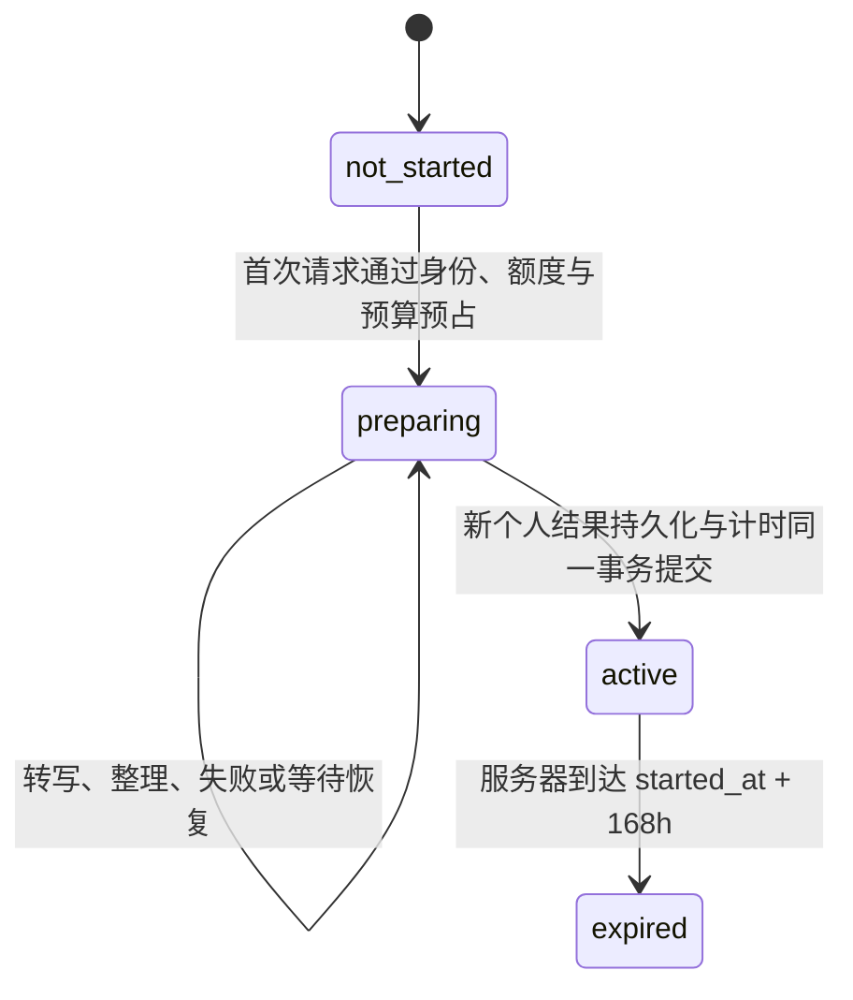

# Selah 注册画像与试用权限补充设计

日期：2026-09-12。状态：规划稿，依据主人已认可的注册登录调研结论整理；本轮只修改文档。

总入口为 [会员与 Dashboard 总计划](../plans/2026-09-11-membership-dashboard-final-plan.md) ，执行任务见 [本轮补充计划](../plans/2026-09-12-registration-profile-trial-plan.md) 。本设计细化首次试用、注册后画像及研究统计；既有价格、权益、费用保护和发布门槛继续有效。

## 1．目标与核查基线

目标是让新用户能够先学习免费示例，注册后顺利开始一次受保护的试用，并自愿提供用于使用／付费群体研究的基础资料。

| 核查项 | 已有证据 | 本轮设计要解决的问题 |
|---|---|---|
| 注册 | 页面与 `SupabaseLearningGateway.signUp` 只收邮箱、密码 | 保持简短注册，另设可跳过的画像流程 |
| 生成鉴权 | 客户端 `_online` 与服务端 JWT 鉴权要求登录；前轮对单句、配音、转写接口的无凭证 GET 均得到 401 | 保持全部新增 AI 处理的服务端登录检查 |
| 试用部署 | 同会话前轮实测 `membership-status` 为 404；本地 006 migration 尚未应用 | 明确区分代码、数据库、远端接口与已启用产品 |
| 首次试用 | `reserve_generation_allowance` 无有效权益即拒绝；激活在单句完成后的另一 RPC 中 | 补齐试用预备状态，并原子保存结果及激活时间 |
| 批量生成 | 逐条调用完成 RPC，未与首次试用激活形成共同事务 | 单句与批量共用完成机制与表达额度 |
| 画像存储 | `user_profiles` 当前保存语言、声线等学习偏好，参与旧客户端同步 | 将可撤回的研究资料与已有学习偏好分开 |

以上远端状态和 6 项 Node 准入测试通过属于前轮调研证据，本轮没有重新执行远端检查或产品测试。开发启动与启用前都需重新核对环境。

## 2．确定的产品规则

| 项目 | 规则 |
|---|---|
| 访客 | 免费示例、内置音频和可访问的本机学习内容可用 |
| 注册 | 邮箱与密码；邮箱确认行为以 Supabase 实际认证策略为准 |
| 新增 AI 处理 | 个人英文、批量生成、长文整理、转写、新增配音均需登录和服务端准入 |
| 试用起算 | 首次新的个人英文结果在服务器成功持久化时起算，连续 168 小时 |
| 不触发起算 | 注册、登录、看示例、填问卷、单独转写／整理、失败请求、只取回旧结果 |
| 试用额度 | 30 条表达、3000 配音字符、300000 毫秒转写、3 次长文整理 |
| 月会员 | 39.9 元／月；每账期 300 条、30000 字符、3600000 毫秒、30 次 |
| 到期／触顶 | 限制对应新增处理；已有文字与可用音频仍能学习，账户数据继续隔离 |
| 画像 | 自愿填写、每题可跳过、整页可跳过；不影响试用、会员或管理员资格 |

用户界面继续只展示方案的完整静态权益与必要到期日期，不展示剩余数量、已用比例或用量倒计时。继续使用现有模型与声线；本轮不增加基于画像的自动推荐或修改生成 prompt。

## 3．试用状态与事务

### 3.1 状态

| 状态 | 服务端事实 | 允许的行为 |
|---|---|---|
| `not_started` | 尚未有试用记录 | 当新试用开放、身份及预算条件通过时，允许预备试用 |
| `preparing` | 已有唯一预备记录，时间为空，额度及费用已有归属 | 可在原试用总额度和预算内处理；不重复赠送预算 |
| `active` | 首次新结果已持久化，存在起止时间 | 在 `[started_at, expires_at)` 内按剩余权益准入 |
| `expired` | 服务端时间达到到期点 | 取回已有结果与学习，新增处理需其他有效权益 |
| `unavailable` | 状态服务不可用或资格不能可靠判断 | 显示暂不可用；不得把读取失败解释为免费开放 |

这些是拟新增的 `trialState` 合约值。月会员仍由原 `plan`、`status` 和账期字段表达并优先展示。`not_started` 本身不等于获得使用授权；最终资格始终在准入事务中判断。

### 3.2 数据与计量方案

建议复用 `user_memberships` 表中的一个终身唯一试用记录：仅试用允许新增 `preparing` 状态，准备阶段起止时间为空；激活时更新同一记录。其他有效期间必须有合法起止时间。对每账户的试用记录设置数据库唯一约束，不能只靠应用先查询再插入。

预备期的 `membership_reservations` 绑定这个试用 ID。激活后继续累计同一记录的额度和费用，不能用 `created_at >= started_at` 排除预备期消耗。单句和批量统一占用「表达条数」，不能各得 30 条。批量的已完成重放项不重复计数。

第一次付费处理之前完成个人、平台及试用池预算预占。仅转写或整理也使用同一个终身试用预算；失败不赠送新的预算。已发生的供应商费用和未知结果的保守预占按既有费用设计保留，未发送请求才能按证据释放相应预占。2 元试用／20 元会员仍是待验证的模型预算目标。

### 3.3 首次生成顺序

1. 校验登录、内容归属、请求参数和幂等键；已完成的相同请求直接取回原结果。
2. 服务端读取可信开关。在同一准入事务中找到有效会员，或为符合资格的新用户建立／复用 `preparing` 试用；预占权益和费用。
3. 认领发送权后调用既有供应商。未获准入的请求，上游调用次数必须为零。
4. 通过一个新的内部 RPC `complete_personal_generation`，原子完成新结果持久化、成功表达计量和首次试用激活。
5. 返回可恢复的结果与真实会员摘要；客户端是否在线、是否收到响应、是否完成学习库同步均不改变起算时间。

这里的服务端持久化沿用现有 `generation_requests.response_payload` 成功结果账，不要求提前重写客户端负责的句库同步。单句传一项、批量传多项；批量中全部新增且校验通过的结果在同一事务提交。时间只取数据库时钟，API 不接受客户端指定开始／到期时间。

同一账户并发的首次生成、支付和赠送遵循固定锁顺序。已预占的请求始终结算到原权益记录；后续购买不能将旧请求挪到新账期。已经是月会员且未发起试用时，不另建试用；试用预备请求发出后才发生购买的，该在途请求仍按原试用记录完成，月会员在界面优先显示。

关闭「新试用」只阻止建立新的预备记录，不中断已接受试用的完成／激活。暂停新增生成阻止新的供应商发送，在途结果仍可保存与结算。明确配置的免费模式与服务控制读取失败必须分开处理；生产环境不能因 RPC 缺失自动绕过权益及费用保护。

### 3.4 故障要求

- 上游调用前失败：不开始计时，按未发送证据处理预占。
- 转写／整理成功但未有英文结果：仍为 `preparing`，相应用量与费用保留。
- 英文成功、配音失败：英文结果已经满足激活条件，试用时间不回退；配音可按原请求规则重试。
- 完成事务失败：不得向客户端返回「生成已成功」；恢复时优先查原结果与原请求，不重新获得试用预算。
- 完成事务成功但响应丢失：重放返回原结果、原起算时间，不重复调用供应商或计量。
- 到期前已获准入、到期后才完成：仍结算原记录并交付已有结果；到期后的新请求不再获准。
- 旧免费模式的历史内容、注册时间和清理浏览器缓存均不能回填或重置试用开始时间。

## 4．注册与问卷流程

建议采用「免费示例 → 按需注册／登录 → 完成一次有效学习 → 可选问卷」。用户从生成入口登录后，保留原草稿和所在页面；登录成功不自动提交会产生费用的请求，用户明确点击生成。

问卷自动邀请只面向已登录账户，在当前账户首次完成 `listen_completed` 或 `practice_rated` 后、播放器与练习保存均已结束时展示。首次邀请采用轻量卡片进入表单，不打断音频、录音或输入。旧用户同样可被邀请一次；不要求重新注册。

| 字段 | 语义与稳定值 | 展示安排 |
|---|---|---|
| `learningGoal` | `work`、`daily`、`travel`、`exam`、`other`、`prefer_not_say` | 首轮：主要学习目标，单选 |
| `englishLevel` | `starter`、`reading_stronger`、`conversational`、`not_sure`、`prefer_not_say` | 首轮：英语自评，不冒充正式测评 |
| `ageGroup` | `under_14`、`age_14_17`、`age_18_24`、`age_25_34`、`age_35_44`、`age_45_plus`、`prefer_not_say` | 首轮选填；实际开放选项受年龄政策约束 |
| `lifeStage` | `student`、`employee`、`self_employed`、`other`、`prefer_not_say` | 设置中后续选填 |
| `gender` | `male`、`female`、`self_described`、`prefer_not_say` | 设置中后续选填 |
| `genderDescription` | 仅 `self_described` 可有值，最多 40 个 Unicode 字符 | 不进入日志或后台聚合明细 |

所有字段默认未选。字段空值表示未填写，`prefer_not_say` 表示明确不愿透露，两者分别保留。首轮最多三题；不因多填资料赠送额度或强迫填满。不收真实姓名、精确生日、公司、收入、电话或精确位置。

服务端记录 `promptState`：`unseen`、`offered`、`skipped`、`answered`、`withdrawn`。原子领取邀请机会后再展示，避免多设备反复弹出；中断或跳过后始终可从「设置→研究资料」主动填写。离线和接口不可用时不自动弹问卷，学习流程照常进行。

建议用途文案：

> 帮助我们了解谁在使用 Selah，以及不同用户群体的学习和购买情况。这些资料用于用户研究与改进学习体验，填写完全自愿，不影响试用或会员权益。你可以跳过，也可以在设置中修改或撤回。

该文案是待结合实际政策完善的说明草案，不表示数据匿名化，也不承诺已经实现个性化推荐。提交有答案的资料前需有明确的研究用途同意；不预先勾选，不与基础注册或营销同意捆绑。跳过不需要同意。

## 5．研究资料、权限与撤回

建议新增独立的 `user_research_profiles` 表，以 `auth.users.id` 作为一对一账户键，保存问卷字段、邀请状态、研究同意状态、告知版本、同意／撤回时间、更新时间和修订号。

采用独立表，是因为现有 `user_profiles` 已参与学习偏好同步和多客户端兼容。研究资料不加入 `LearningSnapshot`、旧学习备份或游客缓存，避免退出账户后残留，或由旧客户端同步覆盖。客户端只在内存中保留正在填写的资料；网络失败时显示未保存，不能伪称保存成功。

拟新增 `user-research-profile` Edge Function，继续使用现有 `LearningGateway.invoke`，不扩展通用网络层。GET 读取自己的资料及能力状态；POST 只接受 `offer`、`save`、`skip`、`withdraw` 四种操作。账户 ID 来自已验证 JWT，客户端不得指定目标账户、同意时间、会员状态或管理员身份。

启用 RLS，默认撤销公开写入和 RPC 执行权限；服务端只通过受控 RPC 修改。读写与同意记录在同一事务完成，未知字段、非法枚举、过长文本、旧告知版本和修订冲突返回明确错误。研究资料不能进入 `app_metadata`、会员判定、OpenAI 请求或通用事件 metadata。

撤回需清空研究答案、停止后续群体关联，并更新最小撤回状态；后续登录不重新自动邀请。重新参加须主动进入设置并明确同意。历史研究关联明细与可能的缓存要按已确认保留策略清除；保留学习内容、合法订单及必要财务记录，不把研究撤回解释为删除账户。恢复备份时必须重新应用撤回／删除记录。

上线前必须确定处理者信息、目标地区、保存期限、备份处置和权利请求入口。上述参数未确定时，画像能力保持关闭；可用成年合成样本开发及验证。不得擅自新增成人限定，也不能用可跳过的年龄段题承担最低年龄核验；涉及不满十四周岁用户时，在收集研究资料前落实适用的监护同意及专门规则。

## 6．后台研究口径

复用现有管理台与 `admin-summary`，增加受管理员权限控制的 `audience` 视图。首版只按一个画像维度分组，支持目标、水平、年龄段、身份和性别；不提供个人画像明细、任意交叉筛选或原始问卷导出。

| 指标 | 首版精确定义 |
|---|---|
| 注册人数 | 服务端账户创建时间落在所选 UTC 半开区间内的去重账户数 |
| 画像覆盖率 | 当前有效同意且至少填写一个非空答案的账户数／对应注册人数；另显示未填写、不愿透露与撤回计数 |
| 近 7 天学习活跃 | 最近 168 小时内至少有一次有效 `listen_completed` 或 `practice_rated` 的去重账户；不把心跳或生成点击算完成学习 |
| 第 7 天留存 | 在注册后 `[168h, 192h)` 有上述学习事件的账户／已获得完整 192 小时观察期的注册账户 |
| 30 天首购转化 | 注册后 `[0, 720h)` 出现首笔服务端核实成功付款的账户／已获得完整 720 小时观察期的注册账户 |
| 赠送／补偿 | 按服务端权益来源单列；不算付款，之后真实购买才计首购 |
| 退款 | 成功付款后的退款单列；保留曾经首购事实，不以当前会员状态反推是否付过款 |

展示各指标的实际分母、样本量、观察期和查询时点。观察期不完整时显示「观察中」，不填 0。部分退款或净收入缺少可信支付数据时不展示对应指标，本轮不扩展支付渠道实现。

按「当前有效研究资料＋注册同期组」关联，并明确标签；不得宣称是注册当时或付款当时的历史画像。修改与撤回立即影响后续查询，不新增不可撤回的画像快照。未填写、不愿透露和未知支付来源均不推测补齐。

默认小于 5 人的群体只展示「样本不足」，不显示该组细分比率；5 人仅是首版展示规则，不是统计显著性或合规保证。保留整体覆盖情况；不把自愿填答者直接外推全部用户，也不把群体相关性解释为因果。

## 7．接口与状态约定

| 合约 | 输入／输出责任 |
|---|---|
| `reserve_generation_allowance` | 保留统一准入名称，增加预备试用路径；身份、费用和时间全部服务端决定 |
| `complete_personal_generation` | 内部服务专用；接受父请求 ID、预占 ID 和已校验的新结果项；原子持久化、计量、激活，返回原始结果及试用起止时间 |
| `membership-status` | 只读，不创建试用；增加 `trialState`，未起算日期为空，读取失败不能返回伪造免费摘要 |
| `get_user_research_profile` | 内部 RPC，输出字段、`promptState`、同意状态、告知版本、修订号和是否可以邀请 |
| `update_user_research_profile` | 内部 RPC，执行 `offer/save/skip/withdraw`；账户从服务端传入，时间与版本规则在服务端验证 |
| `admin-summary` 的 `audience` 视图 | 输入注册时间范围及单一维度，调用 `get_admin_audience_summary`；输出聚合数据、实际分母、观察期与数据可用状态 |

拟新增画像错误码为 `profile_unavailable`、`profile_invalid_input`、`profile_consent_required`、`profile_notice_changed`、`profile_conflict`、`profile_age_policy_required`。这些错误只影响画像；不能映射成登录失败或试用资格丢失。会员接口缺失或不可用则明确显示状态暂不可用，并保留已有内容学习入口。

## 8．启用门槛

| 门槛 | 必须具备的结果 | 未满足时 |
|---|---|---|
| G-R01 地区与年龄 | 确认服务地区、最低年龄规则及儿童路径 | 不向真实用户启用新增画像 |
| G-R02 告知与保留 | 确认用途正文、保存期限、撤回入口、备份清理与恢复流程 | 不收真实研究资料 |
| G-R03 数据库授权 | 明确允许创建／修改 migration，并分别允许隔离环境及远端应用 | 只做获准的应用代码和合成测试，不能伪造数据库成功 |
| G-R04 试用事务 | 新账户首条、首批、故障及并发测试通过，原费用 G01—G05 满足 | 不启用会员强制限制或承诺 7 天已生效 |
| G-R05 平台发布 | 对应函数部署、普通账户验收、开关与 Web 更新分别获准并验证 | 保持待发布状态 |

开发顺序为试用与权限闭环优先，画像存储／问卷其次，后台聚合再次，最后封闭环境验收与逐项启用。画像和会员开关分别控制，画像故障不阻塞试用。

## 9．资料依据

- [NNGroup：When to Hide Content Behind Forms and When to Give Content Away](https://www.nngroup.com/articles/content-behind-forms/) ：支持随阶段逐步收集，不提供可直接套用的转化提升比例。
- [GOV.UK：Collecting personal information from users](https://www.gov.uk/service-manual/design/collecting-personal-information-from-users) ：最小化字段并解释收集用途。
- [GOV.UK Design System：Equality information](https://design-system.service.gov.uk/patterns/equality-information/) ：研究问题可选、允许跳过与后续更新；此处借鉴交互原则，不套用其英国公共部门法律适用范围。
- [《中华人民共和国个人信息保护法》官方全文](https://www.samr.gov.cn/wljys/gzzd/art/2023/art_3ef1e889c1e644d4b65b5f5c7f432386.html) ：参考第六、十六、十七、二十八至三十一条；适用地区尚需确认。
- [Supabase：Row Level Security](https://supabase.com/docs/guides/database/postgres/row-level-security) ：用户可修改的 metadata 不适合作为授权依据。

资料已在本会话前轮检索并打开核对。本文件中的字段、交互、统计口径和事务分解是针对 Selah 的设计决定，不是来源提供的效果保证。
