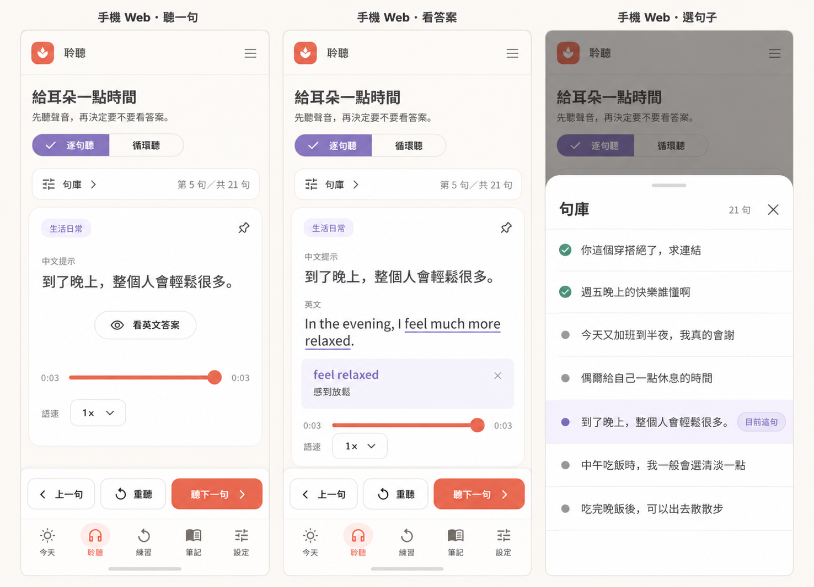
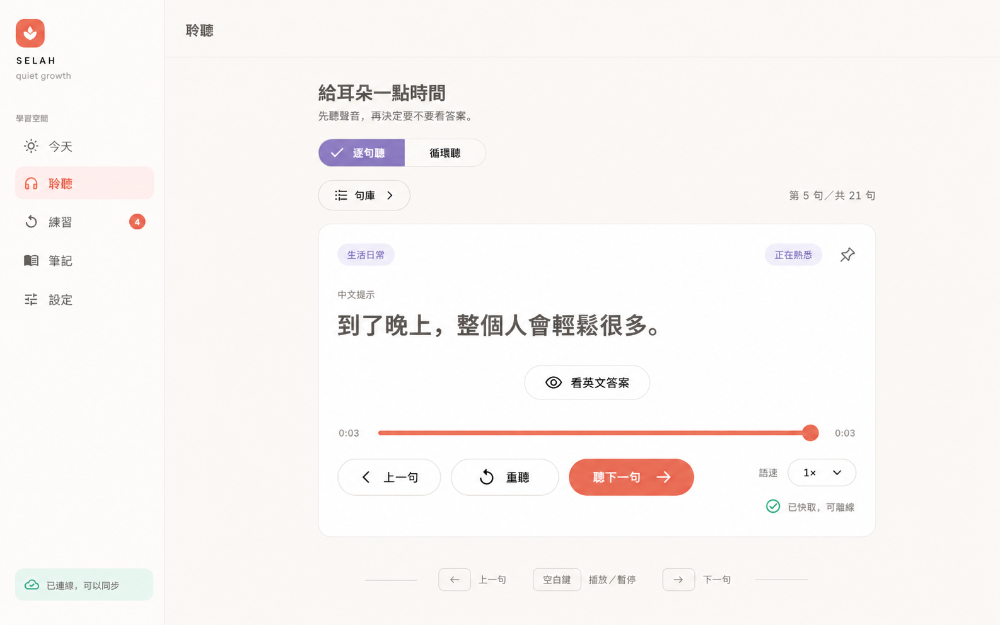

# Selah 逐句聆听方案 B：手机优先的 UI／UX 设计

> 日期：2026-10-01。状态：主人已认可方案 B 与两张概念图，本轮整理设计和开发准备，未授权产品代码实施。
>
> 后续开发入口：[开发计划](../plans/2026-10-01-listen-focus-b-plan.md) 。本文与项目 `CLAUDE.md` 是产品规则依据；图片用于表达布局方向，不替代真实状态与验收。

## 1．目标与范围

把普通「逐句听」从「找句子、点播放、再找下一句」改为「听当前句、按需要看答案或重听、听下一句」。同一个 Flutter Web 页面适配手机与桌面，优先保证手机用户单手操作和长文本阅读。

手机优先是本次设计假设。当前没有设备占比数据，不声称手机用户已经占多数，不为验证这个假设新增统计系统。

本期包含普通逐句页、句库弹层、前后切换、播放状态按钮、紧凑语速入口、桌面快捷键、三语文案及后续验证。既有账户、音频、学习完成、置顶与缓存服务继续复用。

「今天」的轻量学习保留已有推荐顺序、听完后继续与返回流程；它的「下一句」不改为普通句库的相邻句。循环听保留独立会话、双语语序、准备／开始、时长与迷你播放器规则。本期不新增滑动换句、耳机按键、自动推进、句间倒计时、学习任务、搜索筛选或新的播放模式，也不改原生客户端。

## 2．已确认的概念图

### 2.1 手机 Web

从左到右为普通学习卡、英文与词义展开、句库底部抽屉。展开答案后，上一句／播放状态／听下一句的操作位置保持一致。

### 2.2 桌面 Web

保留全局导航侧栏。主内容仅有当前句学习卡，句库通过入口按需打开，键盘提示位于卡片附近。

### 2.3 设计图与落地的关系

- 两张 PNG 是 Codex 内置生图的已认可输出副本，仅供设计审阅；不导入 Flutter assets、Web 构建或预缓存清单。
- 手机图右上角额外出现的菜单图标没有已确认功能，实施沿用现有 `_MobileTopBar`，不新增菜单。
- 图中的近似紫色、鼠尾草色、圆角与字体以现有 `SelahColors`、`SelahTypography`、`SelahSpacing`、`SelahCornerRadius` 为准。继续使用项目的 Plus Jakarta Sans 与既有 Noto Sans SC 回退，不增加字体。
- 图中第 5 句／共 21 句、已缓存、熟悉状态、置顶与导航数字仅为展示样例，实施必须读取真实数据。已听过不等于已经掌握。
- 图片展示的是音频已结束状态，所以中间按钮为「重听」；首次、播放中和暂停中按下面的状态表显示。

## 3．信息结构与响应式布局

### 3.1 两端共同结构

页面依次呈现说明、逐句听／循环听切换、句库入口与位置、当前句内容、音频进度与语速，以及三个独立操作。位置文案仅说明「第几句／共几句」，不使用完成百分比或强制完成整库的暗示。

当前句卡保留实际分类、母语正文、英文答案入口、已置顶提示／图钉、现有按词释义和拆解能力。英文默认隐藏，切换到另一句时重新隐藏并关闭旧词义；重听同一句时保留已展开的答案。

### 3.2 手机与窄屏

沿用现有 Web shell 的全局断点：视口宽度小于 900 logical px 时使用顶部标题与底部五项导航。平板窄屏采用相同内容组织，学习区最大宽度 860，居中显示。

- **可滚动区：**说明、模式切换、句库入口、当前句、答案／词义、进度与语速。页面左右间距通常 20，320 宽或大字体时允许减至 16。
- **固定操作区：**上一句、播放状态按钮、听下一句。位于现有底部导航上方，不放进可滚动区，不覆盖最后一行内容。按钮目标至少 48×48，常规高度 52～56，下一句占更大宽度。
- **底部导航：**继续使用今天、聆听、练习、笔记、设置。安全区由页面与既有导航分工处理，避免重复增加底部间距。
- **空间不足：**按钮文字可换行并增加操作条高度；页面内容滚动，操作顺序不变。不通过缩小点击目标或隐藏文字解决溢出。
- **浏览器变化：**以实际可用高度布局，不固定为 844 高。地址栏展开／收起、横屏和键盘出现时，保持操作区可见，弹层与正文各自可滚动。

实现采用 `_ListenPage` 内的有界 `Column`：`Expanded` 承载滚动内容，其下是固定操作条。现有 `_Content` 与 `Scaffold` 已提供页面可用空间和底部导航，不叠加第二个 `Scaffold`。这与 [Flutter Scaffold 的布局和键盘说明](https://api.flutter.dev/flutter/material/Scaffold-class.html) 相符。

### 3.3 桌面

视口宽度至少 900 logical px 时沿用全局侧栏与顶栏。主内容最大宽度 860；学习卡外边距随可用空间收缩，正文左对齐。

- 移除普通逐句页常驻的句子列表列，保留按需打开的句库入口。
- 桌面卡片分为内容区与底部控件区。长答案在内容区滚动；进度、三个操作与紧凑语速入口在卡片底部保持可用，避免展开内容把操作挤到视口外。
- 极短窗口时优先缩减垂直留白，让内容滚动，不挤压按钮。
- 根据内容容器实际宽度排版，兼容现有陪伴栏开启后主区域变窄的情况；不改变陪伴栏开关和断点。
- 卡片附近显示左右方向键与空格提示，操作仍提供可见按钮。

## 4．交互规则

| 操作 | 结果 | 是否开始新播放 | 学习状态 |
| --- | --- | --- | --- |
| 进入普通逐句页 | 恢复当前有效选择，否则显示句库第一句；答案默认隐藏 | 否；已有同句播放状态按真实情况呈现 | 不写完成 |
| 打开／关闭句库 | 展示／收起可滚动列表，关闭后返回原操作入口 | 否，不改变当前播放状态 | 不写完成 |
| 句库选择另一句 | 停止旧单句，显示所选句，隐藏新句答案，关闭弹层 | 否，保留现有选句静音习惯 | 不写完成 |
| 句库选择当前句 | 仅关闭弹层；保留当前进度、答案与播放状态 | 否 | 不写完成 |
| 听下一句／上一句 | 按当前句库顺序切换，清空旧句展开状态，并播放新句一次 | 是，来自用户主动操作 | 点击本身不写完成 |
| 看英文答案／查看词义 | 只改变当前句展示 | 否；逐句听没有自动推进计时 | 不写完成 |
| 单句真实播放结束 | 停在当前句，中间按钮变为重听 | 不进入下一句 | 沿用现有真实结束事件 |
| 调整语速 | 保留当前句、位置和答案，更新既有偏好 | 不创建新播放 | 不写完成 |
| 置顶／取消置顶 | 沿用本机置顶顺序，更新图钉与位置计数 | 否，当前句与答案不变 | 不写完成 |

上一句与下一句都沿用 `orderedListenSentences`：当前账户未归档句子，置顶在前，其他句子维持原顺序。每次操作按最新列表与当前句 ID 求相邻句，不用旧索引，也不新增独立队列快照。

置顶后当前句可能变成第 1 句，位置立即更新，后续切换遵循更新后的顺序。归档或同步导致当前句不可用时，回退到当前有效第一句并隐藏答案，保持静音；没有有效句子则显示已有空态。

## 5．播放状态与边界

### 5.1 中间按钮

| 当前句真实状态 | 文案 | 点击结果 | 前后切换 |
| --- | --- | --- | --- |
| 未播放／idle | 播放 | 从头播放当前句 | 有相邻句时可用 |
| 当前句音频准备中／loading | 准备音频…，带加载标识 | 暂不可用 | 暂不可用 |
| playing | 暂停 | 暂停，保留位置 | 有相邻句时可用，切换会停止旧播放 |
| paused | 继续播放 | 从暂停位置恢复 | 有相邻句时可用 |
| ended | 重听 | 从头再播放一次 | 有相邻句时可用 |
| 音频失败／error 或准备失败回到 idle | 播放 | 重试当前句，现有消息区说明真实原因 | 请求结束后有相邻句时可用 |

按钮只绑定当前句。另一句的 `playing`／`paused` 不能让当前卡误显示暂停／继续。`loading` 还需匹配当前选择与准备目标，不能把全局同步忙碌当成音频准备中。

首句的上一句禁用，末句的下一句禁用，不绕回。最后一条仅提示「这是最后一句，可重听或从句库选择」，不声称前面的句子都已经听完。一句句库保留两个禁用的边界按钮；空句库不展示无效的三按钮操作条。

### 5.2 请求、失败与账户变化

- 同一切换请求进行中禁止重复点击和长按键自动重复，不排队播放多句；完成后再接收下一次操作。
- 切换应终止旧播放并失效旧异步结果。复用既有 `_playGeneration`、`_accountGeneration` 和 `stopPlayback()`，避免旧音频在新卡上出声或写完成。
- 浏览器拒绝播放时，留在已选的新句，保留音频准备结果与现有「音频已准备好，请再点一次播放」提示，让用户重试；不换到别句，不假报成功。
- 缺缓存、离线、登录／权限或配音失败沿用现有服务与真实错误；不静默跳过，不调用新的配音服务。
- 账户切换、退出或页面所属账户变化时，关闭本页弹层、清空选择展示状态，后续 UI 与音频只使用当前账户。
- 切换逐句听／循环听不启动新音频；继续复用两套播放互斥逻辑。循环听显示时不出现普通逐句操作条。
- 本期不修改全局切页和后台播放策略。离开聆听页后隐藏本页操作与快捷键，返回时按当前真实状态呈现。

用户主动启动音频并能暂停是本设计的基本规则，参考 [W3C 音频控制说明](https://www.w3.org/WAI/WCAG22/Understanding/audio-control.html) 。

## 6．句库弹层

| 项目 | 手机与窄屏 | 桌面 |
| --- | --- | --- |
| 容器 | 白色圆角底部模态抽屉；常规高度约可用空间的 70％，最大 85％ | 居中有界对话框，最大宽度 560，最大高度为可用空间的 80％ |
| 标题 | 句库、实际句数、关闭按钮与拖动提示 | 句库、实际句数与关闭按钮 |
| 内容 | 同一份可滚动句子列表 | 同一份可滚动句子列表 |
| 行信息 | 母语正文、当前句浅紫选中态、真实已听标记与置顶操作 | 与手机一致 |
| 关闭 | 关闭按钮、遮罩、下拉关闭；浏览器返回行为需实测 | 关闭按钮、遮罩、Escape |
| 焦点 | 首次进入当前行附近，关闭后回到入口 | 键盘可遍历，关闭后回到入口 |

列表用惰性构建，长句显示最多两行，完整句子在学习卡阅读；读屏名称包含完整正文与选中状态。加载中可浏览，但选句与置顶暂不可操作。选择当前行不重播，置顶图标不触发行选择，置顶后弹层保持打开。

复用现有 `_SentencePicker` 的内容与置顶语义，改为可滚动列表，不增搜索、筛选或编辑操作。手机使用 [Flutter showModalBottomSheet](https://api.flutter.dev/flutter/material/showModalBottomSheet.html) ，按实际约束处理安全区与滚动。

## 7．语速与键盘

### 7.1 紧凑语速入口

普通逐句页只展示当前值「语速 1×」及展开箭头。点开手机底部选择层／桌面选择菜单，继续提供 `0.5×`、`0.75×`、`1×`、`1.25×`、`1.5×` 和自定义。

自定义继续使用现有 0.5～2.0 范围与 `showCustomSpeedDialog`，先关闭语速选择层再打开自定义对话框，避免叠层。选中态使用既有浅紫底、紫边、深紫字。其他页面继续采用原有 `SpeedSelector` 外观，不因此改设置和循环听。

### 7.2 桌面及外接键盘

| 按键 | 作用 |
| --- | --- |
| 右方向键 | 与听下一句相同 |
| 左方向键 | 与上一句相同 |
| 空格 | 与当前播放状态按钮相同 |
| Tab／Shift＋Tab | 按阅读顺序遍历页面控件 |
| Escape | 关闭当前弹层；没有弹层时不换句 |

快捷键仅在普通逐句页的学习区域有焦点、页面处于当前 tab、无弹层且没有输入／进度／语速控件接管按键时生效。输入、滑块、按钮自带的空格激活和模态交互优先；一次按键最多触发一次操作，忽略重复的按住事件。

使用已有 Flutter [Shortcuts](https://api.flutter.dev/flutter/widgets/Shortcuts-class.html) 、Actions 与 Focus，不增加全局 DOM 键盘监听或新依赖。参考 [W3C 对快捷键误触与焦点范围的说明](https://www.w3.org/WAI/WCAG22/Understanding/character-key-shortcuts.html) ，本期不增加字母键快捷操作。

## 8．文案、可访问性与视觉

新增正式文案覆盖繁中、简中与日语，不把图片文字写死在控件中。现有播放、暂停、关闭、自定义语速与错误文案继续复用。

| 新文案键 | zh-Hant | zh-Hans | ja |
| --- | --- | --- | --- |
| `listen.library` | 句庫 | 句库 | 文の一覧 |
| `listen.previous` | 上一句 | 上一句 | 前の文 |
| `listen.nextPlay` | 聽下一句 | 听下一句 | 次の文を聞く |
| `listen.replay` | 重聽 | 重听 | もう一度聞く |
| `listen.resume` | 繼續播放 | 继续播放 | 再生を再開 |
| `listen.preparing` | 準備音訊… | 准备音频… | 音声を準備中… |
| `listen.position` | 第 {index} 句／共 {count} 句 | 第 {index} 句／共 {count} 句 | {count} 文中 {index} 文目 |
| `listen.currentSentence` | 目前這句 | 当前这句 | 現在の文 |
| `listen.lastSentence` | 這是最後一句，可重聽或從句庫選一句。 | 这是最后一句，可重听或从句库选一句。 | 最後の文です。もう一度聞くか、一覧から選べます。 |
| `listen.nativePrompt` | 母語提示 | 母语提示 | 母語のヒント |
| `listen.unavailable` | 這句已不在目前的句庫，請重新選一句。 | 这句已不在当前句库，请重新选一句。 | この文は現在の一覧にありません。別の文を選んでください。 |
| `listen.keyboardHint` | ← 上一句　空白鍵 播放／暫停　→ 下一句 | ← 上一句　空格 播放／暂停　→ 下一句 | ← 前の文　スペース 再生／一時停止　→ 次の文 |

位置参数都用真实的一基索引与句数。母语提示采用通用标签，已有中文／日语正文及语言元数据保持原样。英文答案与现有词义文案继续复用。

读屏顺序为模式、句库、位置、母语、答案、音频状态／语速、前后与播放操作；模态按自身顺序遍历。控件有明确名称、禁用与选中状态，颜色之外有图标／文字区分。全页支持 200％ 文字放大，Reduce Motion 时使用静态内容切换，切句不做整页滑动或奖励动画。

## 9．当前实现依据

| 现有位置 | 已核对内容 | 本期处理 |
| --- | --- | --- |
| `web_learning_app.dart`：`_WebShell` | 900 全局断点；238 宽侧栏；既有底部导航 | 保留 shell 结构 |
| 同文件：`_Content`、`_PageFrame` | 有界页面、全局消息／邀请、普通滚动框与循环迷你播放器 | B 页自行分开滚动与操作区，保留消息和循环区域 |
| 同文件：`_ListenPage`、`_ListenDetail`、`_PlaybackControls` | 列表选句后再播放，移动端列表在卡片前；词义与拆解已实现 | 普通逐句页调整布局和控制组 |
| `learning_controller.dart`：`orderedListenSentences` | 本机置顶在前、未置顶保持原序 | 作为导航与句库同一排序来源 |
| 同文件：`selectSentence`、`play`、`togglePlayback`、`stopPlayback`、`_poll` | 静音选句、真实音频、代际失效与真实结束记录 | 包装本页切换操作，沿用播放服务与完成逻辑 |
| `ui/speed_selector.dart` | 五个预设、自定义与 0.5～2.0 范围 | 仅新增紧凑呈现，其他使用处保持原样 |
| `test/web_app_test.dart`、`web_listen_peek_ui_test.dart`、`listen_pin_test.dart` | 既有 Today、播放、词义、置顶回归 | 更新普通句库从弹层打开的测试入口 |

上表是只读代码核对，不能等同于方案 B 已实现或已通过产品验收。

## 10．验收矩阵

| 编号 | 可观察的成功标准 | 计划任务 |
| --- | --- | --- |
| U01 | 两端进入页均无新播放；当前句、位置与真实播放一致 | T1、T3 |
| U02 | 点击听下一句／上一句一次完成切换和真实播放，无第二次手动播放 | T1、T2 |
| U03 | 真实 ended 后不换句，只记录现有结束事件；提前跳过不写完成 | T1、T6 |
| U04 | 0／1／首／末句不越界、不绕回、不出现虚假完成提示 | T1、T2 |
| U05 | 置顶、取消置顶、归档／同步后，位置与下一句始终对应当前列表 | T1、T3 |
| U06 | 320／390／430 宽与横屏无横向溢出，三个动作可点击 | T2、T3、T7 |
| U07 | 展开长英文／词义并滚动时，手机操作条原位可见，正文不被遮挡 | T3、T7 |
| U08 | 桌面 900／1024／1440 宽及陪伴栏开启时，长答案与控件均可用 | T3、T7 |
| U09 | 句库按需打开、定位当前句、关闭恢复焦点；点击图钉不选句 | T3、T5 |
| U10 | 新句重新隐藏答案与词义，同句重听保留展示状态 | T2、T3 |
| U11 | 准备中重复点击／长按不跳多句；账户切换后旧请求不回写 | T1、T5、T6 |
| U12 | 离线或浏览器拒绝播放时，当前句保留、真实错误可见、可重试 | T1、T2、T7 |
| U13 | 语速预设与自定义仍生效、持久化，其他页外观与范围无变化 | T4、T6 |
| U14 | 左右键与空格只在学习区域触发一次，输入／滑块／模态不误触 | T5 |
| U15 | 三语、200％ 文字与 Reduce Motion 下，无截断关键操作或焦点丢失 | T2、T4、T5、T7 |
| U16 | Today 推荐、继续／返回和循环听会话／迷你播放器保持既有语义 | T6、T7 |

开发完成后，至少实际体验「不看句库连续听五句」「单手推进」「展开答案后再继续」三条路径。手机 Safari／Android Chrome 真机未验收时须单独标明，不用桌面窄屏截图代替真机通过。
