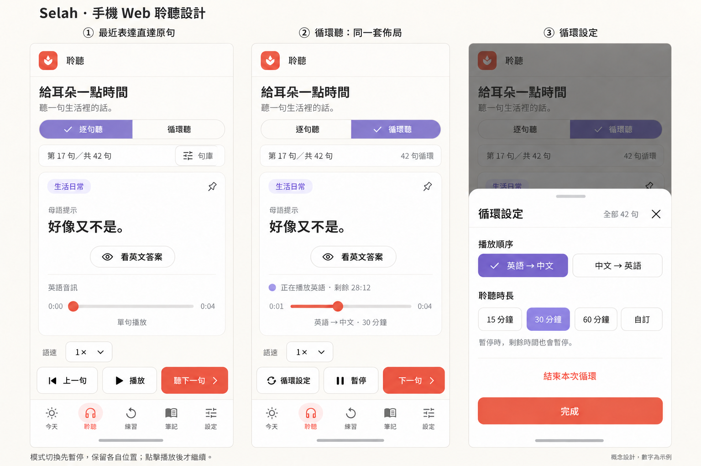
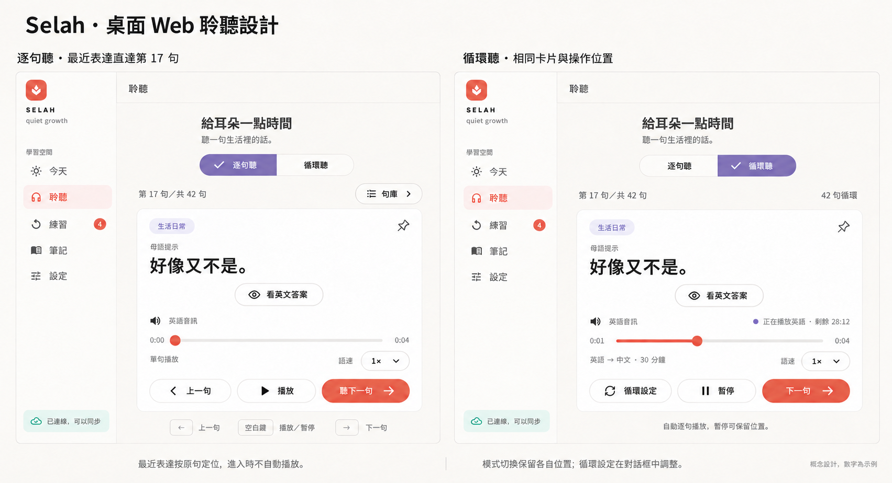

# 最近表达直达与聆听模式统一 UI／UX 设计

> 状态：主人已确认设计方向，并授权进行 Flutter Web 实施。
> 日期：2026-10-01
> 范围：正式 Flutter Web 的「今天 → 最近表达」跳转，以及「聆听」页内的逐句听、循环听和循环设置。

## 目标

把最近表达变成通往某条既有学习数据的入口。用户点开一条表达后，直接在逐句听中看到同一句，而不是进入「今天」专用的轻量学习状态。

逐句听和循环听共享聆听页的内容结构、学习卡和固定操作位置。循环听保留自己的音轨顺序、会话状态、语速、准备和定时规则；展示当前句的内容取自实际循环会话。

## 设计参考

### 手机 Web

### 桌面 Web

上述 PNG 是讨论用概念稿。它展示了以同一句作布局比较的示例状态，不代表每个账户都位于第 17 句、句库总数固定为 42 条或会话正在播放。实际正文、序号、音频状态、时长和学习状态均读取当前数据；视觉细节必须使用项目现有颜色、字体、间距与交互目标。

## 信息结构和响应式布局

浏览器宽度至少 900 logical px 时保留现有桌面侧栏。聆听内容列沿用最大 860 logical px 的宽度；页面标题、模式切换、句库／循环设置入口、学习卡与底部操作对齐于同一内容列。

低于 900 logical px 时沿用现有移动页面和底部五项导航。学习内容在可滚动区域内，播放控件留在底部导航上方的固定操作区。最窄 320 logical px 仍允许正文换行与滚动，操作保持可见并提供足够触控面积。

两个模式共用页标题、逐句听／循环听切换、当前句学习卡、音频信息、语速入口和主要播放操作。切换模式只替换循环特有的状态文字、控制动作和设置入口，不切换到另一种页面宽度或独立播放器卡片。

学习卡共用分类、母语正文、英文答案入口、置顶状态、词义内容区和相同间距。英文默认隐藏；模式切换时若当前还是同一句，保留其答案展示状态；句子改变时收起旧答案和词义。

进度条与三个主要播放按钮保持在两种模式的相同位置。循环听显示当前播放语言、实际音频进度和剩余时间；进度条仅显示真实进度，不提供循环音轨内跳播。剩余时长使用紧凑辅助信息，避免挤占正文。

## 交互规则

| 操作 | 行为 | 播放与学习记录 |
|---|---|---|
| 点击今天页的一条最近表达 | 校验当前账户仍有这条未归档句子；打开普通逐句模式，并按句子 ID 定位到句库的实际位置 | 不开始新音频，不写入听完或复习状态 |
| 重新点击正在显示的同一句最近表达 | 展示同一句并将内容滚动回开头；收起已展开答案和旧词义 | 已经播放的同一句按真实播放器状态呈现，不额外启动第二份音频 |
| 最近表达 ID 已失效、被归档或账户已切换 | 显示现有本地化错误反馈，保持当前账户范围 | 不用下一句或同文案句子替代 |
| 切换聆听模式 | 暂停正在播放的普通句音轨或循环会话；保存两边当前会话位置及状态，不自动播放目标模式 | 普通句和循环会话互相独立；循环暂停保留既有剩余时间 |
| 从逐句听切换为循环听 | 继续显示当前循环会话，或显示新循环的第一句预览；循环准备完成后等待用户点击开始 | 模式切换不等待音频准备或自动播放；界面切换完成后可在后台准备 |
| 从循环听切回逐句听 | 返回先前选中的逐句句子和答题展示状态；若从「最近表达」进入则以该表达为焦点并收起答案 | 循环保留在暂停状态，可主动恢复 |
| 操作循环的「下一句」 | 调用现有循环音频会话跳过行为；卡片按会话返回的实际句子 ID 和播放阶段更新 | 不写入逐句听完、复习或奖励记录 |
| 调整循环语序 | 沿用现有桥接规则，在当前句完成后应用到下一句 | 不中断单个语言音轨 |
| 调整循环时长 | 设置只用于下次循环会话；当前会话沿用其开始时的截止时间 | UI 明确标记“下次循环生效” |
| 打开循环设置 | 手机打开可滚动的底部抽屉，桌面打开对话框；打开或关闭本身不改变播放状态 | 结束循环保留为明确的次要操作 |
| 离开聆听页 | 循环迷你播放器在其他主导航页继续提供返回和播放操作 | 聆听页内部不额外显示第二个迷你播放器 |

逐句听底部操作为「上一句｜播放／暂停／继续／重听｜听下一句」。循环听为「循环设置｜开始／暂停／继续｜下一句」。循环不新增上一句能力。「结束循环」保留在循环设置中，避免结束会话取代主要导航位置。

## 状态与数据来源

最近表达必须使用现有账户作用域内有效句库查询句子 ID，再使用统一的句库导航顺序计算实时序号。无效 ID 通过当前错误通道报告；不自动播放，也不创建学习完成事件。

展示循环内容时用音频桥会话状态中的当前句 ID 查询准备和实际播放音轨对应的句子文本。会话阶段区分英语、母语、两种语言间停顿和句间停顿；暂停时继续读取音频桥返回的冻结位置与剩余时间。循环卡片不能按主句库下标推测循环句子。

控制器明确区分页面正在展示的模式与循环播放会话是否存在。模式切换受单一操作锁保护；进入目标模式前暂停来源播放器，返回时保留其进度。循环迷你播放器仅在「聆听」页以外显示。

## 文案与无障碍

使用现有繁体中文、简体中文和日文文案机制。循环播放语言、循环设置、结束、下次生效、失败和等待用户点击播放等新增字符串均纳入三语表和本地化测试。

模式切换名称、当前句、当前播放语言、剩余时长、准备／播放／暂停／继续按钮使用清楚的可访问名称；所有行为保留可点击的可见按钮。移动端底部控件不得遮挡句子内容或底部导航安全区。

## 范围和验收

仅修改 Flutter Web 的页面、学习控制器、循环播放状态展示、必要的浏览器音频状态字段和对应测试；复用现有音频、缓存、音量与速度系统。不改 SwiftUI 原生客户端、数据库、服务端、API 合约、账户规则、依赖、音频资产、密钥、CI 或远端配置。

验收须验证：

1. 从 Today 最近表达进入后显示正确账户、正确句子和置顶序号；点击本身不请求播放。
2. 同一句再次打开可回到顶部并收起答案；过期 ID 和账户切换不会定位到他人的句子。
3. 桌面和移动两种模式使用相同的页面与卡片锚点；切换先暂停音频，并能还原各自位置。
4. 循环卡片的文本、当前语言和进度对应实际音轨；待播放、开始、播放、暂停、间隔、设置、结束和浏览器拦截播放状态都有真实反馈。
5. 循环不会触发逐句完成或复习写入；常规今日推荐流程与「直接开始」保持现有轻量学习行为。
6. 320、390、759、899、900、1280 和 1440 logical px 视口中控件完整可用。

## 2026-10-04 循环听准备性能补充

本补充明确循环音频的准备时机与就绪判断，覆盖上文「循环准备完成后等待用户点击开始」的实现细节：

- 本机账户数据加载后，后台只计算音频内容指纹并读取当前账户的浏览器音频缓存清单。该检查不下载资源、不请求音频生成、不设置用户可见错误或提示。
- 进入循环听模式后，模式切换立即完成、不等待准备且不播放；界面更新后，后台开始准备缺失音轨。此时仅沿用原有音频生成权限、账户校验和服务端额度保护。
- 点击「开始」仍保留同步准备兜底。若后台准备正在进行，开始操作复用同一准备任务，避免重复生成或下载。
- 只有队列中至少一条句子的目标语与母语音轨都已就绪，循环才可开始。启动时的缓存检查若发现缺失音轨，不得把部分缓存误判为完整就绪。
- 缓存清单不可用时保留逐条缓存检查兜底；账户切换后不得复用旧账户的指纹或缓存就绪状态。

验收补充：已缓存的完整队列在打开循环听前台准备界面之前即可就绪；本机启动检查不产生云端调用或音频下载；进入循环听的异步准备不占用通用 `busy` 锁；开始按钮等待中的后台准备，而不是并行启动第二套准备任务。
